# GitHub 上的 Branch 是什么？

> 原文：<https://blog.devgenius.io/what-is-branch-on-github-d3fea06e1702?source=collection_archive---------17----------------------->

## GitHub 初学者指南

## 您现在必须熟悉基本的 Git。本文将讲述 Git 上的分支以及如何将它与你的主分支合并。

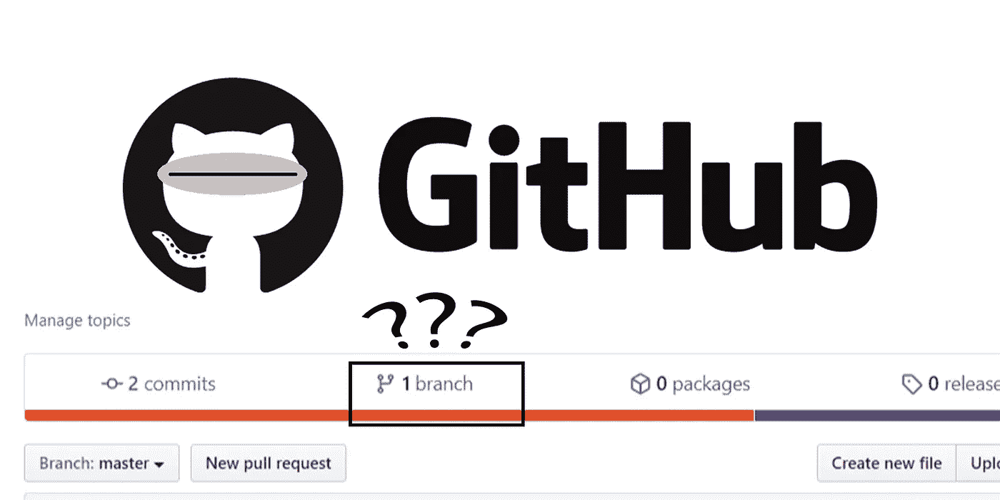

由 Kinng 创建

[在之前的讨论](https://medium.com/dev-genius/git-to-getting-repos-from-others-ff829802ba54)中，我们学习了如何将他人的回购文件克隆和派生到我们的 GitHub 或者本地机器上。在我们进入拉请求会话之前，我想先分享一下分支的概念。您可能已经注意到了回购页面上提交旁边的“分支”,想知道这是什么，所以…

# 什么是分支？

到目前为止，在这个系列中，我们只是把我们的代码推到被称为主分支的主分支。在生产中，它是我们向客户展示的主要代码。例如，我们现在使用的 YouTube 页面就是 YouTube team master 分支上的内容。有一天，团队决定测试一个新的设计，将搜索栏移到页面的底部。然后他们将为新的设计测试版创建一个分支。主分支将仍然为大多数人工作，而新的设计将作为测试版向某些人开放，这是一个分支。

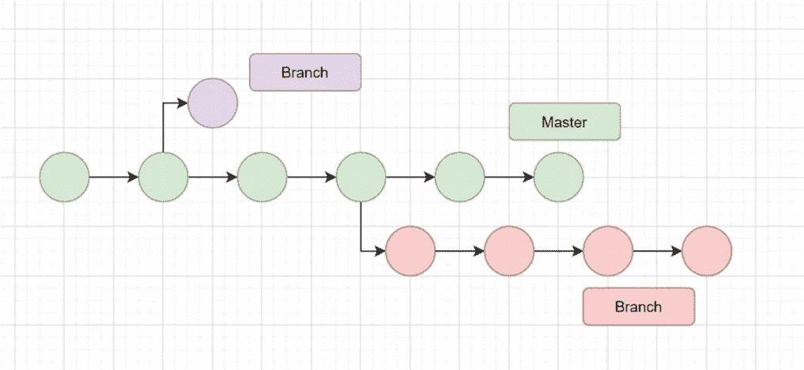

绿色是主人，紫色和红色是树枝

请注意，分支可能很小，仅持续一个提交(紫色)，但分支也可能成为一个大功能，团队最终会将它变成另一个独立的项目(红色)。

# 分支可以和主控合并吗？

是的，我们创建的分支可以与主分支合并。这个过程可以通过一个拉请求和一个 Git 合并来完成。我们将在下一篇文章中对此进行探讨。

# 如何为我的回购创建分支机构？

总有两种方法可以做到，1。在 GitHub 网页 2 上。在终点站旁边。我将首先在 GitHub 网页上展示这个过程，然后通过一个例子展示分支的终端方式。

*   转至“项目回购”页面，找到“分支”按钮。

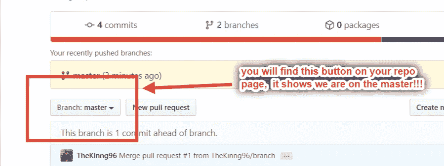

在回购页面上

*   只需点击按钮并创建一个。这里我把我的分支叫做“分支”。

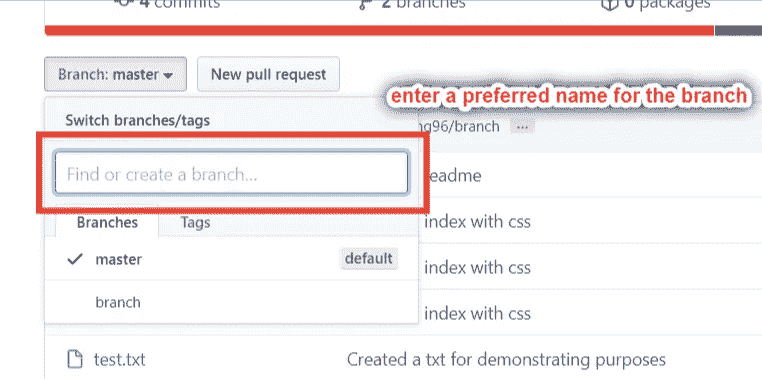

*   如果你看到系统显示你的分支，恭喜你，你已经成功地创建了一个，现在我们在分支。

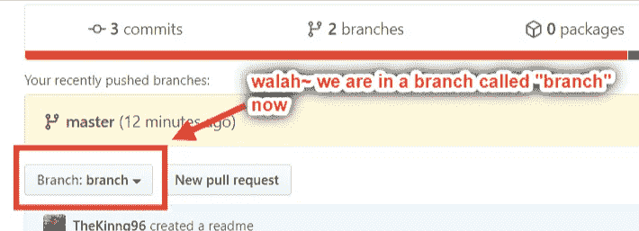

*   要删除分支，请转到提交旁边的“分支”,您将看到如下图所示的视图。单击红色的删除按钮完成分支。

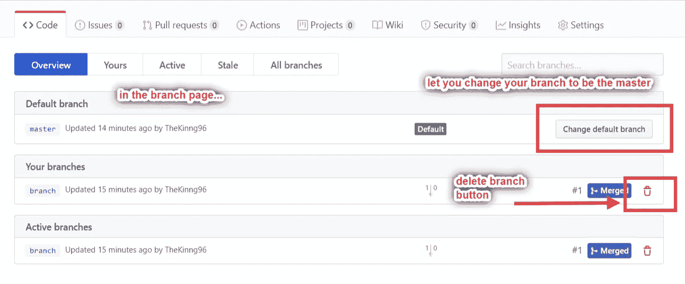

# 最后是末端分支的例子

因为我已经在 GitHub 上创建了一个分支，所以我不会再创建另一个分支。相反，我将展示如何在终端上从主服务器切换到分支服务器，并将编辑好的 HTML 文件上传到分支服务器。

因为我已经创建了一个新的分支，但是本地 Git 还没有更新，所以我们需要在告诉你的本地 Git 分支之前运行`git pull`。

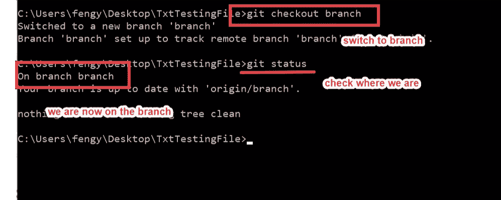

截屏后提供代码

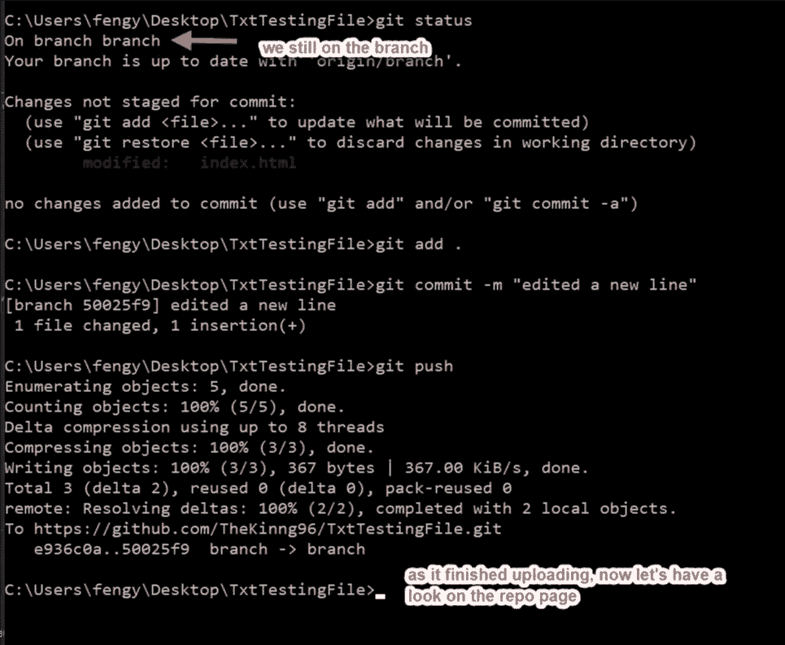

单击 GitHub repo 页面上 commits 按钮旁边的按钮，返回到 branch 页面。之后，将分支切换到分支，您将在终端上看到您刚刚提交的承诺。

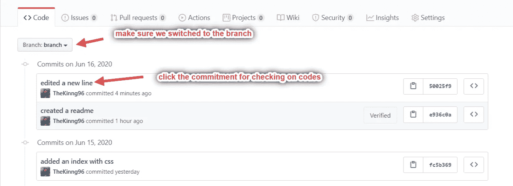

点击承诺，GitHub 会向我们显示添加或更改了哪些行。

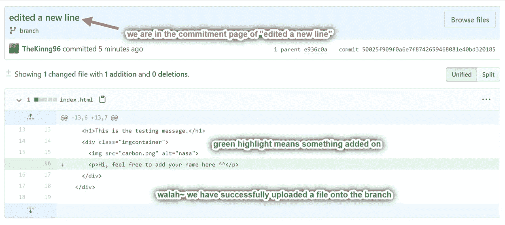

到目前为止一切顺利。我们将在下一篇文章中讨论拉取和合并主题。希望这篇文章能帮助你理解分支是如何工作的，以及如何在浏览器和终端上访问分支。

```
# checking branches available to switch
git branch# switch branches on terminal
git checkout *branch_name* or *master*# create a new branch 
git branch *branch_name*# shortcut to create and switch to branch
git checkout -b *branch_name*
```

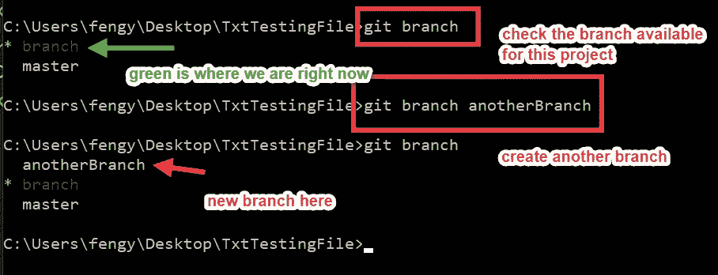

在终端上创建分支的示例

想在终端上了解更多？↓↓↓↓

[](https://medium.com/dev-genius/tips-to-know-your-command-prompt-better-75bc218bbab3) [## 更好地了解命令提示符的技巧

### 探索一些有用的 CMD 命令。让 CMD 成为你的伙伴！

medium.com](https://medium.com/dev-genius/tips-to-know-your-command-prompt-better-75bc218bbab3) 

错过这个系列的第一部分？

[](https://medium.com/@fengyuan.yap/what-is-github-260412a0dcd7) [## 什么是 GitHub？

### 这是一篇面向初学者的文章，讲述了为什么我们应该使用并上传我们的代码到 GitHub。以下是我对…的回答

medium.com](https://medium.com/@fengyuan.yap/what-is-github-260412a0dcd7) 

**感谢您的阅读！！！**我希望这个系列可以帮助你了解 GitHub 是如何工作的，以及如何使用它作为一个工具。我个人花了几个月的时间来试验和阅读如何 Git。比起只用文字来解释，我更喜欢在解释中插入图片和截图。此外，我试图用简单的语言和更少的术语来解释一切，因为我在编码的前几个月遭受了很多。我相信术语很重要，但是事物如何工作的概念更重要。此外，在编码过程中，我们会以某种方式得到术语。祝你好运，敬请期待！

下一篇文章↓↓↓

[](https://medium.com/dev-genius/pulling-on-git-327e6aaafc88) [## 拉动 Git

### 第 5 部分:提取、合并和提取请求

medium.com](https://medium.com/dev-genius/pulling-on-git-327e6aaafc88)