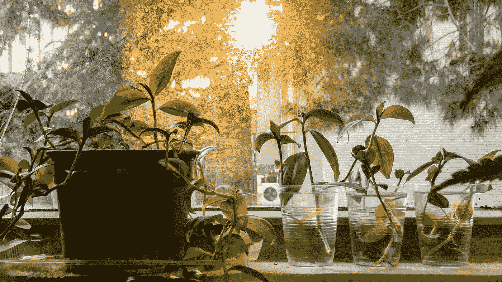

# JavaScript 中冒泡是什么？

> 原文：<https://blog.devgenius.io/what-is-bubbling-in-javascript-bc8622f040de?source=collection_archive---------11----------------------->



照片由[纳伊姆·沙赫里扎德根](https://unsplash.com/@shahrizadegan?utm_source=medium&utm_medium=referral)在 [Unsplash](https://unsplash.com?utm_source=medium&utm_medium=referral) 拍摄

JavaScript 应用由“[事件](https://developer.mozilla.org/en-US/docs/Web/Events)驱动。点击、悬停、拖放都是 web 应用程序中事件的例子。当嵌套在其他元素中的元素触发事件时，DOM 会经历三个不同的阶段来处理事件——[捕获、目标和冒泡](https://developer.mozilla.org/en-US/docs/Learn/JavaScript/Building_blocks/Events#bubbling_and_capturing_explained)。

在冒泡阶段，当一个事件在子元素上被触发时，DOM 检查父元素是否附加了任何事件侦听器，如果是，就运行它们。这个过程一直重复，直到到达文档的顶部(`<html>`标签)。默认情况下，所有事件都被订阅到冒泡阶段。

它被称为“冒泡”,因为事件是从最里面的元素开始触发的，并“冒泡”到顶部。冒泡不一定是一件坏事——但在构建应用程序时，这是一件应该考虑的事情。

# 冒泡的例子

这里，一个简单的应用程序通过菜单选择选项来显示不同的“仪表板”,用于演示冒泡。可以从 [GitHub](https://github.com/andrew-lundy/blog-source-code/tree/main/bubbling) 抓取源代码。下面是文档中`body`的内容:

```
<div id="side-nav-menu" class="side-nav-menu">
    <span id="side-nav-menu__close-button">&times;</span>
    <ul>
        <a href="#">Home</a>
        <a href="#">About</a>
        <a href="#">Contact</a>
        <span id="side-nav-menu__sub-menu__dashboard">Saved Dashboards</span>
        <span id="side-nav-menu__sub-menu__dashboard-content">
            <a href="#" id="side-nav-menu__sub-menu__dashboard-content__dashboard-one">Dashboard One</a>
            <a href="#" id="side-nav-menu__sub-menu__dashboard-content__dashboard-two">Dashboard Two</a>
            <a href="#" id="side-nav-menu__sub-menu__dashboard-content__dashboard-three">Dashboard Three</a>
        </span>
    </ul>
</div>

<div id="top-nav-bar">
    <span id="top-nav-bar__menu-button">&#9776;</span>
</div>

<div id="dashboard-container">
    <div id="dashboard-container__content">

    </div>
</div>
```

有三个主要元素:

*   默认情况下隐藏的侧菜单。
*   顶部菜单，打开菜单的按钮所在的位置。
*   将呈现“仪表板”的页面区域。

当您在浏览器中打开应用程序时，单击左上角的汉堡图标打开菜单。一点 CSS 和 JavaScript 提供了打开和关闭菜单时的平滑过渡。还有选择“仪表板”的选项


说到 JavaScript——这里是每个元素的事件监听器(记住，你可以在这里找到所有的代码):

```
// Menu Stuff
const menuButton = document.getElementById('top-nav-bar__menu-button');
const sideNavMenu = document.getElementById('side-nav-menu');
const closeButton = document.getElementById('side-nav-menu__close-button');
const dashboardMenuItem = document.getElementById('side-nav-menu__sub-menu__dashboard');
const dashboardMenuSubItem = document.getElementById('side-nav-menu__sub-menu__dashboard-items');

// Open the menu.
menuButton.addEventListener('click', function(event) {
    sideNavMenu.style.width = '250px';
    console.log(0);
});

// Close the menu.
closeButton.addEventListener('click', function(event) {
    sideNavMenu.style.width = '0px';
    console.log(1);
});

// Another way to close the menu - by clicking on the menu itself.
sideNavMenu.addEventListener('click', function (event) {
    sideNavMenu.style.width = '0px';
    console.log(2);
});

// Show the list of dashboards in the menu.
dashboardMenuItem.addEventListener('click', function (event) {
    if (dashboardMenuSubItem.style.display === 'flex') {
        dashboardMenuSubItem.style.display = 'none';
    } else {
        dashboardMenuSubItem.style.display = 'flex';
        dashboardMenuSubItem.style.flexDirection = 'column';
    }
    console.log(3);
});
```

打开和关闭菜单的按钮是通过设置菜单元素的宽度来实现的。默认情况下，菜单的宽度为`0`:

```
#side-nav-menu {
    display: flex;
    flex-direction: column;
    height: 100%;
    width: 0;
    position: fixed;
    z-index: 1;
    top: 0;
    left: 0;
    background-color: #536f50;
    overflow-x: hidden;
    transition: 0.5s;
}
```

回到 JavaScript 文件，这里是仪表板的呈现。它非常简单，展示了根据哪个按钮被选中来改变区域内容的基本功能。这里设置的内容是在“保存的仪表板”菜单中选择的元素的标题。

```
// Dashboards
const dashboardOneButton = document.getElementById('side-nav-menu__sub-menu__dashboard-items__dashboard-one');
const dashboardTwoButton = document.getElementById('side-nav-menu__sub-menu__dashboard-items__dashboard-two');
const dashboardThreeButton = document.getElementById('side-nav-menu__sub-menu__dashboard-items__dashboard-three');
const dashboardContent = document.getElementById('dashboard-container__content');

const dashboards = [dashboardOneButton, dashboardTwoButton, dashboardThreeButton];

function showDashboard(event) {
    const html = event.target.innerHTML;

    dashboardContent.innerHTML = html;
}

for (const dashboard of dashboards) {
    dashboard.addEventListener('click', function (event) {
        showDashboard(event);
        console.log(event);
    });
}
```

总而言之，JavaScript 文件:

```
// Menu Stuff
const menuButton = document.getElementById('top-nav-bar__menu-button');
const sideNavMenu = document.getElementById('side-nav-menu');
const closeButton = document.getElementById('side-nav-menu__close-button');
const dashboardMenuItem = document.getElementById('side-nav-menu__sub-menu__dashboard');
const dashboardMenuSubItem = document.getElementById('side-nav-menu__sub-menu__dashboard-items');

// Dashboards
const dashboardOneButton = document.getElementById('side-nav-menu__sub-menu__dashboard-items__dashboard-one');
const dashboardTwoButton = document.getElementById('side-nav-menu__sub-menu__dashboard-items__dashboard-two');
const dashboardThreeButton = document.getElementById('side-nav-menu__sub-menu__dashboard-items__dashboard-three');
const dashboardContent = document.getElementById('dashboard-container__content');

const dashboards = [dashboardOneButton, dashboardTwoButton, dashboardThreeButton];

// Event Listeners
menuButton.addEventListener('click', function(event) {
    sideNavMenu.style.width = '250px';
    console.log(0);
});

closeButton.addEventListener('click', function(event) {
    sideNavMenu.style.width = '0px';
    console.log(1);
});

sideNavMenu.addEventListener('click', function (event) {
    sideNavMenu.style.width = '0px';
    console.log(2);
});

dashboardMenuItem.addEventListener('click', function (event) {
    if (dashboardMenuSubItem.style.display === 'flex') {
        dashboardMenuSubItem.style.display = 'none';
    } else {
        dashboardMenuSubItem.style.display = 'flex';
        dashboardMenuSubItem.style.flexDirection = 'column';
    }
    console.log(3);
});

// Dashboard rendering
function showDashboard(event) {
    const html = event.target.innerHTML;

    dashboardContent.innerHTML = html;
}

for (const dashboard of dashboards) {
    dashboard.addEventListener('click', function (event) {
        showDashboard(event);
        console.log(event);
    });
}
```

目前，当点击“保存的仪表板”时，菜单关闭。人们希望菜单保持打开，这样他们就可以选择想要查看的仪表板。这是冒泡在行动。

1.  选择子元素(`side-nav-menu__sub-menu__dashboard`)并触发附加的事件监听器。
2.  DOM 处于“冒泡”阶段，并在任何父项上寻找同一事件的事件侦听器。
3.  然后触发父元素(`side-nav-menu`)上的事件监听器。

```
<!-- 2 -->
<div id="side-nav-menu" class="side-nav-menu">
    <span id="side-nav-menu__close-button">&times;</span>
    <ul>
        <a href="#">Home</a>
        <a href="#">About</a>
        <a href="#">Contact</a>
        <!-- 1 -->
        <span id="side-nav-menu__sub-menu__dashboard">Saved Dashboards</span>
        <span id="side-nav-menu__sub-menu__dashboard-items">
            <a href="#" id="side-nav-menu__sub-menu__dashboard-items__dashboard-one">Dashboard One</a>
            <a href="#" id="side-nav-menu__sub-menu__dashboard-items__dashboard-two">Dashboard Two</a>
            <a href="#" id="side-nav-menu__sub-menu__dashboard-items__dashboard-three">Dashboard Three</a>
        </span>
    </ul>
</div>
```

为了进一步证明这一点，每个事件侦听器中都记录了`console.log(INT);`消息。在浏览器的开发工具中打开控制台，然后在 web 应用程序中打开菜单，选择“保存的仪表板”。

```
menuButton.addEventListener('click', function(event) {
    sideNavMenu.style.width = '250px';
    console.log(0);
});

sideNavMenu.addEventListener('click', function (event) {
    sideNavMenu.style.width = '0px';
    console.log(2);
});

dashboardMenuItem.addEventListener('click', function (event) {
    if (dashboardMenuSubItem.style.display === 'flex') {
        dashboardMenuSubItem.style.display = 'none';
    } else {
        dashboardMenuSubItem.style.display = 'flex';
        dashboardMenuSubItem.style.flexDirection = 'column';
    }
    console.log(3);
});
```

当你点击菜单图标时，`0`被打印到控制台。没有打印任何其他内容，因为没有带有 click 事件侦听器的父元素。但是，当您单击“保存的仪表板”时，`3`和`2`会打印到控制台。`3`从“保存的仪表板”项目(`dashboardMenuItem`)打印，`2`从`sideNavMenu`父元素打印。

```
0
3
2
```

如果 DOM 中有任何其他带有 click 事件侦听器的父元素，它们也会被触发。您可以通过向`body`添加一个事件监听器来测试这一点。

希望“冒泡”的概念在这一点上是清楚的。

> 当一个事件在 JavaScript 中被触发时，DOM 会经历一个过程，从触发事件的元素开始搜索事件监听器，然后向上遍历父元素，直到碰到`html`标签。如果找到匹配的事件监听器(即，如果初始事件是一个`click`事件，父事件监听器将需要监听`click`事件)，它将被触发。

需要时，有一种方法可以阻止事件在 DOM 中传播。

# 传播

> 运动、光、声音等的传播。以特定的方向或通过媒介。— [谷歌](https://www.google.com/search?q=propagation&ei=taZxY6X4Iom5qtsPzv-i8Ac&ved=0ahUKEwjlpqDwzqz7AhWJnGoFHc6_CH4Q4dUDCBA&uact=5&oq=propagation&gs_lcp=Cgxnd3Mtd2l6LXNlcnAQAzIICAAQsQMQkQIyCAgAELEDEJECMgUIABCRAjIFCAAQkQIyBQgAEJECMgsIABCABBCxAxCDATIICAAQgAQQsQMyBQgAEIAEMgUILhCABDIICAAQgAQQsQM6CggAEEcQ1gQQsAM6BwgAELADEEM6BAgAEEM6CAguEIAEENQCOg4ILhDHARCxAxDRAxCABDoOCC4QgAQQsQMQxwEQ0QM6BwgAELEDEEM6CAgAELEDEIMBOg4IABCABBCxAxCDARDJA0oECEEYAEoECEYYAFCPB1jWFWDGFmgCcAF4AIABW4gBjQWSAQIxMZgBAKABAcgBCsABAQ&sclient=gws-wiz-serp#:~:text=transmission%20of%20motion%2C%20light%2C%20sound%2C%20etc.%20in%20a%20particular%20direction%20or%20through%20a%20medium.)

JavaScript 中的事件传播描述了事件如何在 DOM 中传播，以及它们传播的方向。

前面提到了事件触发时发生的三个不同阶段；捕获、瞄准和冒泡。在冒泡阶段，事件传播方向从子元素向上移动到父元素。在捕获阶段，情况正好相反。

> 冒泡阶段是所有事件默认订阅的唯一阶段。

要停止事件的传播，应该将`event.stopPropagation();`方法添加到要停止传播的事件侦听器中。[这里是该方法的 MDN 文档的链接](https://developer.mozilla.org/en-US/docs/Web/API/Event/stopPropagation)。

在本例中，我将它添加到了`dashboardMenuItem`事件监听器中:

```
dashboardMenuItem.addEventListener('click', function (event) {
    event.stopPropagation();

    if (dashboardMenuSubItem.style.display === 'flex') {
        dashboardMenuSubItem.style.display = 'none';
    } else {
        dashboardMenuSubItem.style.display = 'flex';
        dashboardMenuSubItem.style.flexDirection = 'column';
    }
    console.log(3);
});
```

这将确保当单击“保存的仪表板”选项时，菜单不会关闭。


# 包裹

当事件被触发时，有三个不同的阶段发生；冒泡、瞄准和捕获。这些阶段与事件的传播相关，即它们区分事件在 DOM 中传播的方向。在冒泡阶段，事件从发起事件的子元素开始，然后向上遍历每个父元素。

对于包含相同类型事件侦听器的深度嵌套元素的应用程序，如果没有在 DOM 树中的正确级别停止事件传播，您可能会遇到意外行为。

如果您渴望阅读更多关于 JavaScript 事件的内容，请查看 [MDN 文档](https://developer.mozilla.org/en-US/docs/Learn/JavaScript/Building_blocks/Events)。如果你在寻找更多围绕 JavaScript、编程、科技职业和相关主题的帖子，我每周都会在 Medium 上写。