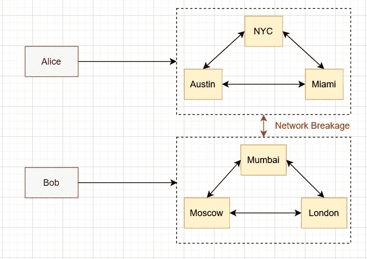
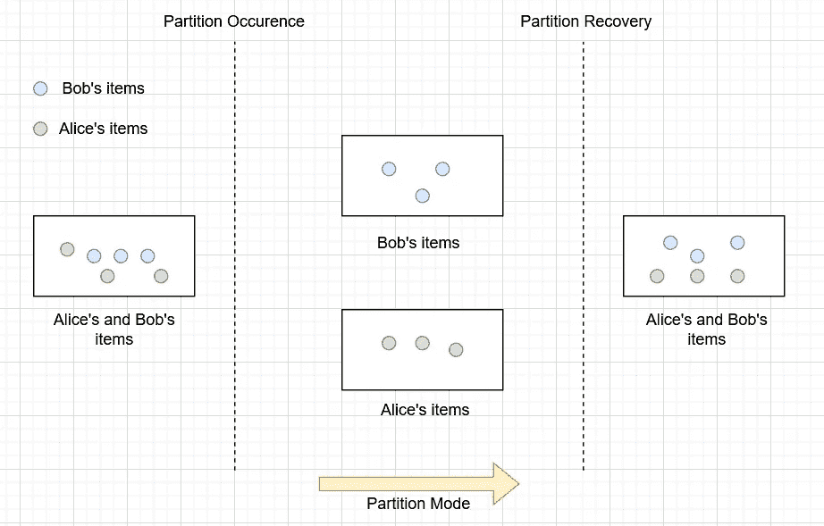

# 什么是 CAP 定理？

> 原文：<https://blog.devgenius.io/what-is-cap-theorem-95bb5240a5ee?source=collection_archive---------1----------------------->

## 通过实时应用了解 CAP 定理

420 fourttwoo 在 [Unsplash](https://unsplash.com?utm_source=medium&utm_medium=referral) 上拍摄的照片

今天我们将讨论系统设计的另一个重要概念:CAP 定理。在本文中，我们将了解什么是 CAP 定理，以及它如何应用于实时应用程序。所以事不宜迟，让我们深入这个话题。

分布式系统有三个基本方面:

*   一致性:每次读取都会收到最近的写入。
*   可用性:功能节点收到的每个请求都必须得到及时的响应。
*   分区容忍度:分布式系统应该继续运行，尽管通信中断将网络分成不能相互通信的集群。

CAP 定理指出，分布式系统不可能提供上述三个方面中的两个以上。在设计分布式系统时，必须根据业务需求在一致性、可用性和分区容错之间进行选择。

事实上，没有一个分布式系统可以避免网络故障，必须容忍网络分区，并且我们必须在一致性和可用性之间进行权衡。最终的系统并不完全一致或可用——但是对于特定的业务需求来说是一个合理的组合。

当系统选择一致性而非可用性时，如果由于网络分区而无法保证特定信息是最新的，系统将返回错误或超时。当选择可用性而不是一致性时，系统将总是处理查询并尝试返回信息的最新可用版本，即使它不能保证它是最新的。

## 做出权衡决策:机票预订系统

我们有在不同地理位置的 Alice 和 Bob(Alice 在纽约，Bob 在莫斯科),他们都想使用您的分布式系统预订最后一张机票。他们位于不同的地理位置，他们的请求被定向到您系统上的不同节点(Alice 的请求被定向到迈阿密节点，Bob 的请求被定向到孟买节点)。当 Alice 想要订票时，为了确保一致性，Miami 节点需要与 Mumbai 节点通信，并且两个节点必须就请求的序列化达成一致。它提供了一致性；然而，在任何网络中断的情况下，两个节点都不能预订机票，
牺牲可用性。

做出权衡决策:机票预订系统

在航班预订系统中，我们可能希望可用性高于一致性，以便为我们的客户提供更好的体验。为了获得更多的可用性，我们可能允许两个节点继续接受航班预订，即使通信线路中断。这种方法最糟糕的结果是 Alice 和 Bob 最终都会预订机票。然而，这种情况可以使用领域知识来解决。航班被超额预订是很常见的事情，然后航空公司通过采取适当的措施来解决这种情况，如退款、转到另一个航班等。

## 分区恢复:电子商务购物车系统

爱丽丝和鲍勃是一对夫妇，他们在不同的地理位置(爱丽丝在孟买，鲍勃在波士顿)，他们正在一个电子商务网站的共享帐户的购物车上添加物品。由于他们位于不同的地理位置，Alice 的购物车位于 Mumbai 节点，Bob 的购物车位于网站分布式数据库系统的纽约节点。让我们考虑一种情况，当分布式系统中发生网络故障时，两个节点(即孟买和波士顿)不再能够相互通信。这导致 Alice 的购物车没有显示 Bob 添加的商品，反之亦然。

处理分区恢复:电子商务购物车系统

如果我们正在设计一个电子商务应用程序，我们可能不希望限制我们的客户将商品添加到他们的购物车中，因为这将恶化客户体验，并且企业也可能最终亏损。有几种方法可以从这种网络分区情况中恢复。一种可能的解决方案是，只有在确保分区已经恢复之后才触发结帐过程，然后将 Alice 和 Bob 的购物车中的商品合并到一个购物车中。

据观察，这些情况与领域相关，需要领域知识来确定解决方案。对于一个新闻媒体来说，我们可以分分钟容忍老版面；然而，在金融交易工具的情况下，我们不能依赖陈旧的数据。这个决定需要开发团队和领域专家的参与。

我们已经讨论了系统设计的另一个重要概念。我会添加更多关于系统设计概念的文章，这样我们可以一起学习和设计系统。敬请关注。快乐学习！🎃