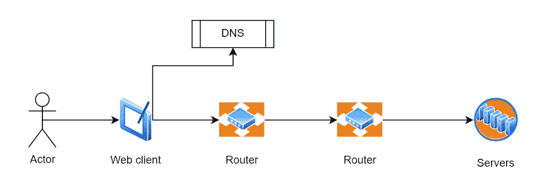
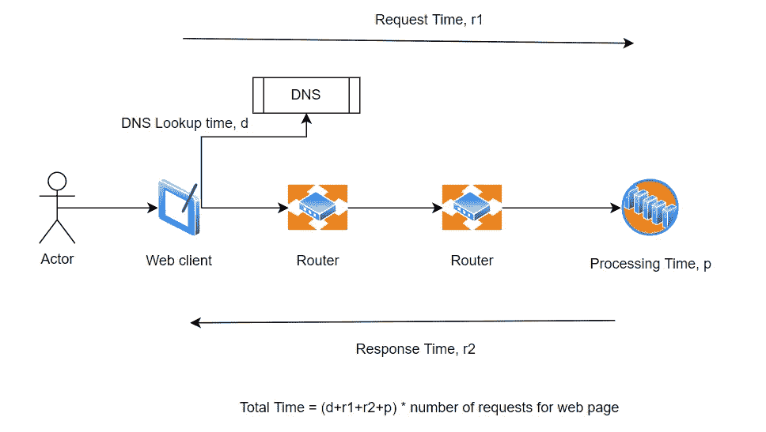
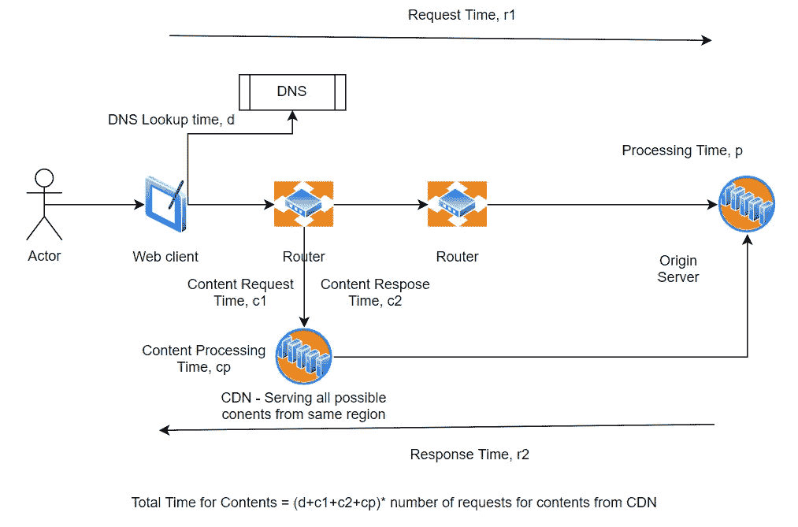
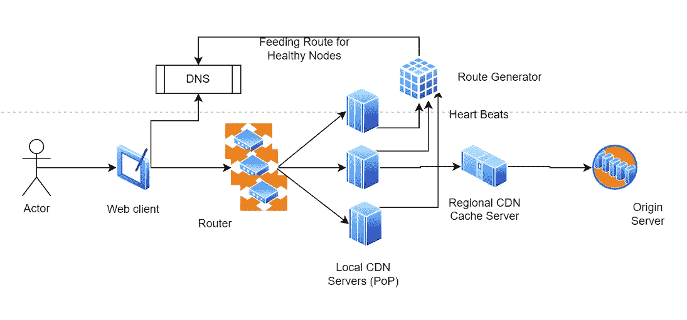

# 什么是 CDN，它有什么帮助

> 原文：<https://blog.devgenius.io/what-is-cdn-how-does-it-help-e364051ed09c?source=collection_archive---------9----------------------->

## 内容分发网络是 Web 应用的主干

托马斯·詹森在 [Unsplash](https://unsplash.com?utm_source=medium&utm_medium=referral) 上的照片

CDN —内容交付网络

让我们先了解一些基础知识。

# 什么是内容

在每个网站上，我们都需要向用户展示内容。这些内容可以是动态的，如已经由用户操作保存的数据。例如，用户列表、订单列表等。或者这些可以是相对静态的内容，如媒体、图像和视频。

# 渲染网页需要什么？

以下是步骤(一个简单的流程)

*   客户端/用户点击服务 URL
*   DNS 将域解析为服务器地址。
*   通过复杂的网络/路由器生态系统请求到目的服务器的路由
*   服务器处理请求，生成包含所有必需内容的响应，并将其发送回请求客户端(浏览器)
*   客户端(例如，浏览器)呈现或使用响应
*   对于单个函数，可能有多个嵌套的请求/响应。例如，在呈现一个页面时，客户端可能会发送对图像、视频、动态内容等内容的多个请求。

# 网页渲染需要时间

整个请求>响应>呈现过程需要时间，尤其是在后续操作中。

*   请求从客户端到服务器的传输时间，这取决于客户端和服务器之间的距离
*   服务器请求处理时间
*   响应的传播时间，这同样取决于服务器和客户端之间的距离。它还取决于将向客户端传送哪个响应的内容的大小。
*   不同内容的数量也很重要，因为这些内容会有多个请求/响应。例如，如果网页上有多个图像或视频。

# 时间就是金钱

在今天的世界里，网络上的一切都在几秒钟内完成。消费者的流量取决于网站或其他资源的加载速度。加载 web 资源的任何延迟都类似于失去客户和业务。因此，确保网页或服务在期望的时间内加载是非常关键的。

然而，在 check 中包含上述所有步骤的响应时间是一个很大的挑战。在这个请求和回应的旅程中，每一毫秒都很重要。

这段旅程中最耗时的部分是什么:

*   客户端和服务器之间的距离是决定延迟的一个重要因素
*   媒体内容作为最重要的内容，是影响响应时间的最重要的资源
*   媒体内容的大小是另一个重要因素

这就是内容交付网络(CDN)成为救星的原因。

# 什么是 CDN

> 内容传递网络是一组地理上分布的服务器，它们一起工作，从离用户最近的位置向用户提供缓存的内容。它使互联网内容的传递更快。

因此 [CDN](https://en.wikipedia.org/wiki/Content_delivery_network) 有助于通过优化内容交付来提高网络性能，缩小内容的大小和距离，从而减少内容交付时间。

CDN 是怎么做的？

CDN 通过在大多数地区部署本地服务器来实现这一点，这些服务器可以在本地向客户端提供内容。它节省了前往位于另一个洲的原始服务器的时间，如下图所示。

CDN 是怎么做的？让我们弄清楚。

## CDN 缩短了距离

CDN 是一个地理上分散的服务器网络，这些服务器协同工作来提供内容。

基于客户端位置，对内容的请求被路由到 CDN 网络上最近的服务器。这有助于减少请求和响应之间的距离。

当我们考虑对 web 上的单个页面进行多次请求/响应时，时间会大大减少。

此外，它还降低了出错的几率。离客户端越近，网络出错的可能性就越小，等等。

## CDN 减少了内容的大小

CDN 应用所有可能的数据最小化或压缩技术来减少内容的大小。

[GZip](https://en.wikipedia.org/wiki/Gzip) 是著名的压缩选项之一。

类似地，有许多最小化技术可以从内容中移除额外的元素，例如，从 Java 脚本文件中移除所有文档、空白、大变量名等。

减少内容大小减少了带宽的使用，这直接转化为时间和成本的节约。

## CDN 节省带宽

CDN 通过在边缘节点(本地、区域节点)进行智能缓存来帮助节省带宽。

缓存通过从本地缓存向客户端提供内容来帮助优化响应时间，而不是往返于原始服务器。

有关更多详情，请参考下面的优化设计部分。

## CDN 提供更快的内容访问

CDN 还通过将内容存储在更快的存储设备中，如 SSD 或 HDD + SSD 的混合存储设备(用于一级和二级缓存),来帮助更快地访问内容。

SSD 虽然贵，但是比 HDD 快很多。因此，它有助于更快地访问内容。

# 带有 CDN 的请求响应流

*   客户端/用户点击服务 URL
*   DNS 将域解析为服务器地址。
*   通过复杂的网络/路由器生态系统请求到目的服务器的路由
*   服务器处理请求，生成响应，并将其发送回请求浏览器(客户端)
*   响应包含内容的嵌套 URL，它引用 CDN。
*   客户端解析响应并找到更多内容的嵌套 URL。它发送对这些的请求。
*   这些请求被解析到离用户位置更近的一个 CDN 服务器。
*   所有对内容的请求都从同一个区域提供服务，这个区域比实际的源服务器更靠近客户机。

请注意，一旦对主 web 资源的初始请求由原始服务器提供服务，其余所有对内容的调用将被路由到 CDN 服务器。

参考上图。

# CDN 的整体优势

*   **更低的延迟，增加用户在网站上的时间** —这有助于加快网站的加载时间。这反过来又增加了用户在网站上的流量和时间，从而增加了收入。
*   **更快的访问** —它通过从最近的 CDN 节点(也称为存在点，PoP)返回缓存内容来帮助减少延迟。
*   **节约成本**—PoP 缓存有助于降低带宽成本(从原始服务器移出的数据量)，从而降低总拥有成本
*   **提高可用性** — CDN 通常是一个由多个节点组成的网络，可以满足客户的需求。因此，它有助于通过确保多个备份节点来减少故障，从而提高网站的可用性。
*   **增强的安全性** —它可能有助于通过避免 DDOS 攻击等来增强安全性。
*   **客户位置附近的定制逻辑** —一些 CDN(例如 CloudFront)支持 lambda 表达式的实现，这些表达式可以在边缘节点中执行，因此可以在请求/响应跟踪中添加一些逻辑，而无需在本地拥有实际的应用服务器。

# 针对 CDN 的更多设计优化

CDN 提供商进行了各种优化，以使内容访问更快、更有效。这里有一些简单的设计。

## 边缘服务器上的缓存—一级、二级缓存

缓存是减少延迟和节省网络带宽的重要设计方法。CDN 也有效地利用缓存。

每当用户请求第一次点击任何内容的 CDN PoP 时，它从源服务器获取内容并在本地缓存它们。这有助于减少后续请求的延迟，也节省了源服务器的带宽。

根据 CDN 提供商的不同，第一级和第二级缓存也可以实现。其中，所有热对象都保留在一级缓存中，该缓存可能位于快速访问内存中，而较少使用的对象则存储在二级缓存中，该二级缓存也可能位于速度更快的 SSD 上。

这使得访问速度更快，尤其是当它与内容通过 CDN 传输所需的更短距离相结合时。

## 区域服务器上的缓存—多层缓存

CDN(像 CloudFront)提供多层缓存。除了 PoP 上的缓存(一种离客户端最近的本地边缘节点)之外，在区域服务器级别还有另一个级别的缓存。这些服务器具有比 PoP 更大的缓存空间，因此可以在缓存中包含更大的内容。

两种缓存的结合确保了 PoP 总是拥有最热的对象。它能够更快地为客户端请求提供服务。较少使用的对象存储在区域缓存中，当这些对象变热时，可以将其移动到 PoP 缓存中。

缓存主要基于内容的到期时间而失效。这可以通过 CDN 配置来设置。

## 来自源服务器的内容拉或推

CDN 实施不同的策略来填充或刷新边缘节点和缓存中的数据。

许多人都在使用“拉”的方法，如果本地缓存中没有内容，CDN 节点会自动从源服务器中拉出内容。如果本地对象也由于过期而被逐出缓存，也会发生这种情况。

推送是指源服务器将内容推送到边缘节点，以便在对象发生任何变化时填充甚至刷新缓存。

这两种策略各有利弊。

pull 比较容易实现，并且只保留那些经常使用的边缘节点中的对象。但是，如果对象不在缓存中，加载对象需要时间，因此用户获得第一次响应会慢一些。这主要用于高流量场景，在这种场景中，保持本地缓存优化更为重要。

Push 使缓存与服务器上的任何更改保持同步，因此总是确保用户获得最新的对象。它可以用在流量低的地方，但是获取最新的对象是很重要的。

## 智能路由到负担最小或健康的节点

CDNs 还使用各种智能路由方案来优化可用节点之间的负载，或者将流量始终路由到健康节点。这有助于减少错过的事件。

一些 cdn 应用智能逻辑，通过检查服务器心跳或故障响应来预先填充路由映射，并主动将该路由映射推送到 DNs 服务器，因此 DNS 总是仅将请求发送到健康的服务器。

亚马逊 Cloudfront 很好地运用了这一策略。

这提高了可用性，反过来也提高了客户的信心。

# CDN 传递什么样的内容？

理论上，CDN 可以缓存和交付整个网站。

然而，它主要用于缓存和提供静态内容，如图像、视频、JavaScript 等。，不会频繁更改，因此可以长期安全地缓存。

# 结论

CDN 是现代网络应用的支柱。它有助于使 web 更加高效、用户友好和高度可用。

许多网络应用大量使用 CDN，没有它几乎无法生存。例如，所有流媒体网站都大量使用 CDN 来为数百万用户提供内容。

本文着重阐明 web 应用流的基础知识，以及 CDN 如何通过 CDN 缓存和高效的 DNS 路由图来帮助提高效率。查看以下参考资料，了解更多信息。

# 参考

*亚马逊云锋。这里参考*

**点击* 阅读 SDD vs 硬盘*

***更多关于 DNS 查找和 Web 请求，响应流程* [*此处*](https://medium.com/@alysachan830/what-happens-from-typing-in-a-url-to-displaying-a-website-part-1-dns-cache-and-dns-lookup-86441848ea59)**

***对更多系统设计和架构文章感兴趣。参见* [*这里的*](https://medium.com/@matrixexplorer)**

# **参考资料—少数流行的 cdn**

*   **Akamai Technologies 智能边缘**
*   **亚马逊云锋**
*   **阿凡克劳德**
*   **CDN77**
*   **云耀斑**

***喜欢看这个，请分享，并关注类似的故事！***

***如有任何建议或想法，欢迎通过****Linkedin****:*[*Mohit Gupta*](https://www.linkedin.com/in/mohitkgupta/)联系我**