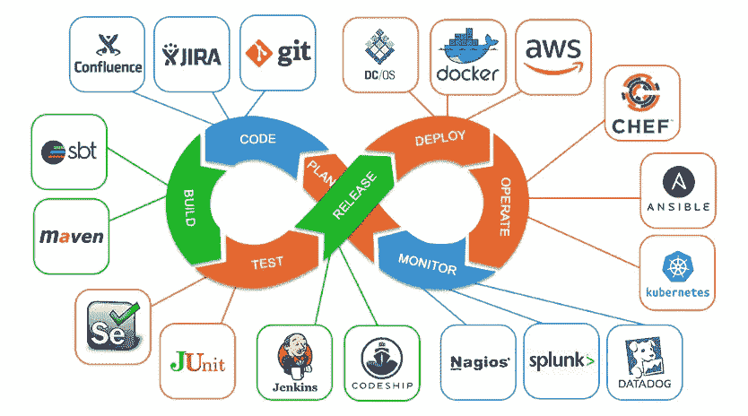
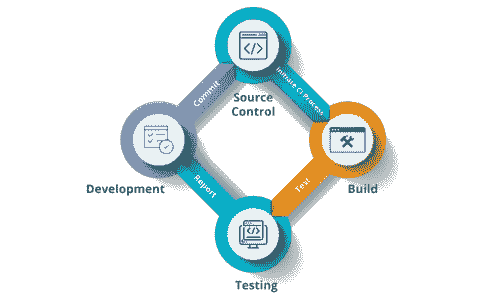
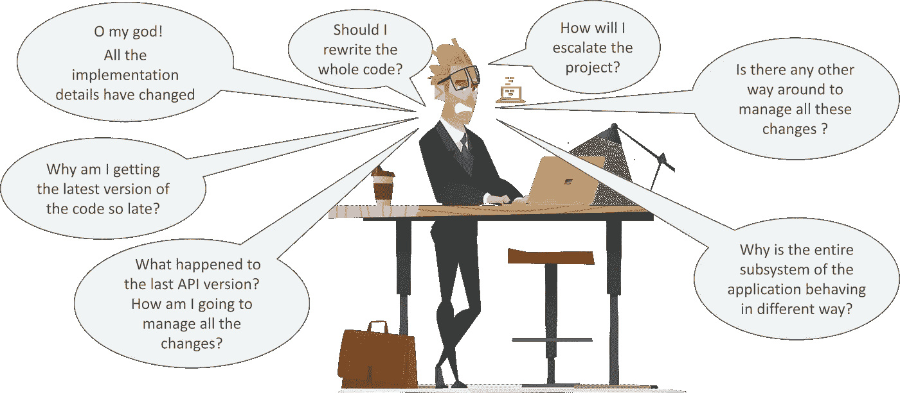
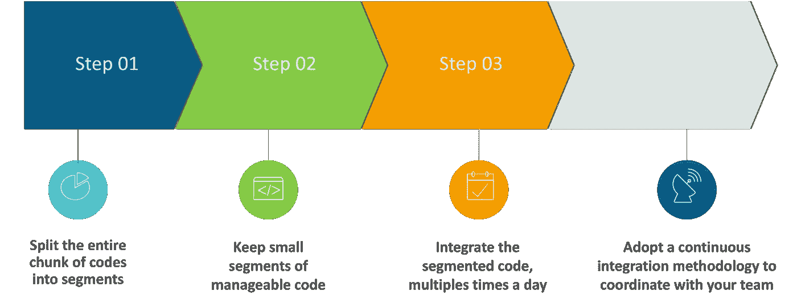
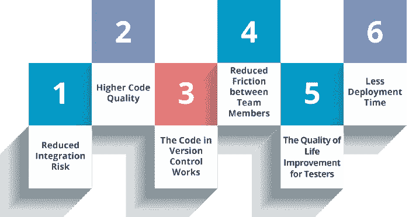
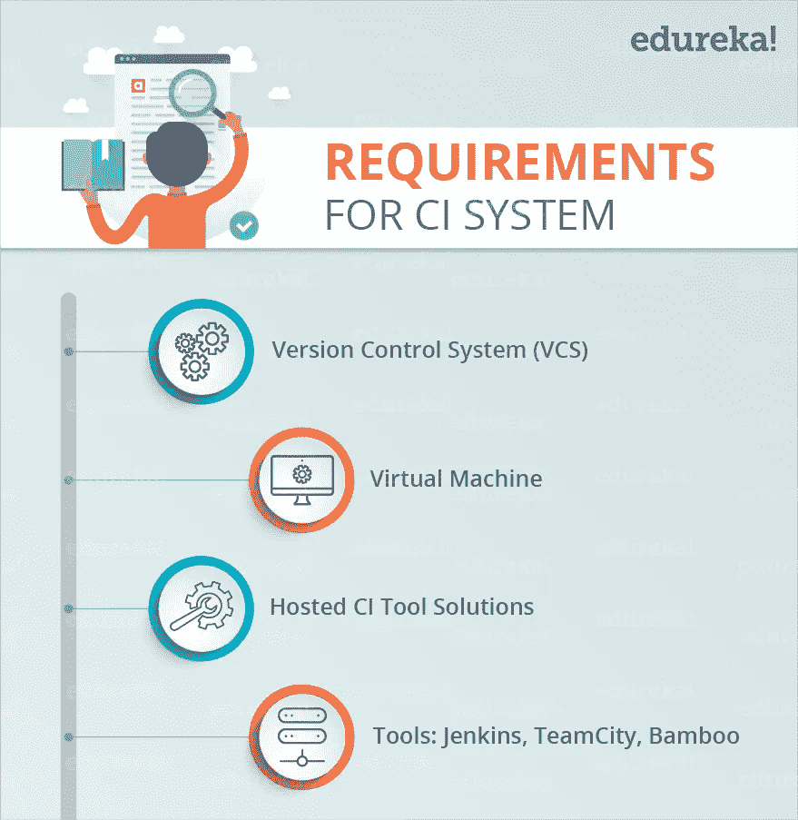
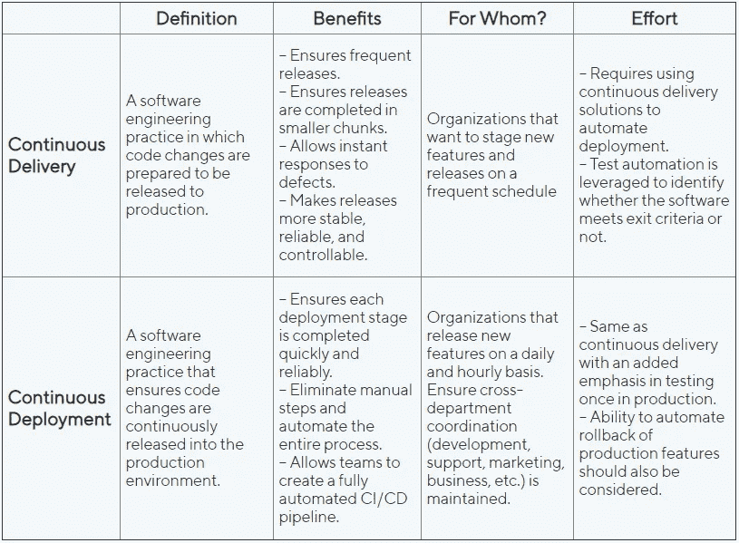

# 什么是 CI/CD 概念

> 原文：<https://blog.devgenius.io/what-is-ci-cd-concept-375cb226cf3d?source=collection_archive---------5----------------------->

## 简介:

CI 和 CD 有两种不同的含义，CI 即持续集成的含义

CD 意味着持续部署，CI/CD 有不同的含义，但不能在没有 CD 的情况下使用，也不能在没有 CI 的情况下使用 CD。这一概念适用于其中一些产品

**在这篇文章中，我想谈谈:**

1.  **什么是持续集成？**

**传统整合**

您团队中的所有开发人员都将编写他们的代码，在编写完代码后，团队集成应该都可以工作了，但在这种情况下，许多开发人员会为同一团队或另一个团队中的另一个开发人员更改代码，这就是我们在这种情况下的问题

**传统集成的问题**

但是上述问题的解决，用发展的步骤过程走着，看下图。

**持续集成**

**马丁·福勒的定义:**

> *持续集成是一种软件开发实践，团队成员经常集成他们的工作，通常每个人至少每天集成一次，导致每天多次集成。每个集成都由一个自动化构建(包括测试)来验证，以尽可能快地检测集成错误。许多团队发现这种方法可以显著减少集成问题，并允许团队更快地开发内聚的软件。*

但是马丁·福勒说

> 自动化你的构建、测试和部署过程会增加项目中经常发生的问题。因此，我们应该有一个可靠的集成方法，确保尽早发现错误。

## 持续集成的优势

1.  **降低集成风险:**通常，在项目中工作意味着许多人在单独的任务或代码部分上工作，这使得集成有风险。调试和解决这个问题可能非常痛苦，并且可能意味着对代码进行大量修改。更频繁地集成有助于将这类问题减少到最低限度。
2.  更高的代码质量:更加关注代码的功能会产生更高质量的产品。
3.  **版本控制中的代码有效:**如果您提交了破坏构建的代码，您和您的团队会立即得到通知，并且在其他人退出“破坏的”代码之前，问题就被解决了。
4.  减少团队成员之间的摩擦:建立公正的制度可以减少团队成员之间争吵的频率。
5.  对 QA 团队来说很容易:拥有不同版本和构建的代码可以帮助有效地隔离和跟踪 bug，并且让 QA 团队的生活变得更容易。
6.  **更少的部署时间:**部署项目可能会非常繁琐和耗时，自动化这一过程非常有意义。

## 竞争情报系统的要求

*   **版本控制系统(VCS)** 。它提供了一种可靠的方法来集中和保存随着时间的推移对项目所做的更改。
*   **虚拟机:**对于现场解决方案，您应该有一台备用服务器或至少一台虚拟机。一台干净的机器来构建你的系统是至关重要的。
*   **托管 CI 工具解决方案:**为了避免使用服务器或虚拟机，您可以选择托管 CI 工具解决方案，它有助于整个流程的维护，并提供更简单的可扩展性。
*   **工具:**如果您选择了自托管版本，您将需要安装许多可用的持续集成工具中的一个，如 Jenkins、TeamCity、Bamboo 等。

# 什么是持续部署？

**连续部署**比连续交付更进一步。这是一种软件工程实践，可以确保代码变更不断地发布到生产环境中。目标是每当开发人员做出更改时发布一个新版本，并自动将这些更改提供给最终用户。

持续部署是软件开发公司的终极目标。

在连续部署中，代码在模拟环境中运行和维护，确保最终质量得到考虑。实时监控实时环境也是跟踪任何出现的问题并快速解决它们的一个要求。

# 连续交付与连续部署|表格对比

# 结论

在这篇文章中，我解释了什么是 CI 概念，什么是 CD 概念，以及这些概念的作用是什么。

这篇文章非常重要，因为这两个概念在这个时候有非常重要的用途，因为整个世界都将实现所有操作的自动化。

# 参考

[https://medium . com/edu reka/what-is-continuous-integration-40 e 75 e 8326 e 8](https://medium.com/edureka/what-is-continuous-integration-40e75e8326e8)

[https://medium . com/katalon-studio/continuous-delivery-vs . continuous-deployment-where-to-draw-the-line-3d 220033 DFB 6](https://medium.com/katalon-studio/continuous-delivery-vs-continuous-deployment-where-to-draw-the-line-3d220033dfb6)

[https://medium.com/globant/basics-of-cicd-7a5aed1eda5a](https://medium.com/globant/basics-of-cicd-7a5aed1eda5a)