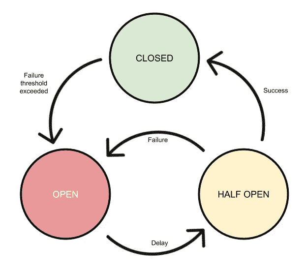
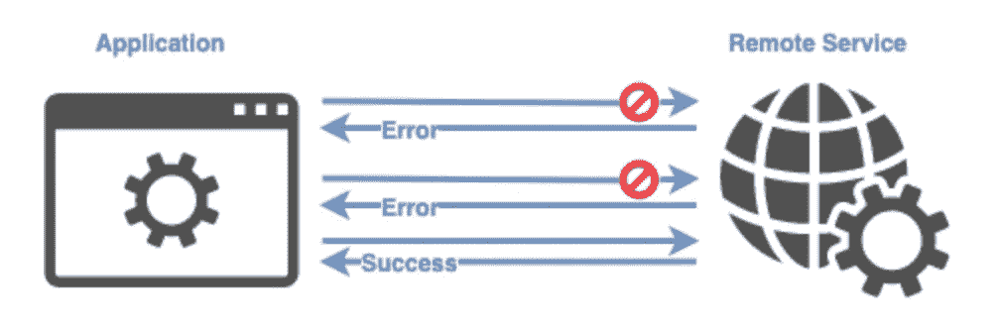
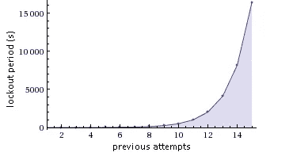
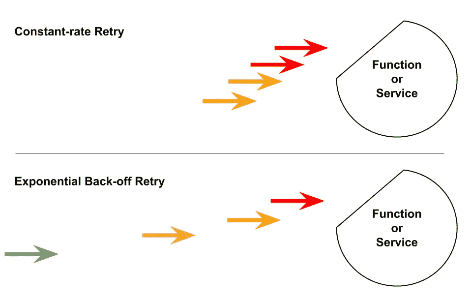

# 什么是断路器？我们为什么需要它？

> 原文：<https://blog.devgenius.io/what-is-circuit-breaker-why-do-we-need-it-f0ce20e386e0?source=collection_archive---------13----------------------->

**断路器**是现代**软件**开发中使用的一种设计模式。它用于检测故障，并封装了防止故障在维护期间、临时外部系统故障或意外系统困难中不断重复出现的逻辑。

断路器模式的目的是处理长期的瞬时故障。这种模式背后的想法是，我们将把服务调用包装在断路器中。

*   如果重试失败的次数达到某个阈值以上，我们将使该电路断开，这意味着该服务此时不可用。
*   一旦电路达到打开状态，对服务的进一步调用将立即向调用者返回失败，而不是执行我们的重试逻辑。
*   该断路器将有一段超时时间，在此之后，它将进入半开状态。在这种状态下，它将允许服务调用，该调用将确定服务是否可用。
*   如果服务不可用，它将返回到开放状态。
*   如果该服务在超时后变得可用，断路器将变为闭合状态。

在开发应用程序时，使用断路器模式可能有多种原因。在这里，我列出了一些原因及其解决方案。

***瞬时故障*** 瞬时故障是在与外部组件或服务通信时发生的故障，外部服务不可用。这种不可用或连接失败不是由于服务中的任何问题，而是由于一些原因，如网络故障或服务器过载。这些问题都是短暂的。如果我们再次调用该服务，我们的调用很可能会成功。这种故障被称为瞬时故障。

> **重试模式
> 实现重试的典型方式如下:**
> 
> 1.确定故障是否为瞬时故障。
> 2。定义最大重试次数。
> 3。重试服务呼叫，并增加重试计数。
> 4。如果调用成功，将结果返回给调用者。
> 5。如果我们仍然得到相同的故障，继续重试，直到达到最大重试次数。
> 6。如果在最大重试次数后调用仍失败，让调用者模块知道目标服务不可用。

重试模式

> 但是后退！！！！！

> 让我们设想一个场景，其中由于服务过载或在服务端实现了一些节流而发生了瞬时故障。我们的重试请求可能会进一步增加繁忙服务的过载，这意味着如果我们的应用程序有多个实例重试相同的服务，服务将处于过载状态更长时间，并且需要更长时间才能从这种状态中恢复。
> 
> 在重试中使用**指数补偿**的想法是，在每次重试失败后，我们增加重试之间的等待时间，而不是在等待固定时间后重试。因此，对于指数补偿，我们的重试算法将如下所示:
> 
> 1.确定故障是否为瞬时故障。
> 
> 2.定义最大重试次数。
> 
> 3.重试服务呼叫，并增加重试计数。
> 
> 4.如果调用成功，将结果返回给调用者。
> 
> 5.如果我们仍然得到相同的故障，增加下一次重试的延迟时间。
> 
> 6.不断重试并不断增加延迟时间，直到达到最大重试次数。
> 
> 7.如果在最大重试次数后调用仍失败，让调用者模块知道目标服务不可用。

> ***指数退避*** 影响重试算法，使其更有弹性。

