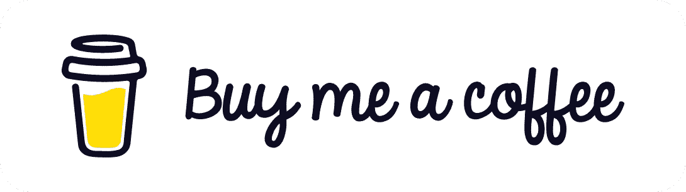

# 什么是“干净的代码”,为什么要关心它？

> 原文：<https://blog.devgenius.io/what-is-clean-code-and-why-even-care-93e4b294f653?source=collection_archive---------5----------------------->

大多数开发人员在其职业生涯的早期阶段都有“只要能工作就很好”的方法。然而，在一些经历和加入一个团队后，他们有这种感觉，这并不容易。目前，大型项目是由许多人编写的，这是一个非常有活力的团队。为了保护代码的动态性和由另一个开发者扩展项目，代码必须是可理解的是至关重要的；这就是所谓的“干净代码”。

尽管说干净的代码由一套标准维护听起来很简单，但实际上本质上是开发人员的纪律。从项目开始，团队中的开发人员必须就一些标准达成一致，并遵守这些规则，以便防止未来的复杂性。此外，标准必须是通用的，以便新的开发人员能够容易地遵循。简而言之，如果你想扩展你的项目，你必须保持干净。

*土耳其语版本*

 [## 你不知道吗？

### kod yaz Maya yeni baland NDA " al t sürece nasl yazd n Bir nemi yok " an lay n Bir ok yaz l mcaz da olsa……

medium.com](https://medium.com/@Mellowdevs/temiz-kod-nedir-ve-ne-i%C3%A7in-%C3%B6nemsenir-8146d1e504d0) 

**臭码怎么了？**

让我这么说吧:想象一下这样一种情况，你有一个杂乱无章的工作台，它并不那么乱，所以你认为可以稍后再整理。你继续工作，桌子变得更乱了；你认为你以后会处理它，等等，等等，最后你决定重新组织它，但是你有一个最后期限。你开始了一点点，但之后你不得不工作；但是桌子变得比以前更乱了。现在你意识到，如果不从工作中抽出时间，你不可能清理你的办公桌。接下来，你停止工作，把所有的注意力和时间都放在办公桌上，但是问题太大了，你不知道什么属于哪里，你需要另一双手。你向你的室友寻求帮助，并偷走他们的时间来整理你的桌子。不幸的是，因为你已经停止了你的项目工作，另一个应用程序已经开发了你计划要做的所有特性，在一天结束的时候，你已经结束了一个财务和道德损失的混乱的办公桌。

这就是臭码会造成的。你可能相信你已经控制了局面一段时间了；然而，一旦项目越来越大，越来越复杂，代码也会越来越混乱。最终，该项目的开发人员将会花费一些时间来修改现有的特性，而不是开发新的更酷的特性。当有一个新的团队成员或者在代码审查会议期间，为了理解你的代码意味着什么，会出现大量的时间损失。

综上所述，如果在开始项目之前没有掌握编写干净代码的原则，那么臭烘烘的代码将是最令人头疼的事情。

**如何识别臭码？**

这很容易。它闻起来太难闻了，你就是知道。有臭味的代码会让读者感到困惑，并在他们头上留下问号。

1.  难以理解
2.  未打开扩展，需要修改新功能
3.  隐藏意图
4.  这些对象是紧密耦合的，并且相互依赖。

**为什么开发者会写臭代码？**

要想成为一个好的编码员，经验是关键；但是我认为编码并不是成为一个好的编码者的唯一要素。理解什么是好的、干净的代码就足够了。这种经验是通过阅读其他开发人员的干净代码示例和关注代码审查会议获得的。有了这两种方法，开发人员将会知道他们的代码散发出某种难闻的气味，以及如何去除它。

即使是有经验的开发人员有时也会写出糟糕的代码，这主要是因为来自上层管理的截止日期压力。如果没有时间来检查代码并进行必要的调整，它将会一直很糟糕，因为它做了要求它做的事情。

有时候，开发者可能会说“我以后再修”；而且你知我知，这个开发商多半是个骗子。因为正如鲍勃大叔(罗伯特·马丁)所说

> “以后等于永远不会”。

**干净代码需要遵循什么标准？**

当有人说“干净的代码”时，首先想到的肯定是“罗伯特·c·马丁的干净的代码”。我强烈推荐这本书给每一个开发人员，这是一本有趣且有收获的读物。这些主题解释简单，但也很详细。我将简要介绍这本书的四个章节，我认为这些章节是最重要的，对第一步有好处。

**命名**

为变量、函数和类找到最合适的名字确实是一个挑战；然而，选择最好的名字是至关重要的，所以值得一些思考。

1.  名字必须揭示其内涵。例如，当给一个变量命名时，我们可以根据个人喜好使用任何单词或任何字母组合，这样代码就能工作；但这不是正确的做法。例如，对进程进行计数，可以为变量选择“myVar”或“count”名称，但是当您将其命名为“count”时，读者会立即理解该变量的用途。对于“myVar”来说，情况并非如此。它没有告诉任何关于变量的事情，所以读者必须阅读实现，有时，实现也没有揭示意图。
2.  每种编程语言在命名方面都有自己的惯例。最常见是用小写首字母命名变量和方法；大写字母代表类。然而，在 GoLang 中，当第一个字母大写时，意味着变量是公共的；小写则为 private。因此，将被公开访问的变量的名称以小写开始，因为它是一个变量，这将导致一些严重的问题。
3.  你不需要称赞来解释名字。名字本身应该给出信息。
4.  命名时避免误传。名称必须清晰准确；它不应该声明任何不相关的内容。
5.  尽可能保持你的名字简短。名字越长，名字越混乱。您可以选择一个将在整个 IDE 中传播的名称；但是你为什么想那样做(反问，我知道你不想那样)？这对任何人都没有帮助。你可能会选择更可爱的“*更新计数*，而不是使用名称“*唯一且非常特殊的计数，它将保持多少次另一个特殊的变量已处理但什么也没处理。*
6.  避免使用缩写。如果没有关于“conn”的信息，没有人会有时间去编码这个名字。但是“mongodb_conn_host”的信息量要大得多。
7.  最后但同样重要的是，相似的概念用相似的方式命名。当读到相似的名字时，我们的超级大脑会将它们联系起来。如果您在命名时使用了“教师”，请使用“教师”关键字来命名类似的类。比如“TeacherController”和“TeacherService”会告诉我们它们依赖于产品对象本身；然而“EducatorController”和“EducationService”这两个名字只会让一些人感到困惑。

**功能**

1.  函数必须简短。一些从事大型项目的开发人员会极力辩解说，编写简短的函数并不总是可行的；然而，他们也会同意我的观点，大函数是不可读的。较长函数往往被分成较小的函数；但是一开始不容易看出来。
2.  你只有一份工作...不要让一个功能来承担其他功能可以轻松完成的所有负担。让它有且只有一个责任。赋予一个功能多于一个的职责将会增加依赖性，这违背了可靠的设计原则:*单一职责。*
3.  此外，保持参数列表简短。我们可能想要长而复杂的论点列表，但是我们真的需要它吗？尽量把论点结合起来；检查你是否在其他地方也有类似的参数列表。如果是这样，这意味着你也可以使用一个对象。例如，如果您分别使用 x 和 y 坐标数字；请注意，这是一个点，所以点对象将解决所有问题。此外，在理想的编码世界中，函数没有参数；但我们是现实的人，所以尽量简短。
4.  使用动词来命名函数，因为它们会做一些事情。
5.  最后，这些功能必须没有副作用。假设你的函数将被另一个开发者使用(这很可能发生)。其他开发人员不应该担心可能发生的异常或错误。您负责处理任何异常和“空”返回。请不要返回 null，这是痛苦的…

**类**

1.  你如何组织你的课程也很重要。从全局变量开始:公共常量和公共变量。然后，编写私有静态变量，私有变量，最后是函数(首先是公共函数)。
2.  类应该像函数一样小。确保如果可能的话，将这些方法分配给其他类。此外，长类可能有太多或太长的方法(或者更糟:两者都有！).这将导致代码味道糟糕，并失去设计的逻辑。
3.  根据单责任设计原则，一个类应该有且只有一个责任。如果你认为这个类中的所有方法都是为了那个责任而存在的，那么请再想一想。

**评论**

1.  如果你需要注释来解释你的代码，修改你的代码。它是不言自明的，没有注释。
2.  注释代码片段会导致脏乱。如果你不需要这段代码，为什么还要写呢？如果您可能需要它，那么为什么要注释掉它呢？
3.  你不需要提供太多的信息。“我写这段代码是因为我认为 bla bla ..”我们不需要这些类型或注释，因为你和我都是优秀的开发人员；我们的代码会自己讲述这个故事。
4.  没有必要对代码中的位置进行注释。例如，在变量实现上面写*"////VARIABLES//////*是没有意义的，因为任何一个了解变量是什么的人都会知道你正在用心实现一组变量。任何不这样做的人都不会阅读你的代码，不要担心非开发人员。

《干净的代码》这本书对于那些想要获得编写干净代码的哲学的人来说是一个很好的指导。另外，我发现有四条格言非常容易记住，那就是干净的代码应该是什么样子。

*   **吻**:保持简单愚蠢→有多想的必要。保持你的基本思维。
*   **干**:不要重复自己→如果你不止一次在做一个过程，试着为它写一个方法
*   **DIE** :重复是恶→如果你在一遍又一遍的重写同样的台词，那就好好看看。
*   **YAGNI** :你不会需要它的→在它被要求之前不要构建未来的特性。你可能不需要它。

我希望这篇文章能让你有一种冲动，去回顾那些你想得太多的复杂代码，并尽可能保持代码的整洁。我强烈推荐《干净的代码》这本书给那些想要深入研究的人。另外，干净代码原则不是你突然得到的东西。关于什么是好的和坏的代码，这需要实践和经验。我的建议是，在提交代码之前，至少要考虑两次如何让你的代码更简单，是否对其他开发者来说是干净的。祝大家编码干净！

资源

1.  干净的代码——罗伯特·马丁

2.[https://link.medium.com/SYvUCmYsPlb](https://link.medium.com/SYvUCmYsPlb)

为支持❤，请我喝杯咖啡

*更多内容尽在*[*blog . dev genius . io*](http://blog.devgenius.io)*。*