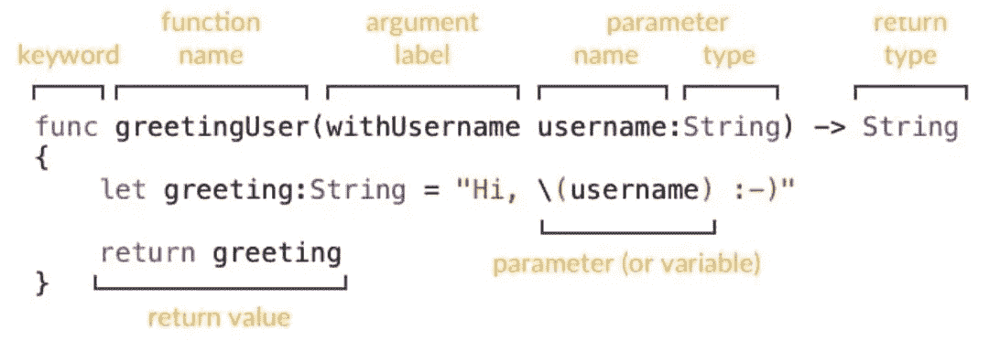

# 用 Oop 概念解释 Swift 中的闭包是什么

> 原文：<https://blog.devgenius.io/what-is-closures-in-swift-explained-with-oop-concepts-aecfe3967592?source=collection_archive---------7----------------------->

在每一种编程语言中，我们都有函数。函数接受参数并处理它们来执行单个相关的动作。在 swift 函数中可以将其他函数作为参数。

swift 中的功能示例

我认为这就像面向对象编程中的多态性。例如，我们有一个像计算器一样的通用函数。计算器接受整数、双精度等参数。，还有一个功能。通过这个函数，我们知道如何处理其他参数。在多态中，我们有一个像动物一样的通用类。其他类从这个类继承并实现它们各自的特征。在闭包里，我们有一个通用函数，当我们调用这个函数时，我们可以实现自己的特性。从这个角度来看，我认为非常相似。

我们可以以两种不同的方式使用闭包；一个人可以创建另一个函数，我们把这个函数作为参数添加进去；这是一条很长的路。

第一种方式

另一种方法是一种非常简单的方法，我们可以在参数区实现该功能

第二种方式

在计算器函数的参数中，我们创建了一个新函数；我们的函数与第一个加法函数完全相同。它采用两个参数(Int，Int)->(Int)并返回计算结果。

你好，如果你需要，我制作 ios 应用程序；你可以从[点击](https://apps.apple.com/developer/halis-bilal-kara/id1537304083)查看我的应用