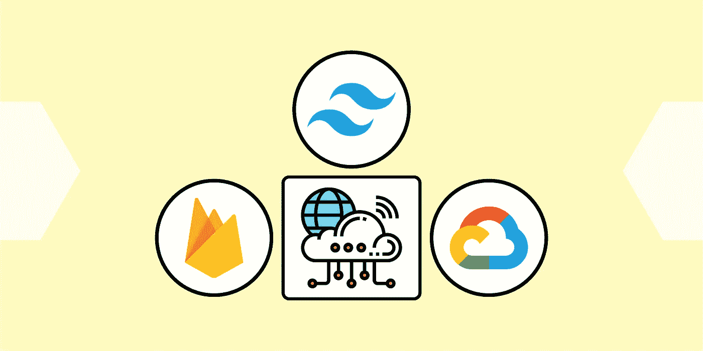
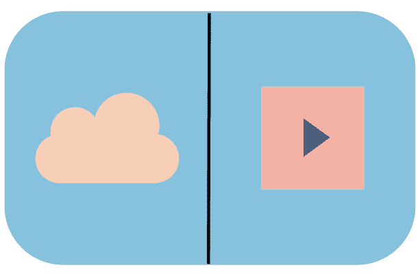

# 什么是云原生？面试要知道什么

> 原文：<https://blog.devgenius.io/what-is-cloud-native-what-to-know-for-your-interview-dc8da4fc1728?source=collection_archive---------2----------------------->

图片来源:作者

云原生技术已经成为现代软件开发的重要组成部分。云原生架构允许我们通过使用容器、微服务、DevOps 和 API，以有组织和高效的方式处理需求的突然激增。随着对云工作的需求如此之高，你可以通过发展强大的云技能来帮助自己在竞争中脱颖而出。

在本文中，我们将探讨术语云原生，并讨论云原生架构的优势，如何构建云原生应用程序，以及在云访谈中需要了解的内容。

我们开始吧！

**我们将讲述**:

*   什么是云原生？
*   云原生应用与传统应用
*   如何构建云原生应用
*   云原生面试要知道什么
*   总结和后续步骤

# 什么是云原生？

Cloud-native 是一种应用程序开发的**方法**，它使用云计算交付模型。云原生开发旨在通过利用云提供的可伸缩性、弹性和灵活性来增强现代应用程序开发。

根据云原生计算基金会(CNCF)的定义，“云原生技术使组织能够在公共云、私有云和混合云等现代动态环境中构建和运行可扩展的应用。”

> ***注****:CNCF 由 Linux 基金会于 2015 年创建。这是一个开源软件基金会，旨在推广云原生技术。微软、甲骨文和英特尔等公司都是该基金会的成员。他们支持开源项目，比如 Kubernetes、Envoy 等等。*

云原生应用开发利用容器化、服务网格、声明式 API 和微服务等工具，让您能够构建、部署和管理**高影响力**云原生应用。云原生服务使用 Docker、Kafka、Kubernetes 和无服务器功能等技术来帮助您在私有云和公共云环境中高效地构建和运行可扩展的应用程序。

# 云原生架构

云原生架构侧重于设计存在于云中的应用或服务，而不是内部基础架构。云原生架构使我们能够创建和部署易于维护且具有**灵活性**的应用，而无需依赖物理服务器。

**微服务**和无服务器功能在云原生架构中非常重要。微服务是云原生 app 架构的主要部分之一。许多公司使用它们，因为它们支持 DevOps、提高可伸缩性、降低成本并实现灵活性。

微服务和容器化支持云原生应用，使我们能够在云提供商之间切换，独立部署服务，并以不同的语言或框架毫无问题地部署服务。在您的应用程序开发流程中实现云原生架构有很多好处。让我们来看看一些好处和挑战:

**好处**

*   **持续集成**:微服务帮助我们进行持续集成和持续交付工作，因为开发生命周期缩短了，更多的过程自动化了。
*   **容器编排**:容器编排者可以根据用户需求调度和分配资源。开源容器编排平台帮助我们识别特定容器中的错误，以便我们可以找到问题的根源，而不是影响整个应用程序。
*   **可移植性**:容器化的微服务非常可移植，这意味着我们不需要太依赖某个特定的云提供商。
*   **减少停机时间**:Container orchestrator 帮助我们以更少的停机时间部署软件更新。
*   **快速开发时间**:云原生架构有助于我们加快那些必须在不同环境中计算资源的组织的应用开发流程。这也让我们能够从混合云中获得更多价值。

**挑战**

*   **缺乏 DevOps** :如果您的组织没有建立 DevOps 管道，可能很难管理您的应用中的分布式工作流和微服务。
*   **微服务**:某些微服务依赖于特定类型的操作系统，所以在继续发展之前一定要考虑到这一点。
*   **依赖性**:如果从传统应用过渡到云原生应用，可能会出现依赖性和相互依赖性。

图片来源:作者

# 云原生应用与传统应用

传统应用程序是运行在大型机环境或客户端/服务器环境中的基本应用程序。云原生应用实施云计算交付模型来改进应用开发流程。

让我们来看看云原生应用和传统应用之间的一些主要差异:

**云原生**

*   **可预测的**:云原生应用遵循一个框架，该框架通过可预测的操作来帮助优化弹性。云平台使用自动化、容器驱动的基础设施来驱动我们编写软件的方式。
*   **协作**:由于云原生架构使用 DevOps，app 开发流程更加精简。
*   **实际容量**:云原生应用开发自动化基础设施供应，这有助于在部署时分配适当的资源。
*   **独立**:微服务架构将应用分成更小的服务。这使得执行更新和扩展服务变得更加容易，而不会影响应用程序的其他方面。
*   **连续发布**:个人更新一准备好就可以发布。
*   **操作系统抽象**:云原生架构允许我们脱离底层基础设施依赖，专注于软件。

**传统**

*   **不可预测**:传统的应用程序是以特定的方式开发的，它们没有利用云计算交付模式的好处。这意味着传统的应用程序可能需要更长的时间来构建，并且它们可能有更多不频繁的发布。
*   **孤立的**:传统的应用程序开发不使用 DevOps，因此不同团队之间的协作通常较少。
*   **大容量**:定制基础设施解决方案由于容量过大，可能会延迟应用部署。
*   **依赖**:整体架构将服务捆绑到单个包中，这导致了服务之间的依赖。这可能会影响更新和扩展。
*   **延迟交付**:更新可能会延迟，影响应用程序的性能。
*   操作系统依赖:传统的应用程序开发通常涉及应用程序本身和底层操作系统之间的依赖。

# 如何构建云原生应用

在构建和操作云原生应用时，我们可以使用许多不同的工具和实践。让我们来看看一些基本原理:

# DevOps

DevOps 是理念、实践和工具的组合，可提高组织快速高效地交付应用和服务的能力。DevOps 使我们能够**充分利用本机云功能**，并确保开发和运营团队在定期沟通和共同目标的基础上合作。有了 DevOps，我们的软件开发过程更加一致和高效。

# 微服务

微服务架构包括将应用程序开发为较小服务的集合。每个微服务都可以独立于同一应用程序中的其他服务进行操作。这实现了更加精简的应用程序开发生命周期，而不会对用户产生负面影响。

# 连续交货

敏捷开发实践使得持续交付成为可能。这意味着我们通过自动化不断地进行分阶段的软件变更。这是一种非常**可靠的**方式，可以更频繁、更安全地发布和交付软件。

# 蜜蜂

由于云原生应用严重依赖微服务，我们需要一种定义良好的方式让这些独立的服务相互通信。这就是 API 的用武之地。应用程序编程接口(API)连接产品和服务，并允许它们**轻松地交流**，因此我们可以最大化开发过程。

# 集装箱化

与传统虚拟机相比，使用容器给了我们更多的**效率和速度**。通过容器化，单个操作系统实例被划分到一个或多个容器中，这允许我们创建和部署单独的微服务。

图片来源:作者

# 云原生面试要知道什么

如果您想在云领域工作，了解云原生应用程序开发非常重要。让我们讨论一些你应该知道的基本信息，以及在你进行与云相关的面试之前你可以做的有用的事情:

# 云计算

你期望的技能和知识在很大程度上取决于你面试的职位。总的来说，你仍然需要对云计算的基础有一个坚实的理解。确保你具备回答关于云的基本问题的知识。

你的准备和学习主题将取决于你申请的职位。确保温习与你想要的工作相关的**想法和技术**。同样重要的是，你要展示你对云计算有一些**实践经验**。如果你没有经验，你应该对概念有一个坚实的理解，并能够在更高的层次上解释它们。

# 云认证

云认证向潜在雇主表明你对云计算的基础有着扎实的理解。超过 80%的招聘经理表示，云认证让申请人更受欢迎。现在市场上最受欢迎的认证是 AWS、Azure 和 GCP。不管你选择什么样的认证，多种云技术都是非常受欢迎的，所以你有足够的空间来移动。

# DevOps

DevOps 是一种策略，通过允许操作反馈直接到达开发人员来帮助加速应用程序开发。这意味着云工程师会在应用的整个生命周期中跟踪应用。对于面试，准备回答关于灾难控制、反馈和自动化数据管理的问题。

# 软技能

别忘了**软技能**！现在，科技公司比以往任何时候都更需要具备专业技能和软技能的全面发展的候选人。一定要突出展示你的灵活性、适应性、沟通技巧和客户服务精神的经历。

# 总结和后续步骤

恭喜您迈出了云原生应用的第一步！云原生开发越来越受欢迎，因此对于软件开发职业来说，了解这一点很重要。关于云原生应用程序开发，还有很多东西需要学习，例如:

*   设置连续部署管道
*   功能切换
*   单一报告

*快乐学习！*

# 继续阅读关于云的内容

*   [云工作路线图:如何以及为什么成为云工程师](https://www.educative.io/blog/roadmap-to-cloud-engineer-jobs)
*   Azure 中的微服务:简介
*   [AWS 快速教程:你绝对应该使用的服务](https://www.educative.io/blog/amazon-aws-best-services)