# 什么是 CSS flexbox？

> 原文：<https://blog.devgenius.io/what-is-css-flexbox-f0ef19726282?source=collection_archive---------14----------------------->

CSS 开发教程

[KOBU 机构](https://unsplash.com/@kobuagency?utm_source=medium&utm_medium=referral)在 [Unsplash](https://unsplash.com?utm_source=medium&utm_medium=referral) 上拍摄的照片

*   **Flexbox 是 CSS3 中的一个新模块，可以很容易地以不同的方向和顺序将元素相互对齐，并在必要时改变不对齐的情况。例如用于响应式设计。**
*   即使你不知道这些元素的尺寸，这也能很好地工作，因为
*   flexbox 背后的主要思想是让容器能够扩展和收缩元素，以最好地利用可用空间。
*   所以，有了 Flexbox，你可以很容易地用更少、更可读、更符合逻辑的代码替换浮动布局。正因为如此，
*   Flexbox 完全改变了我们构建布局的方式，尤其是一维布局，因为这是 flexbox 真正的亮点
*   对于二维布局，实际上有更好的构建方式。例如，使用 **CSS 网格**布局。

**鉴于上述所有原因，Flexbox 是 CSS 的一次真正革命**。它让我们作为 CSS 开发人员的生活变得更加轻松。这就是为什么在本文中，我们将学习 flexbox 的关键基础知识。

# Flexbox 中的概念

在你我使用 CSS flexbox 之前，没有那么多需要了解的东西。我们需要知道的是:

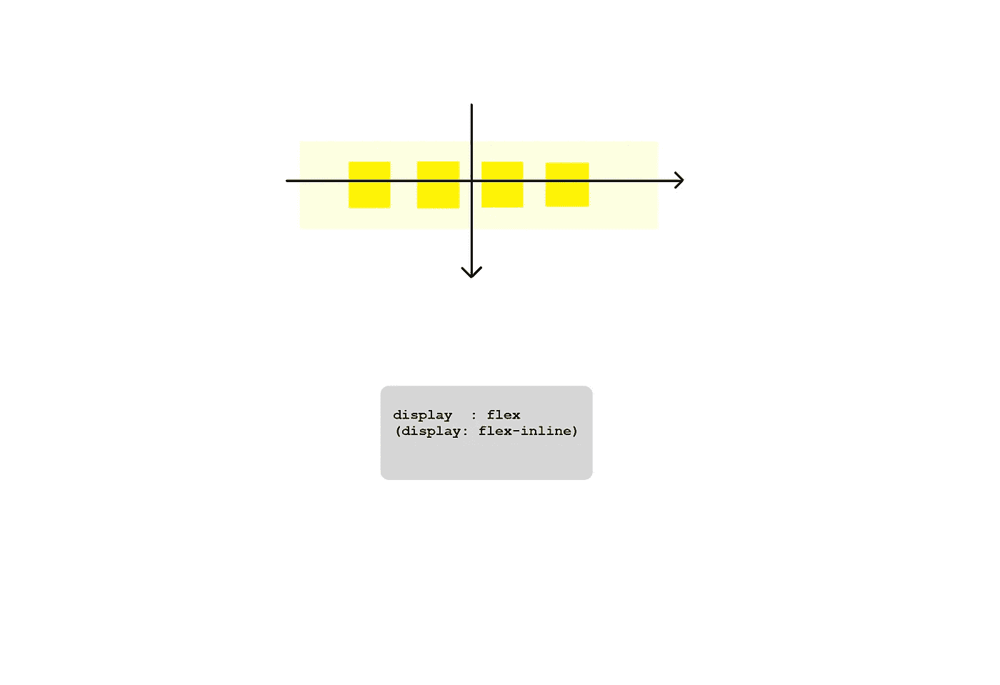

1.  我们在其上使用 flexbox 的元素被称为 **flex 容器**，为了创建一个 flex 容器，我们所要做的就是将其显示属性设置为 flex。我们也可以将它设置为 **flex-inline** ，这将创建一个 flex 容器，并像内嵌元素一样进行设置。

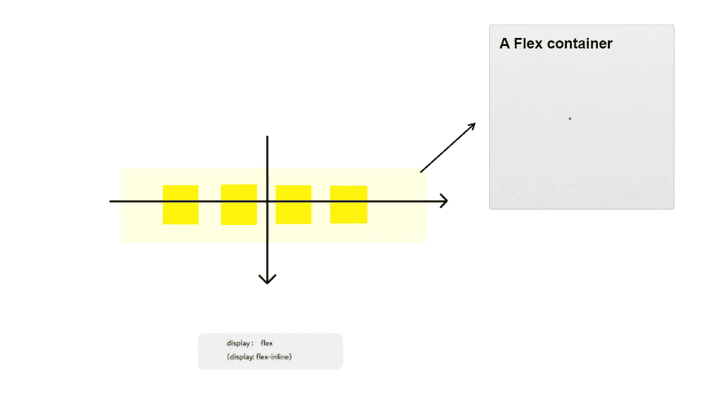

2.flex 容器的所有直接子容器被称为 **Flex 项目**

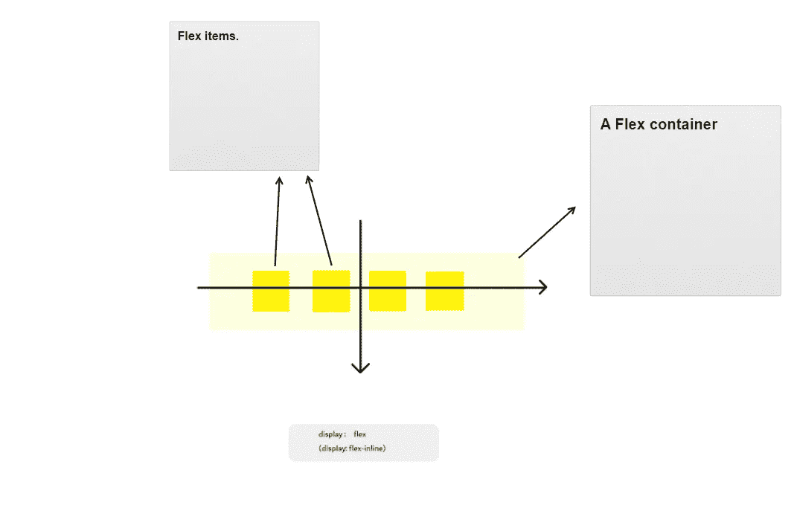

3.伸缩项目的排列方向称为**主轴**，箭头从左向右。然后另一个垂直轴被简单地称为**横轴**。我们需要记住这些轴的名称，因为我们可以改变**主轴**的方向，也因为沿着**主轴**和**横轴**有不同的对齐元件的方式。让我们试着不要忘记这些，这样我们才能完全理解不同的 Flexbox 相关属性是如何工作的。这是我们的下一个话题

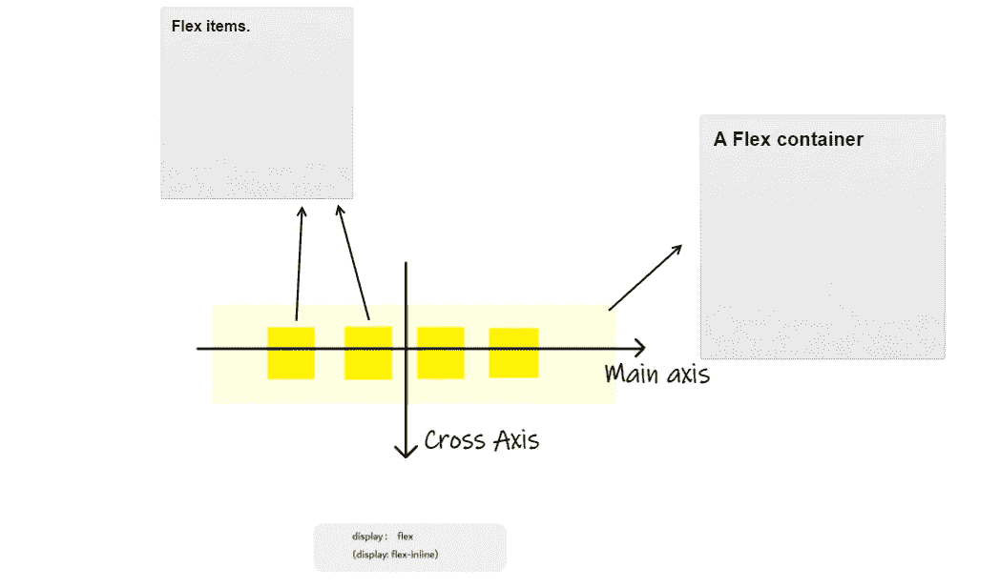

# 不同的 Flexbox 属性如何工作

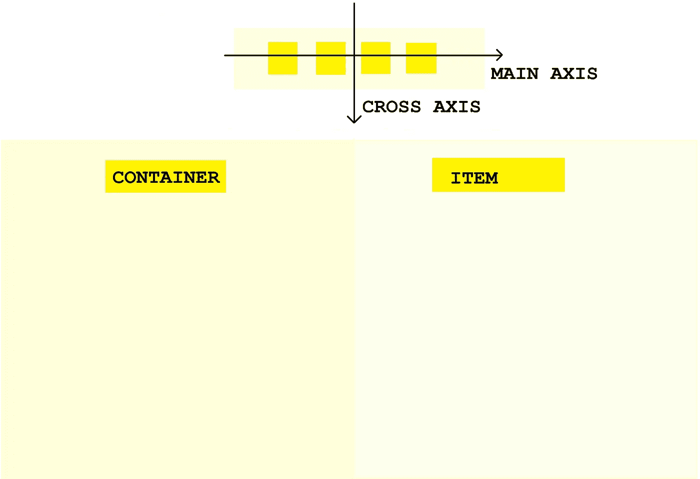

*   因此，flexbox 规范定义了我们在 Flex 容器上使用的几个属性，以便定位和对齐所有 Flex 项目。
*   然后是我们直接在 flex 项目本身上使用的一些其他属性。现在，这里是对所有这些属性的简要总结，这样你和我就可以了解 Flexbox 是如何工作的，有多少属性以及它们是如何工作的。

## 因此，Flex 容器的属性如下:

1.  *伸缩方向*:指定主轴往哪个方向。下面是该属性的名称及其可能取值的图片，其中第一个值是初始值。那是**默认的**值。因此，方向可以是一行，这是下图中的默认方向。但它也可以反方向走，甚至向上或向下，这样就会形成一根柱子。当我们在实践中把这些概念形象化时，它们会变得更容易。但是现在，我们只需要让自己熟悉这些属性，并意识到这些属性的存在。

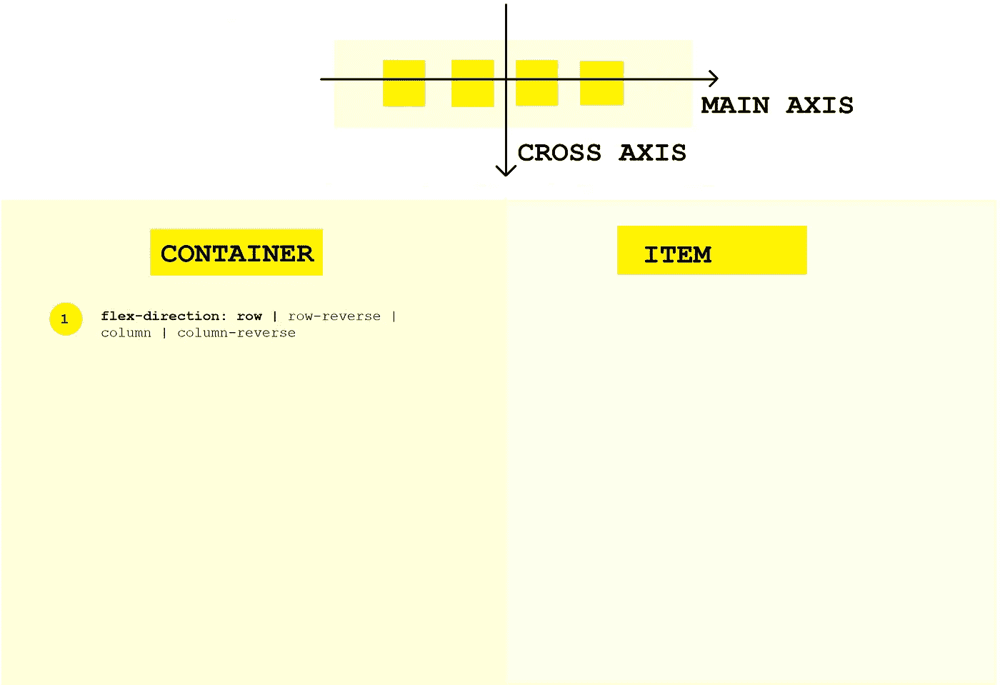

2. *flex-wrap:这个简单的函数定义了当 flex 容器中没有足够的空间时，flex 项目是否应该换行。*

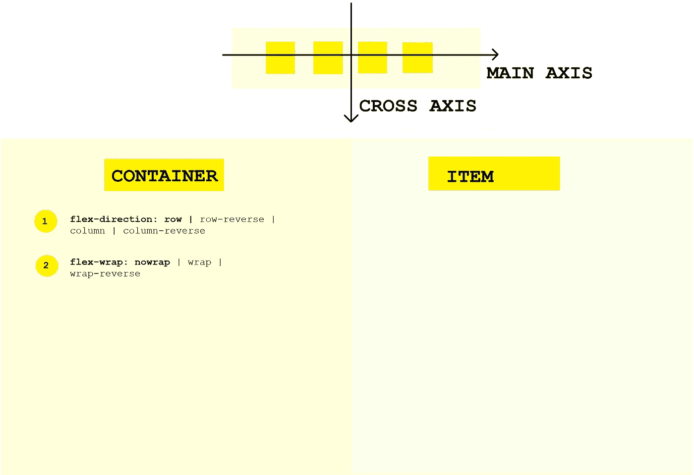

*3。justify-content* :这定义了伸缩项如何沿着主轴对齐。所以知道主轴在哪里超级重要。

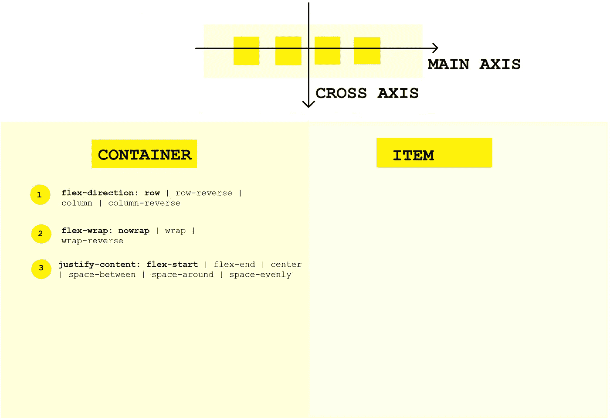

*4。align-items* :这个属性与 justify-content 非常相似，不同之处在于**这个属性定义了伸缩项如何沿横轴对齐，**不是主轴。所以 align-items 通常与 justify-content 一起使用。这两个属性可能是所有 flexbox 属性中最重要的。

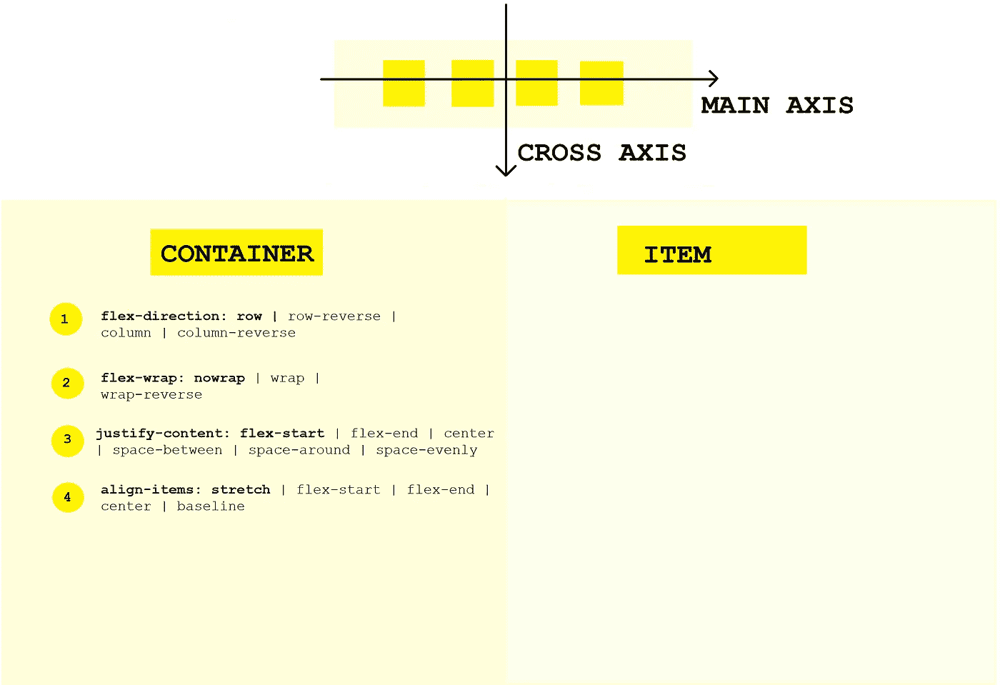

*5。align-content* :这仅适用于有多行弹性项目的情况。在这种情况下， **align-content 控制行如何沿横轴**对齐，如果有一些空白空间的话。

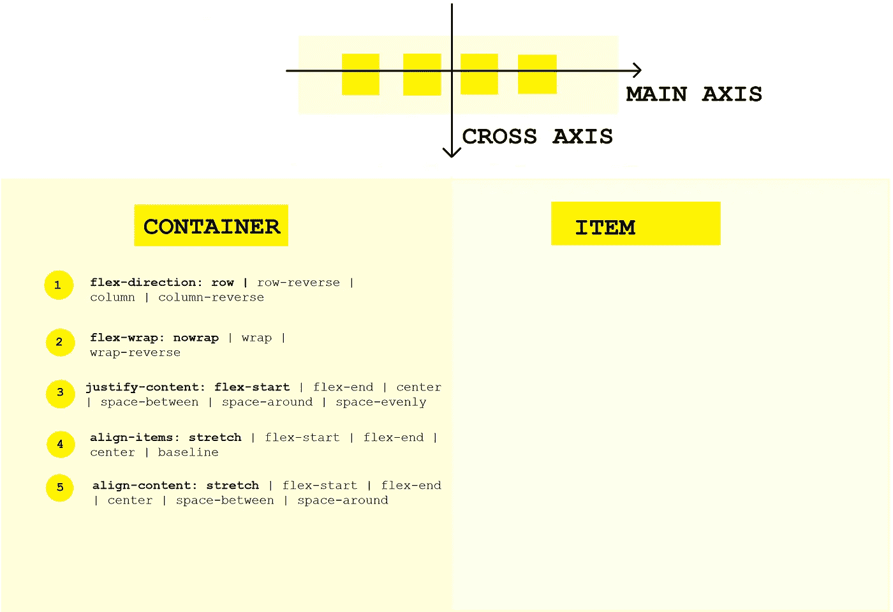

## 不要担心，我们将在下一篇文章中看到这方面的代码。

# 因此，关于 flex 项目的属性:

1.  *align-self:它与 align-items 非常相似，只是针对一个单独的 Flex 项目。想象一下，我们将对齐项目设置为居中，但是我们希望其中一个项目在底部对齐。为此，我们可以使用 align-self。*

*2。order* :定义了一个特定的 Flex 项目在容器中出现的顺序。这在重新排序项目时非常有用，例如对于较小的屏幕。

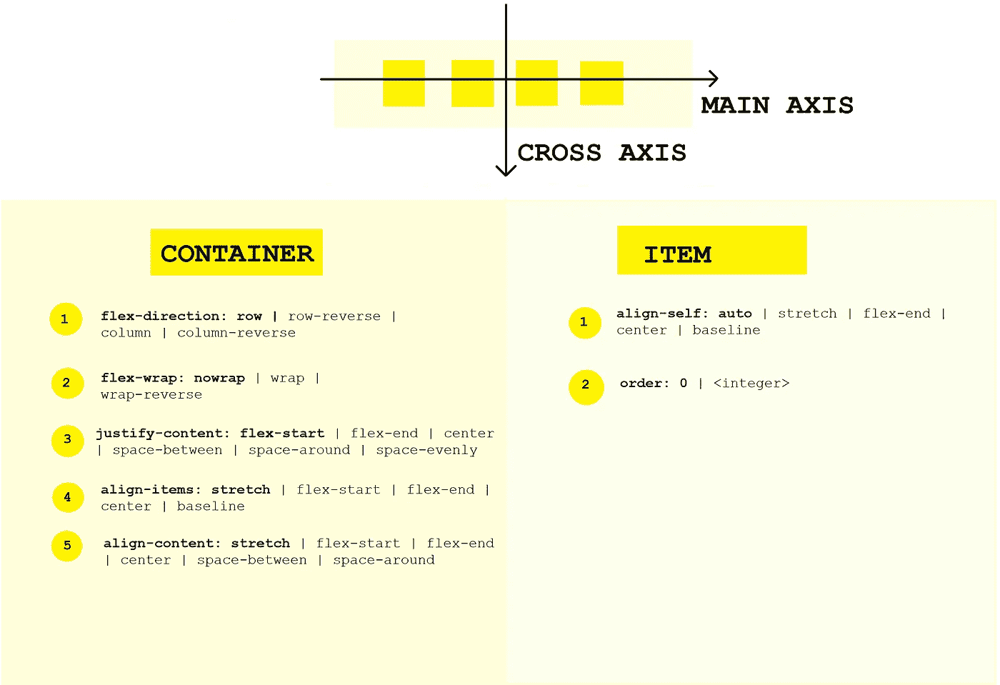

3.最后，我们有 3 个属性，它们共同帮助 Flexbox 决定一个 Flex 项目的宽度。它们是*伸缩*、*伸缩*和*伸缩*。

*   灵活增长:用这个，我们定义一个项目可以增长多少
*   伸缩:用这个，我们定义一个项目可以收缩多少
*   *弹性基础*:通过它，我们可以定义一个项目的基础宽度

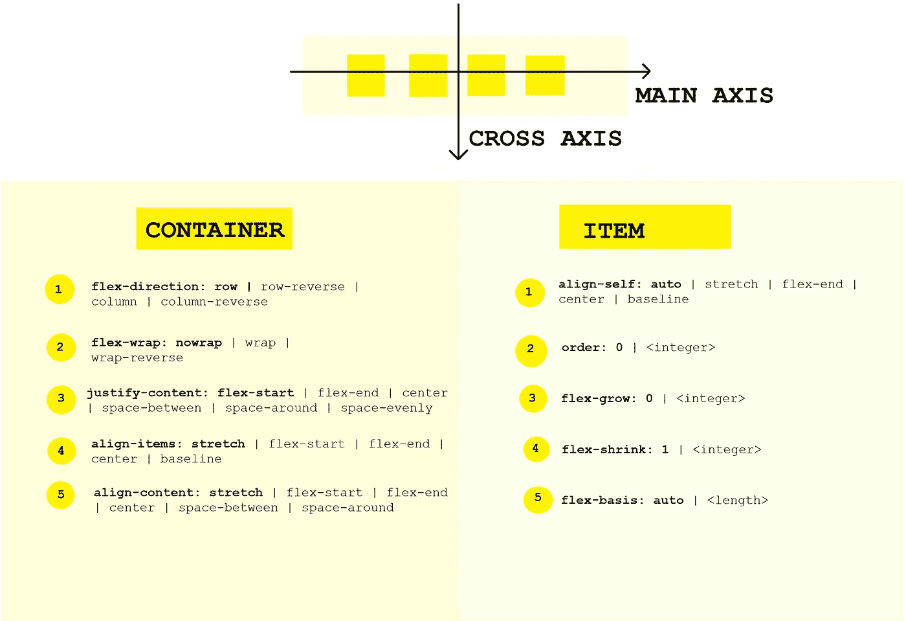

*以上属性还有一个简称，简称为* ***flex*** *。这是我们会使用的一个，因为这是常见的做法。*

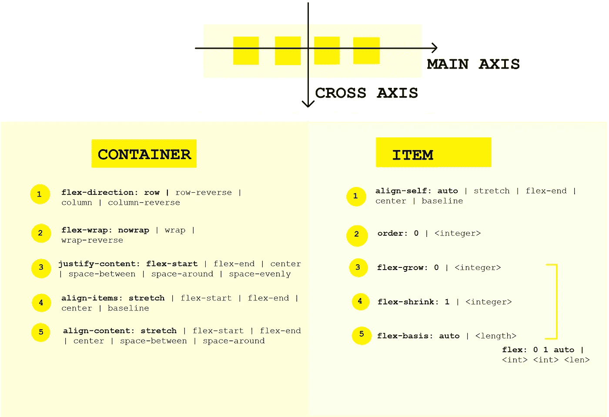

**注意**:为了 kickstart Flexbox，您需要将容器的显示值设置为 flex。那就是:

> 显示器:flex

**别忘了。**

# 结论

在这篇文章中，我们看到了使用 CSS Flexbox 需要注意的一些必要事项。在下一篇文章中，我们将把刚刚学到的东西付诸行动。再见👋**(另外，如果您有任何问题，请随时在**[**Twitter**](https://twitter.com/MyhnTari)**上问我，或者如果您需要认真的辅导，您可以在这里联系我******)****

# **参考**

1.  **[“高级 CSS 和 Sass”作者 Jonas Schmedtmann](https://www.udemy.com/course/advanced-css-and-sass/?utm_source=adwords&utm_medium=udemyads&utm_campaign=LongTail_la.EN_cc.ROW&utm_content=deal4584&utm_term=_._ag_77879424134_._ad_535397245863_._kw__._de_c_._dm__._pl__._ti_dsa-1007766171312_._li_1010294_._pd__._&matchtype=&gclid=Cj0KCQjwtvqVBhCVARIsAFUxcRsvicV6qzlz9NYn6o1JhNWmJFEh07YAWqSrVbESYKTejoMGqpU3tQ0aAgm8EALw_wcB)**