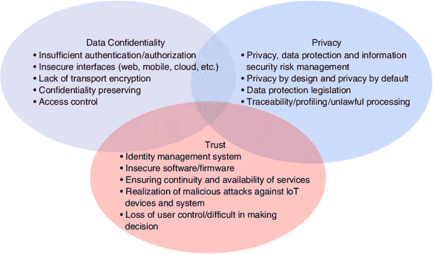
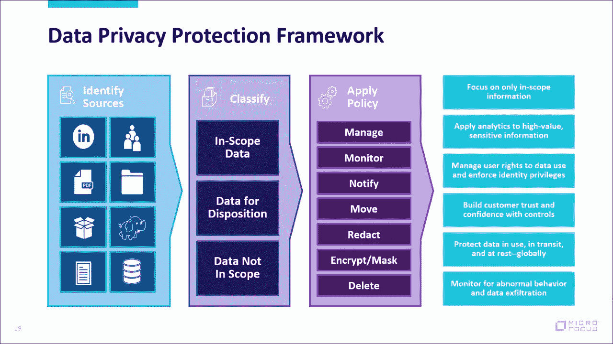
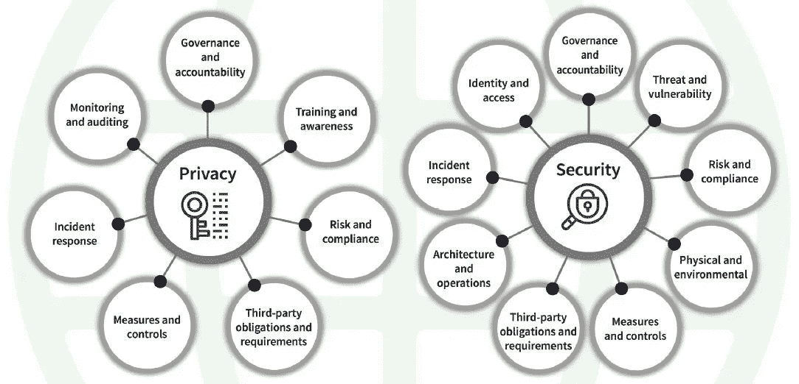

# 数据隐私和数据信任有什么不同？

> 原文：<https://blog.devgenius.io/what-is-data-privacy-and-data-trust-are-very-different-in-software-decisions-75f5ff982aae?source=collection_archive---------4----------------------->

# 先说数据隐私……

隐私与让用户能够控制他们的数据如何被使用和收集有关。随着数据成为新的淘金热，有人打算使用和滥用他们在开放网络上拥有的力量。

隐私领域对诸如应该收集什么样的数据以及数据的允许用途等问题进行优先排序。

如果你感到困惑，想想银行是如何运作的。如果您的银行是一家全国性的金融机构，那么该国的大多数柜员很可能能够安全地访问您的账户信息。

然而，在你变得过于激动之前，隐私可以为你的信息增加一层额外的保护，只在需要的时候才允许访问——比如当你访问另一个城市的银行分行时。

数据隐私是一项合法权利，这也是隐私倡导者和监管者努力提出促进隐私保护的可行策略的原因。

例如，考虑通用数据保护条例(GDPR)。从本质上讲，GDPR 是一系列规则的集合，这些规则赋予欧盟公民对其个人数据更多的控制权。

根据 GDPR，组织有义务确保在严格的条件下合法地收集个人数据。

更不用说，如果出现任何疏忽，那些收集数据的人可能会对任何由此导致的误用或利用承担法律责任。2019 年的《数据保护法》在美国也有类似的作用。

隐私专家努力确保用户不仅被赋予对其数据的最大权限，而且在他们的详细信息被盗用之前，他们还被告知数据的使用情况。

举几个例子，企业可以采用垃圾邮件监管技术，如用户验证、社区标准和选择加入功能。此类功能可用于在访问客户信息之前获得客户的同意，用于任何订阅或营销。

[https://www . bankinfosecurity . com/on demand-webinar-post-gdpr-ccpa-what-must-security-leaders-know-on-privacy-a-13173](https://www.bankinfosecurity.com/ondemand-webinar-post-gdpr-ccpa-what-must-security-leaders-know-about-privacy-a-13173)

# 信任不同于数据隐私…

数字信任与社会责任有关，与组织利用数据的方式有关。

保护数据安全的义务很强，因为客户总是担心企业如何处理他们的信息，以及信息在相关公司手中有多安全。

作为一家企业，你必须小心如何培养客户的信心。这就是数据治理的用武之地。

简而言之，数据治理是帮助保护任何给定组织内的数据资产管理的实践的组合。

由于每年网络安全面临的威胁越来越多，世界各地的政府都在制定加强消费者数据保护的法规。

尽管如此，当涉及到信任时，在义务和服从之间存在着一种摩擦。公司不想触犯法律，也不想失去客户的信任。

然而，在市场竞争和抓住新兴市场机遇方面，他们也不想失去优势。

这就是为什么越来越多的企业通过聘请信任领域的专业人员来关注数据治理。

企业开始关注法律和道德之间的争论，以便在数据合规性和最大化增长潜力之间取得平衡。

[https://www.intersystems.com/gt/](https://www.intersystems.com/gt/)