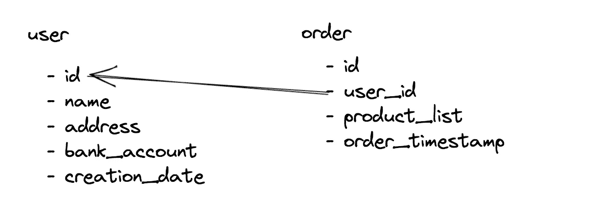
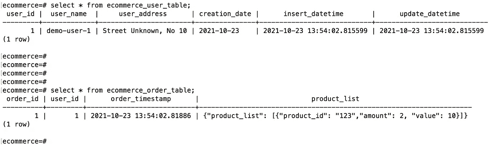
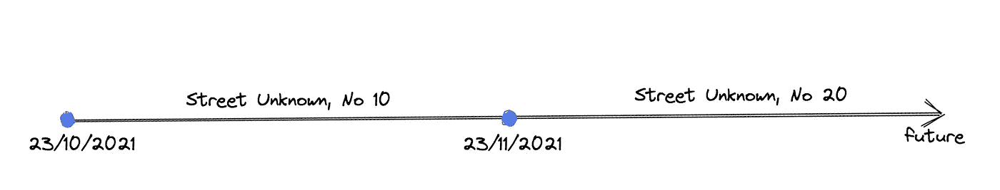
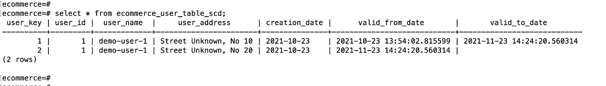
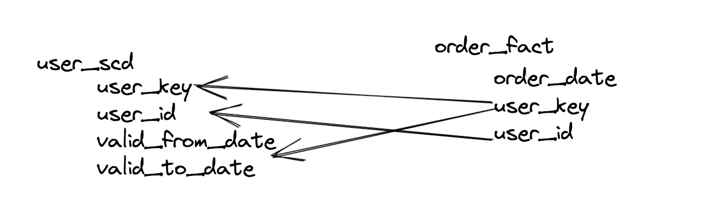
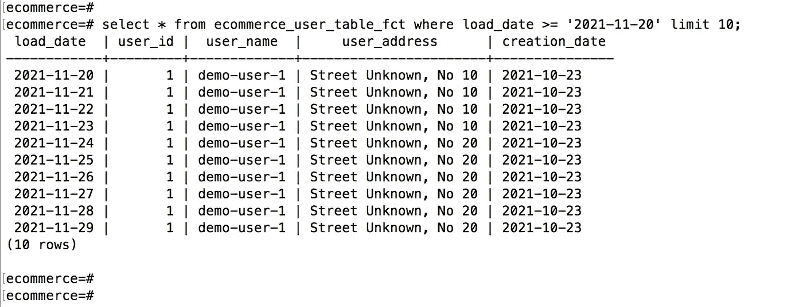
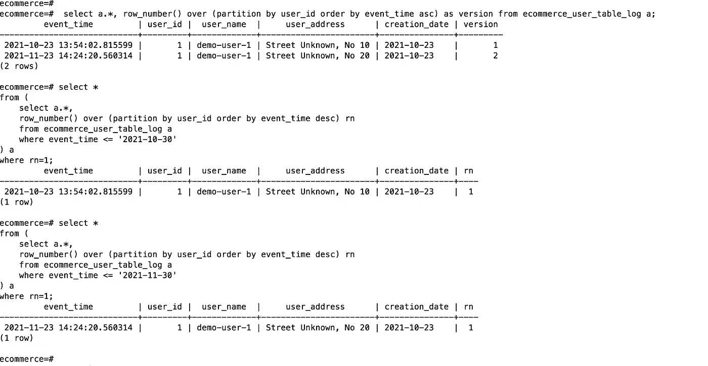
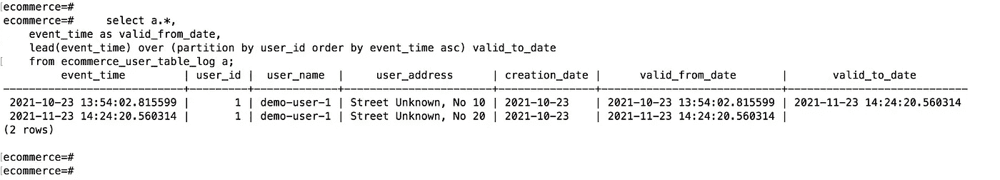

# 什么是数据版本化以及实现它的 3 种方法

> 原文：<https://blog.devgenius.io/what-is-data-versioning-and-3-ways-to-implement-it-4b6377bbdf93?source=collection_archive---------1----------------------->

## 数据的可再现性是任何数据平台的关键要素。称为数据历史化，现在的数据版本化，这是实现它的技术。这篇文章说明了一切。

为了举例说明数据版本控制，我想象自己在一家电子商务公司担任数据工程师。为了简单起见，电子商务应用程序将其数据保存到 Postgres 数据库中，模型简化为两个表:用户和订单。



为了购买产品，用户需要创建一个帐户并提供个人信息:姓名、地址等。由于其描述性和可变性，这类信息保存在一个**维度**实体( ***用户*** )中。当用户下订单时，这被称为事件，并且由于其不变性，它被存储在**事件/事实**实体( ***订单*** )中。



切勿将整个地址存储在一个字段中:)

根据以上数据，我们知道用户`demo-user-1`订购了 2 件产品，应该在`Street Unknown, no 10`地址收到。从今天起一个月内`demo-user-1`将改变地址。首先想到的是，我们可以覆盖现有的信息，忘记以前的地址。通过这样做，重要信息被删除。由于法律要求(审计、合规、法律诉讼)，这类信息需要可检索，这就是数据版本控制的主要作用。这个要求被称为可再现性，它意味着某个时间点的查询结果不会随时间而改变，即使数据在变化。

> 什么是变更数据捕获？

我们的用户在我们的应用程序中更新了地址，我们的数据如下所示:

```
ecommerce=# select * from ecommerce_user_table;
-[ RECORD 1 ]---+---------------------------
user_id         | 1
user_name       | demo-user-1
user_address    | Street Unknown, No 20
creation_date   | 2021-10-23
insert_datetime | 2021-10-23 13:54:02.815599
update_datetime | 2021-11-23 14:24:20.560314
```

在我们的示例中，电子商务应用程序本身对用户的当前地址感兴趣，以便将产品发送到正确的地址。这就是用户表中的记录被覆盖的原因。更新地址的事件会导致数据发生变化，通过变化数据捕获，我们能够在电子商务公司的数据平台中记录这些变化:

*   要么我们在不同的表中存储用户的所有先前版本(历史方法)

```
ecommerce=# select * from ecommerce_user_table_hist ;
-[ RECORD 1 ]---+---------------------------
user_id         | 1
user_name       | demo-user-1
user_address    | Street Unknown, No 10
creation_date   | 2021-10-23
insert_datetime | 2021-10-23 13:54:02.815599
update_datetime | 2021-10-23 13:54:02.815599
```

*   任一事件都记录了更改的内容(事件方法*)



有了疾病控制中心，我们能够记录随时间的变化

现在我们知道了什么是变更数据捕获，什么是数据版本控制？它只不过是以一种可以方便查询的方式存储数据版本的技术。

> 数据版本化，金博尔方法

最常见的数据版本化方法是渐变维度(SCD)方法，由 Kimball 在他的`The DataWarehouse Toolkit`中实现。大约有 7 种 SCD，但是我将展示 SCD 类型 6 的方法。



有效截止日期可以默认为很久以后的日期

对于每一个新的*不同的*记录，一个有效性区间是基于唯一的自然关键字建立的——在这个例子中是`user_id`。每条记录都有一个 **user_key** ，这是一个从自然键和变更日期生成的代理键。



使用 user_key 检索 order_date 的版本，使用 user_id 检索任何版本。

> 数据版本化，功能方法

存储是廉价的，并且由于 Hive metastore 被引入到数据环境中，围绕数据工程创建了一个功能范例。考虑到这一点，我们不需要投资创建复杂的 ETL 来复制某个版本。我们可以简单地创建用户的日常版本:



举个例子。

我确实认为这种方法不够有效，如果我想到:

*   需要回答是否有变化(需要复杂的查询)；
*   非每日频率负载:较高的频率会复制更多的数据，较低的频率会创建虚假数据
*   增量负载:如果数据在输入时是增量的，则需要创建人工数据，以便为某个时刻创建快照。

> 数据版本化，事件方法

从 CDC 这一章，我们知道可以用事件做 CDC。事件可以存储在数据库或文件中，并且可以使用窗口函数进行查询:



使用窗口函数，我们可以及时检索某一时刻的某个版本。

如果我们仔细观察数据，我们会发现使用窗口函数可以生成 SCD 时间间隔:



事实表将只包含 user_id，并且附加的过滤器将应用于有效性间隔。

虽然事件方法减少了实现 SCD 复杂 ETL 的需要，但是有两个相关点需要考虑:

*   如果事件是在不感兴趣的属性上生成的，则可能会创建与前一个事件相似的版本；
*   窗口函数计算量很大，仍然建议在 ETL 作业中处理它们。

在本文中，我总结了什么是数据版本化，变更数据捕获在其中如何发挥作用，以及如何实现它。根据数据量和数据平台的底层技术，这三种方法中的任何一种都可能是最佳选择。

*注意事项*:

*   CDC，事件方法:卡夫卡使之成为可能。您可以在列级别对变更事件进行流式处理，并创建您独特的数据视图。

*   虽然在某些情况下，改变行为可能是分析产品中的一个关键因素，但我还没有遇到一个项目比您的系统产生和集成这种事件的压力(和成本)更重要。
*   现在，你可能知道我是 docker 的超级粉丝。这就是你如何用 docker-compose 运行 postgres:

```
**petra1$ docker-compose up** 
demo-postgres-python_postgres_db_1 is up-to-date
Attaching to demo-postgres-python_postgres_db_1
postgres_db_1  | The files belonging to this database system will be owned by user "postgres".
postgres_db_1  | This user must also own the server process.
postgres_db_1  | 
postgres_db_1  | The database cluster will be initialized with locale "en_US.utf8".
postgres_db_1  | The default database encoding has accordingly been set to "UTF8".**petra1$ docker ps**
CONTAINER ID        IMAGE                             COMMAND                  
....
**10009cb5e923**        postgres:14.0                     "docker-entrypoint.s…" **petra1$ docker exec** -it **10009cb5e923** psql ecommerce -U ecommerce_user
psql (14.0 (Debian 14.0-1.pgdg110+1))
Type "help" for help.

ecommerce=# 
```