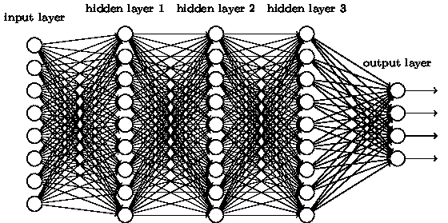

# 什么是深度学习？

> 原文：<https://blog.devgenius.io/what-is-deep-learning-2a4d1db4a26b?source=collection_archive---------5----------------------->

## 深度学习是 ML 社区中经常出现的一个时髦词，但它是什么呢？

来自堆栈交换的[图像](https://stats.stackexchange.com/questions/234891/difference-between-convolution-neural-network-and-deep-learning)

深度学习。你听说过。我听说过它。你住在街那头的邻居和那只讨厌的狗听说过这件事。到底是什么？深度学习是机器学习的一个子领域。用最简单的话来说，这是当我们使用具有多个隐藏层的神经网络来预测输出时发生的“学习”类型。为了更好地理解，让我们来看看神经网络及其工作原理。

# 什么是神经网络？

神经网络是基于神经元连接的想法。它们由单独节点的层组成。有许多不同的神经网络架构，出于解释深度学习的目的，我们将重点关注完全连接的神经网络。全连接神经网络是这样的神经网络，其中一层中的每个节点都连接到该层中在其之前和之后的每个节点。由此，得名“全连通”。

深度神经网络，即负责深度学习的神经网络，是具有不止一个隐藏层的神经网络。隐藏层是既不是输入层也不是输出层的层。一个完全连接的深度神经网络可以少至三层，或多至 10 层、100 层，或你需要的任何层数。建造这些时要小心，因为每一层都会增加你的训练时间！要了解如何使用 Python 3 构建自己的深度神经网络，请查看关于[如何从头构建神经网络的指南](https://pythonalgos.com/2021/12/06/create-a-neural-network-from-scratch-in-python-3/)。

# 深度学习的应用

深度学习几乎可以应用于任何需要复杂分类的领域。深度神经网络广泛用于机器学习子领域[自然语言处理](https://pythonalgos.com/2021/11/23/what-is-natural-language-processing-nlp/)和计算机视觉。短暂的属性意味着它也被广泛用于数据分析、生物信息学、无人驾驶汽车等领域。

在分类之外，深度学习也被用于模拟。这方面的示例应用包括恢复旧图像、模拟物理/化学/生物实验，甚至广告定位。我们将在未来的帖子中探索深度学习的更多应用，所以请确保您关注我，[遇见唐](https://www.medium.com/@ytang07)，了解最新动态！

*更多内容尽在*[*blog . dev genius . io*](http://blog.devgenius.io)*。*