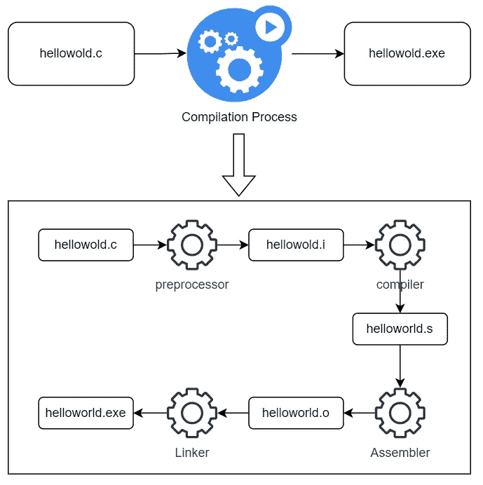

# C 中的#define 是什么？

> 原文：<https://blog.devgenius.io/what-is-define-in-c-dcad8e17615b?source=collection_archive---------6----------------------->


照片由[克里斯里德](https://unsplash.com/@cdr6934?utm_source=medium&utm_medium=referral)在 [Unsplash](https://unsplash.com?utm_source=medium&utm_medium=referral) 拍摄

如果你能看出特色图片中的代码不是 C，那么恭喜你，因为你知道不止一种语言。这是一个你应该庆祝并为自己感到骄傲的成就。

尽管如此，让我们回到主题。在 C 语言中，你肯定见过类似这样的东西

```
#include <stdio.h>
#ifndef __MAIN__
#define __MAIN__
int main(){
   printf("helllo world");
   return 0;
}
#endif
```

开始时，您可能会被要求忽略以`#`字符开头的`#define`或其他关键字。当然，在你开始学习 C 语言的时候，可以忽略它们，直接关注`main`函数内部的内容。但是你是一个好奇的生物，你想知道那些是什么，为什么我们需要写它们？

好吧，我会帮你回答这些问题。但首先，让我们了解一下 C 编程语言中的一些上下文。

# c 是关于优化的

c 语言是一种专为控制硬件而设计的语言。这就是为什么大多数操作系统、硬件驱动程序和微控制器软件都是用 C 编写的。当你编写代码硬件时，你需要考虑的一件事是你需要考虑优化，而 C 就是关于优化的。

所以为了优化软件的最终二进制，C 有了 **C 预处理器**。C 预处理器，或者我们称之为**预处理器，**本质上是一个工具，它将分析 C 源代码，并在编译器编译代码之前执行头文件包含、宏扩展、条件编译和行控制。预处理器本身是整个编译器工具的一部分。

特别是条件编译，对于代码优化非常重要。我们将在后面看到细节，但一般来说，它允许我们编译某些代码行，或者排除最终二进制代码不需要的代码行。这种情况的主要用例是如果您有硬件相关的代码。例如，在处理数据时，如果目标硬件是小端或大端的，您会有不同的做法。如果为小端硬件编译源代码，预处理器可以在编译代码之前完全删除所有使用大端处理的代码。

# 预处理命令

简单来说，预处理命令就是以`#`开头的关键字。它们有时也被称为指令。

```
+-----------+---------------------------------------------+
|   Macro   |                    description              |
+-----------+---------------------------------------------+
| #include  | for file inclusion                          |
| #define   | define a macro (the heck what is macro?)    |
| #undef    | opposite of #define                         |
| #ifdef    | conditional if macro has been defined       |
| #ifndef   | conditional if macro has not been defined   |
| #if       | conditional if with argument                |
| #else     | just else part                              |
| #elif     | it is 'else if'                             | 
| #endif    | closure of if                               |
| #error    | to print error message                      |
| #pragma   | special command to computer                 |
+-----------+---------------------------------------------+
```

不是很多，对吧？让我们根据他们正在做的事情来讨论他们

## 文件包含

这个我们就不细说了。它本质上只是一种在源代码中导入另一个文件的方法，因为您想要使用该文件中的函数、常量或变量。通常，您会包含一个头文件，其中包含由该头文件导出的函数、常数或变量的声明。

您将使用`#include`指令，后跟尖括号中头文件的名称。例如，你写`#include <stdio.h>`是为了使用函数`printf`，因为`printf`是在`stdio.h`内部定义的。有时头文件包含在双引号内，如`#include "someapi.h"`。如果你的头文件是你的源代码的一部分，你就使用`"`,而如果你包含了标准库，就使用尖括号。

## 宏定义和扩展

指令`#define`和`#undef`用于宏展开。我总是把它想成文本替换。`#define`指令将创建一个宏和可选的替换标记。

```
#define <identifier> <replacement_token>
//example
#define PI 3.14
```

在上面的例子中，我们用替换标记`3.14`声明宏`PI`。然后，预处理器将在源代码中搜索宏`PI`，并用`3.14`替换它

```
int area(int radius){
   return PI*r*r;
}
========== after pre processing ========
int area(int radius){
   return 3.14*r*r
}
```

在上面的例子中，你可以看到在预处理之后，预处理器本质上只是用`3.14`替换任何`PI`，基本上就是这样。

然而，神奇的是，你还可以用宏展开来定义一个函数。我们上面用`PI`的例子是所谓的类对象宏，而另一个，类函数宏，是你可以像函数一样声明宏的地方。

```
#define <identifier>(parameters list) <replacement_token>
```

让我们以函数`area`为例来声明一个类似函数的宏

```
#define PI 3.14
#define area(r) (PI*r*r)
int main(){
  int area1 = area(2);
  return 0;
}
========== after preprocessing ========
int main(){
   int area = 3.14*2*2;
   return 0;
}
```

正如您在上面的例子中看到的，整个`area`宏将被替换为我们在宏的替换标记中声明的操作。所以最后真的只是文字替换。

正如我之前所说，替换令牌是可选的。因此，在本文开头的 hello world 程序的例子中，我们使用`#define`声明宏`__MAIN__`，但是没有替换标记。

当你声明一个没有替换标记的宏时，预处理器会记住它，并在你每次使用`#if`指令时使用它。我们将在下一节讨论它。

## 条件编译

条件编译允许您编译或排除编译中的某些代码。当你想优化代码的时候，这真的很方便。我们可以使用`#ifdef`、`#ifndef`、`#if`、`#elif`、`#else`和`#endif`指令。让我们看看下面这个我从维基百科上摘下来的例子:P

```
#if !(defined __LP64__ || defined __LLP64__) || defined _WIN32 && !defined _WIN64
	*// we are compiling for a 32-bit system*
#else
	*// we are compiling for a 64-bit system*
#endif
```

你可能会问，我们可以分别为 32 位和 64 位创建函数，然后根据系统调用它们吗？嗯，上面的例子可能显示了条件编译是多么的无关紧要。但是请记住，C 是为硬件编写的，您可能有数百种不同的硬件配置。如果某些代码是为 ARM 架构编译的，而在 x86 架构中运行得非常好，那么这些代码可能会抛出编译错误。

如果`#if`参数为假，预处理器将删除 32 位的所有代码，反之亦然。它不仅优化了代码，而且还消除了编译中的任何错误，因为一些变量或函数在其他体系结构中是不可用的。

## 令牌字符串化

我觉得这个很少用。我在工作中开发了一个智能卡操作系统，我从未见过令牌字符串化。不过好吧，我们稍微谈一下。根据维基百科，它只会从一个宏创建一个字符串。就是这样。

## 特殊指令和宏

`#error`只是向标准 IO 输出一条错误消息，而`#pragma`应该得到一整篇关于它的文章。`#pragma`是特定于编译器的，但我们通常在 GPU 的并行化中发现它，以允许特定代码由 GPU 的多个内核并行执行。

大多数编译器也支持几个预定义的宏。分别是`__FILE__`、`__LINE__`、`__DATE__`、`__TIME__`、`__TIMESTAMP__`。

# 预处理器如何工作

现在我们已经知道了预处理和宏，我们将通过后面的例子来了解它是如何工作的。所以准备好你的代码编辑器，准备写一些代码吧。



编译过程

如上图所示，预处理实际上是编译的第一步。事实上，这是有意义的，因为预处理器将首先分析代码，以便在编译和进一步处理源代码之前对其进行优化。让我们试着写一些代码，看看预处理的结果。

在这个演示中，我将使用 gcc 编译器。我用的是 Ubuntu 18.04 的 7.5.0 版本。考虑下面的例子

```
#define THREE_COMMA_PI
#ifdef THREE_COMMA_PI
#define PI 3.142
#else
#define PI 3.14
#endif#define area(r) (PI*r*r)int main(){
   int a = area(3);
   return 0;
}
```

之后，我们将这个文件保存到`helloworld.c`的任意文件夹中。之后，我们可以调用这个命令来生成预处理文件

```
gcc -c -save-temps helloworld.c
```

该命令将生成三个文件，分别是`helloworld.i`、`helloworld.o`和`helloworld.s`。如果你打开`helloworld.i`，你会看到这样的东西

```
# 1 "helloworld.c"
# 1 "<built-in>"
# 1 "<command-line>"
# 31 "<command-line>"
# 1 "/usr/include/stdc-predef.h" 1 3 4
# 32 "<command-line>" 2
# 1 "helloworld.c"
# 10 "helloworld.c"
int main(){
   int a = (3.142*3*3);
   return 0;
}
```

你可以忽略前面有`#`的行，但不能忽略，你可以看这篇[文章](https://gcc.gnu.org/onlinedocs/gcc-9.1.0/cpp/Preprocessor-Output.html#Preprocessor-Output)。如果您关注`main`函数，您将会看到`area`已经被替换令牌替换，同样的还有`PI`

# 结论

我上面描述的只是 C 代码预处理的表面。但至少，我希望它能帮助你的旅程了解更多。

我认为更有趣的讨论是为什么你会使用一个类似函数的宏，而不是仅仅写一个简单的函数。如果你想让我写这个，请告诉我

如果你觉得这篇文章有帮助，可以考虑在 Medium 上或者在 [Twitter](https://twitter.com/asyarif_) 上关注我，当然，别忘了 clap。