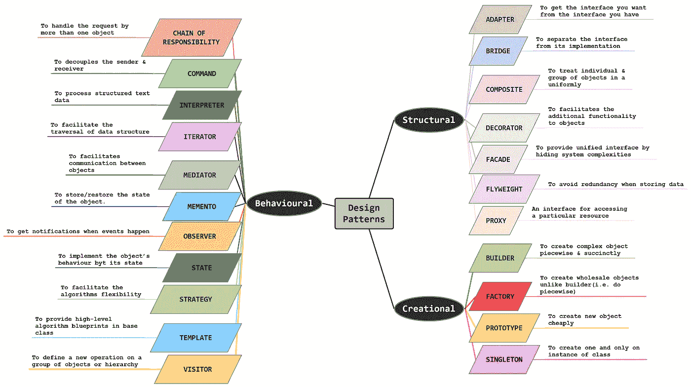
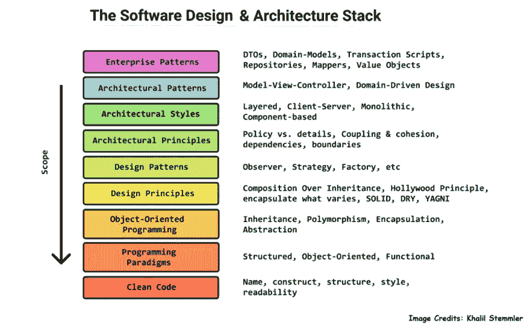

# 什么是设计模式？

> 原文：<https://blog.devgenius.io/what-is-design-pattern-325fdaa58902?source=collection_archive---------1----------------------->

在积累了一定的经验并在这个行业呆了足够长的时间后，我意识到了设计/架构系统和软件的重要性。所以我开始研究系统/软件设计&知道没有什么比设计模式更好的开始了。我做的第一件事是谷歌“什么是设计模式？”于是有了这篇文章的想法。

> */！\:原载@ www.vishalchovatiya.com*[T3](http://www.vishalchovatiya.com/category/design-patterns/)

但是作为一个没有计算机科学背景的人(我来自电子背景)，学习它们是一场斗争。每一份材料、文章、解释或书籍都充满了术语，需要仔细阅读。有些我还是不太明白。我几乎不知道[轻量级](http://www.vishalchovatiya.com/flyweight-design-pattern-in-modern-cpp/) & [古典访客](http://www.vishalchovatiya.com/double-dispatch-visitor-design-pattern-in-modern-cpp/)模式是如何工作的，任何说他们知道的人都是骗子。

所以，在参加了在线课程，YouTube 视频，大量的谷歌搜索，大量的汇编&间隔重复学习和遗忘。以下是我目前为止的收获。

# 什么是设计模式？

***来自维基百科***[***:***](https://en.wikipedia.org/wiki/Software_design_pattern)

***——在软件工程中，软件设计模式是一种通用的、可重用的解决方案，用于解决软件设计中给定环境下的常见问题。
——不是可以直接转化为源代码或机器码的成品设计。它是如何解决一个问题的描述或模板，可以在许多不同的情况下使用。设计模式是程序员在设计应用程序或系统时可以用来解决常见问题的形式化的最佳实践。***

*   设计模式为常见问题建立解决方案，这有助于保持代码的可维护性、可扩展性和松散耦合性。
*   开发人员给解决特定类型问题的解决方案起了一个名字。这就是一切的开始。
*   一个人越了解他们，就越容易解决我们面临的所有问题。
*   由[**G**ang**O**F**F**本(1994)](https://en.wikipedia.org/wiki/Design_Patterns) 书推广。

# 什么不是设计模式？

*   它不是代码重用，因为它通常不指定代码。实际的实现依赖于编程语言，甚至依赖于做这件事的人。
*   设计模式和原则([固体](http://www.vishalchovatiya.com/single-responsibility-principle-in-cpp-solid-as-a-rock/))是两回事。
*   设计模式既不是静态的解决方案，也不是算法，没有硬性的编码标准。
*   软件架构不是一种设计模式。软件架构决定了将要实现什么&它将被放在哪里。而设计模式说明了应该如何去做。
*   **设计模式并没有准备好编码解决方案，它们更像是对解决方案应该是什么样子的描述**。你应该从设计模式中记住的是，问题和问题的解决方案是密切相关的。学习这两者同样重要。

# 为什么我们需要设计模式？

作为软件开发人员，我们经常通过一些属性来评估我们的代码，比如代码有多干净、有多富于表现力、占用的内存少以及多快。但是我们经常忽略的最重要的问题是，你应该能够在以后很容易地改变任何事情。你今天所做的决定明天可能就无关紧要了。你的代码应该足够灵活，这样修改起来就不会太贵。所以设计模式是涵盖这些属性的最佳实践。对我来说，设计模式的核心包括以下 6 条规则:

# 它们是经过验证的解决方案

*   因为许多开发人员经常使用设计模式，所以你可以肯定它们是有效的。不仅如此，你可以确定它们被修改了很多次，优化也可能被实现了。

# 它们很容易重复使用

*   设计模式记录了一个可重用的解决方案，它可以通过修改来解决多个特定的问题。因为它们不局限于特定问题。
*   例如，考虑一下[迭代器设计模式](http://www.vishalchovatiya.com/iterator-design-pattern-in-modern-cpp/)，不管容器&算法如何变化，它在整个 STL 中都是可重用的。迭代器就像容器&算法之间的胶水一样工作。

# 他们很有表现力

*   设计模式可以非常优雅地解释大型解决方案。例如，[访问者](http://www.vishalchovatiya.com/double-dispatch-visitor-design-pattern-in-modern-cpp/)模式用于在一系列/一组类上执行新的操作。因此，标准库采用了这种单一功能的模式，即`[std::visit](https://en.cppreference.com/w/cpp/utility/variant/visit)`算法。同样适用于`[boost::flyweight<>](https://www.boost.org/doc/libs/1_62_0/libs/flyweight/doc/index.html)`。

# 他们简化了交流

*   当开发人员熟悉设计模式时，他们可以更容易地就给定问题的潜在解决方案进行交流。
*   如果你在一个由多个开发人员组成的团队中与同事一起工作，就设计模式与他们达成一致，因为他们可以帮助你更好地解决问题。同样关于软件的维护，你应该遵循这样的程序，因为你使维护操作更快更有效。

# 它们避免了重构代码的需要

*   如果一个应用程序是用设计模式编写的，通常情况下你不需要在以后重构代码，因为对给定的问题应用正确的设计模式已经是一个最佳的解决方案了。
*   如果这样的解决方案是更新的，那么它们可以被任何优秀的软件开发者无缝地应用，并且不会引起任何问题。

# 他们降低了代码库的规模

*   因为设计模式通常是优雅和最佳的解决方案，它们通常比其他解决方案需要更少的代码。这并不总是如此，因为许多开发人员会编写更多的代码来提高理解能力。

# 为什么你应该学习设计模式？

*   如果你把面向对象设计的定义归结为，它把数据和它的操作结合成一个上下文相关的实体(即类/结构)。在设计一个单独的物体时也是如此。
*   但是当你设计完整的软件时，你需要考虑到
*   **创造性设计模式:**那些对象将如何被实例化/创建？
*   **结构设计模式:**那些对象如何与其他对象结合&形成更大的实体？这在将来也应该是可扩展的。
*   **行为设计模式:**你还需要考虑那些对象之间的交流，这些对象可以很容易地预测未来的变化&并且副作用更少。
*   你知道这会把我们引向哪里吗？你需要 ***从对象的角度考虑，处处考虑可维护性、可扩展性、可表达性&***。所以简而言之，这是一个 ***的心态对于好的编码*** 。我很确定如果你来自 C 语言背景，你不会有这种心态&思维过程。

# 在深入研究设计模式之前

但是，在深入研究设计模式之前，您应该学习一些叫做 SOLID 的基本设计原则。SOLID 是面向对象软件开发中最流行的设计原则之一，由 Robert C. Martin 提出，通常被称为 Bob 叔叔。坚实原则由以下五项原则组成:

1.  [**S** RP —单一责任原则](http://www.vishalchovatiya.com/single-responsibility-principle-in-cpp-solid-as-a-rock/)
2.  [**O** CP —开启/关闭原理](http://www.vishalchovatiya.com/open-closed-principle-in-cpp-solid-as-a-rock/)
3.  [**L** SP —利斯科夫替代原理](http://www.vishalchovatiya.com/liskovs-substitution-principle-in-cpp-solid-as-a-rock/)
4.  [**I** SP —界面偏析原理](http://www.vishalchovatiya.com/interface-segregation-principle-in-cpp-solid-as-a-rock/)
5.  [**D** IP —依存倒置原则](http://www.vishalchovatiya.com/dependency-inversion-principle-in-cpp-solid-as-a-rock/)

*   Dev 还将这一坚实的设计原则称为“面向对象设计的前 5 个原则”。
*   这些原则也使开发人员容易避免代码味道，容易重构代码，并且也是敏捷或适应性软件开发的一部分。

> **固体是“不要采用的原则”而是“要使用的框架”**

# 设计模式的类型

# 创造性的设计模式

1.  [**工厂**](http://www.vishalchovatiya.com/factory-design-pattern-in-modern-cpp/)
2.  [**建造者**](http://www.vishalchovatiya.com/builder-design-pattern-in-modern-cpp/)
3.  [**原型**](http://www.vishalchovatiya.com/prototype-design-pattern-in-modern-cpp/)
4.  [**单胎**](http://www.vishalchovatiya.com/singleton-design-pattern-in-modern-cpp/)

# 结构设计模式

1.  [**适配器**](http://www.vishalchovatiya.com/adapter-design-pattern-in-modern-cpp/)
2.  [**桥**](http://www.vishalchovatiya.com/bridge-design-pattern-in-modern-cpp/)
3.  [**复合**](http://www.vishalchovatiya.com/composite-design-pattern-in-modern-cpp/)
4.  [**装饰者**](http://www.vishalchovatiya.com/decorator-design-pattern-in-modern-cpp/)
5.  [**立面**](http://www.vishalchovatiya.com/facade-design-pattern-in-modern-cpp/)
6.  [**蝇量级**](http://www.vishalchovatiya.com/flyweight-design-pattern-in-modern-cpp/)
7.  [**代理**](http://www.vishalchovatiya.com/proxy-design-pattern-in-modern-cpp/)

# 行为设计模式

1.  [**责任链**](http://www.vishalchovatiya.com/chain-of-responsibility-design-pattern-in-modern-cpp/)
2.  [**命令**](http://www.vishalchovatiya.com/command-design-pattern-in-modern-cpp/)
3.  [**解释器**](http://www.vishalchovatiya.com/interpreter-design-pattern-in-modern-cpp/)
4.  [**迭代器**](http://www.vishalchovatiya.com/iterator-design-pattern-in-modern-cpp/)
5.  [**调解员**](http://www.vishalchovatiya.com/mediator-design-pattern-in-modern-cpp/)
6.  [**纪念品**](http://www.vishalchovatiya.com/memento-design-pattern-in-modern-cpp/)
7.  [**观察者**](http://www.vishalchovatiya.com/observer-design-pattern-in-modern-cpp/)
8.  [**状态**](http://www.vishalchovatiya.com/state-design-pattern-in-modern-cpp/)
9.  [**策略**](http://www.vishalchovatiya.com/strategy-design-pattern-in-modern-cpp/)
10.  [**模板方法**](http://www.vishalchovatiya.com/template-method-design-pattern-in-modern-cpp/)
11.  [**来访者**](http://www.vishalchovatiya.com/double-dispatch-visitor-design-pattern-in-modern-cpp/)

# 设计模式的好处

1.  轻松预见和纠正未来的问题。
2.  有助于维护与后续版本的二进制兼容性。
3.  仅仅通过遵循[坚实的原则](http://www.vishalchovatiya.com/single-responsibility-principle-in-cpp-solid-as-a-rock/)对敏捷或适应性软件开发有很大的帮助。
4.  该解决方案以最小的耦合促进了高度[内聚](https://en.wikipedia.org/wiki/Cohesion_(computer_science))模块的开发。因此，增加了可扩展性&的可重用性。
5.  有一些模式，如 Facade、Proxy 等，封装了复杂性，为客户提供了简单直观的界面。因此，使整个系统更容易理解和减少学习曲线。
6.  设计模式使得设计者和开发者之间的交流更加清晰和精确。在讨论软件设计时，当提到用于解决特定问题的模式名称时，开发人员可以立即在脑海中描绘出高层设计。

# 接下来呢？

我并不提倡把所有的东西都背下来，但是你应该尽可能多地理解这些概念，因为你会在工作中经常遇到它们。通过练习实现它们，您将更好地理解它们的用例及其背后的原因。

我希望在本系列中涵盖大多数经典的四人组设计模式。在学习它们的时候，我努力寻找适合初学者的材料，并希望这些能帮助其他人避免同样的命运。顺便说一下，我将使用[现代 C++](http://www.vishalchovatiya.com/21-new-features-of-modern-cpp-to-use-in-your-project/) 的所有模式。所以你也能从思维过程&中嗅到 C++的一些定义(这一行我很难放到话里)。这绝不意味着您不能将这些模式应用于其他语言。

# 常见问题

**你一直都需要设计模式吗？**

最初，您不应该考虑设计模式。 ***富有表现力的&少码永远是第一道防线*** 。你不应该使解决方案复杂化，因为问题本身就是复杂的。

**为什么要学习设计模式？**

如果你是一个自学成才的开发人员&没有接触过行业项目，那么你可能没有使用面向对象设计的思维过程。你不能从物体的角度考虑设计的每个方面。在这种情况下，设计模式会给你一个新的思维过程，用对象来思考一切。如果你严格遵循它，你会看到你的类&软件代表了特定领域的语言。

[有什么建议、疑问或者想说](http://www.vishalchovatiya.com/contact-2/) `[Hi](http://www.vishalchovatiya.com/contact-2/)` [？减轻压力，只需点击一下鼠标。](http://www.vishalchovatiya.com/contact-2/) 🖱️