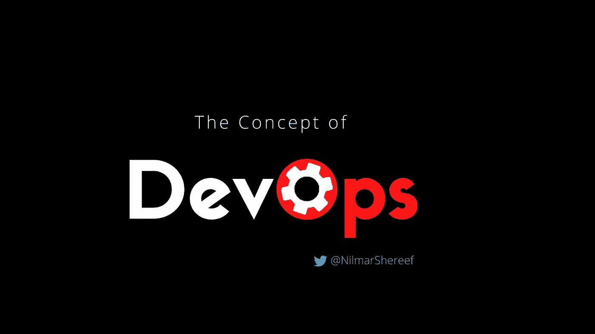
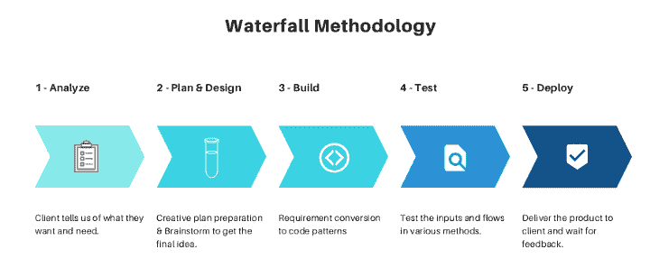
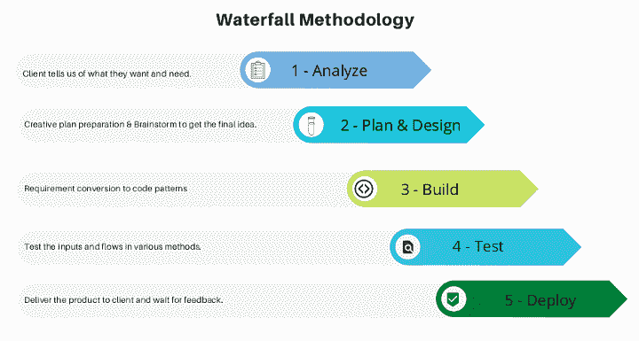
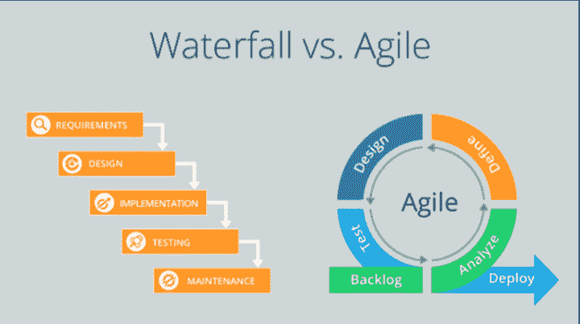
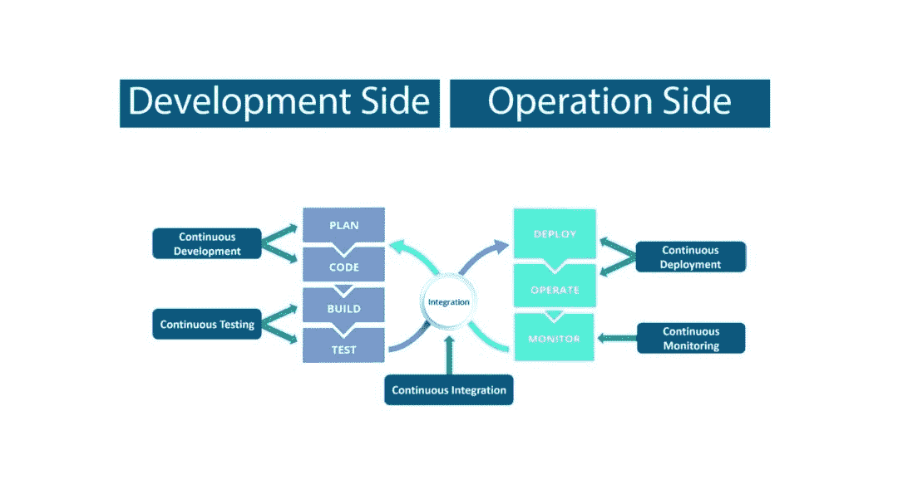
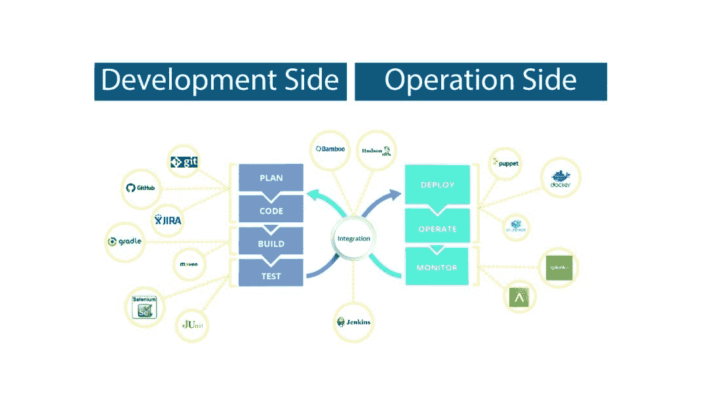
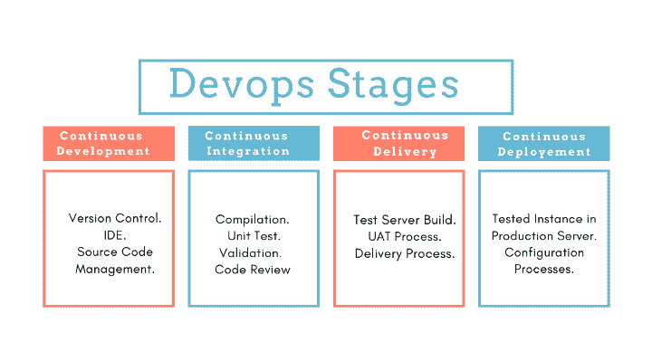
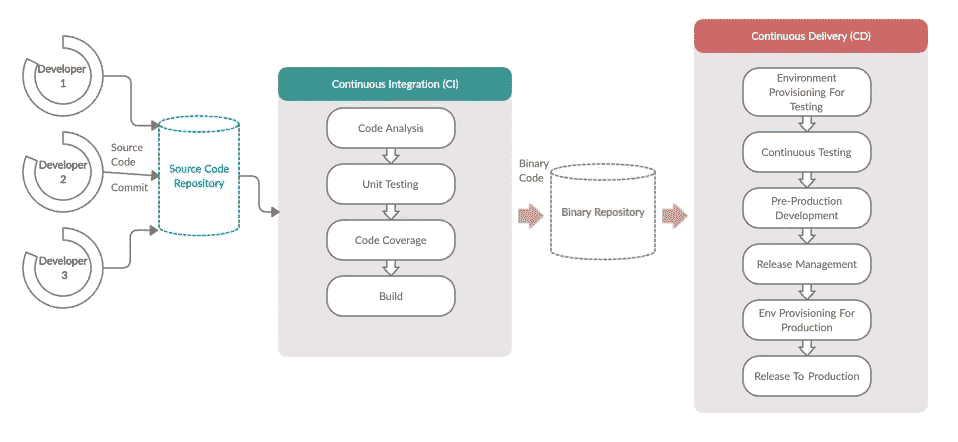
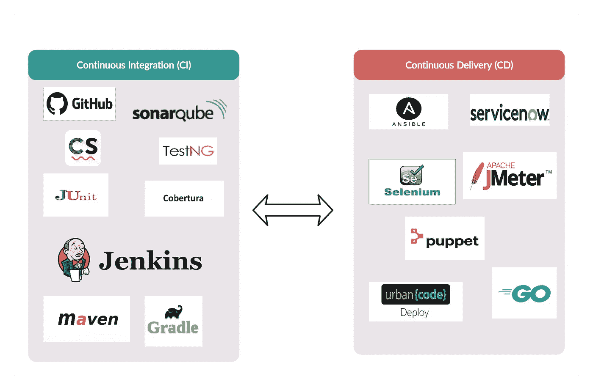

# DevOps 是什么？！

> 原文：<https://blog.devgenius.io/what-is-devops-e0e313a861a7?source=collection_archive---------19----------------------->

DevOps 概念

## DevOps 的概念

项目和项目管理是每个行业的常用词。项目是指为实现特定目标而执行的一系列精心策划的活动。可能是房屋建筑、设计新的车辆模型、开发新产品或软件系统等。

**项目管理**简单来说就是发起、分析、执行、管理和完成团队的工作，以实现一组目标并在规定的时间内满足特定的成功标准。项目管理的主要目标是在给定的约束集内覆盖所有的项目目标。制约因素可能是有限的资源数量、缺乏财政支持、天气状况等..

在 IT 相关项目中，项目管理方法对项目的成功起着至关重要的作用。像任何其他方法一样，组织也根据项目的性质采用 DevOps。有几种方法，如 Scrum、看板、瀑布模型、敏捷等..

## 瀑布方法:

在瀑布方法中，项目活动被分成线性的连续阶段，每个阶段依赖于前一个阶段的可交付成果，并对应于任务的专门化。

项目阶段的中断

**瀑布**顾名思义，掉落的装备不能再回到之前的阶段。这是该模型的主要缺点。

瀑布结构项目管理方法

为什么现在瀑布模型不那么流行了？

仅仅是因为..

1.高风险和不确定性。
2。回溯或迭代的高风险，与其他相比，它的成本巨大。
3。在最终阶段完成之前，不会生产任何工作系统/产品。
4。决策集应该在项目开发之前定义。
5。技术可能会有所不同，因为实施需要很长时间。
6。长期运行项目的高风险。
7。不能申请短期市场项目。
8。固定装置的停机时间可能很长。
9。它不允许修订，或者修订在项目成本和资源时间表方面具有高风险。

## 敏捷方法:

在该策略中，项目的每个阶段被分解为' ***'若干迭代'*** ，所有迭代持续时间相同。它使用增量的、迭代的工作序列，通常被称为*冲刺*。

在特定操作的每次迭代结束时，产品或软件系统被交付。

瀑布 vs 敏捷(来源:Ouriken)

那缺点是什么呢？

开发和测试将持续进行。但是部署阶段会面临敏捷周期之外的问题。开发团队总是需要 ***敏捷*** 但是运营团队需要 ***稳定*** 。在这种权衡中，可交付成果可能会面临一些实际问题。

> 开发团队总是需要“敏捷性”，但运营团队需要“稳定性”。

这个问题最大的例子是“产品服务器中可交付产品的崩溃，但在开发人员的本地系统中同样可以正常工作”。每当这种情况出现时，运营团队将要求开发团队修复代码，而开发团队将声称它在他们的环境中运行良好。这导致了系统或产品生命周期中的 ***循环指责*** 。

> 对这种情况的补救办法是‘devo PS’！

## DevOps 是什么？

DevOps 不是一个纯粹的工具，也不是一种技术。这更像是一种文化变革。DevOps 是实践、文化哲学和工具集的组合，它促进了组织高速交付应用程序和相关服务的能力。通过该方法，系统或产品的开发和运营生命周期将比使用传统软件开发和基础设施管理过程的组织更快地走向市场。

换句话说，DevOps 可以被认为是包括 ***持续集成* (CI)** 和 ***持续交付* (CD)** 作为基石的几个关键实践。它结合了一系列要在整个交付管道中采用的流程和方法，并跨越多个利益相关方。

开发和运营工程师共同参与整个软件生命周期的实践，从设计到开发过程，再到生产服务器支持。

*持续开发的 Devops 无限循环概念&部署*

DevOps 的主要优势是:

>>高效率和团队协作。
> >交货更快的特点&客户满意度更高..
> >早期检测和纠正阻塞。
> >项目失败的几率较小。
> >资源利用率最高&生产率成本较低。
> >多花时间去调查。
> >专业/技术动态。
> >提高灵活性和支撑力。

Devops 方法通过不同部门的各种工具实现，以确保每个阶段的连续性。因此，DevOps 工程师应该知道每个工具在软件产品生命周期中的角色。 **Devops 工具**完全基于要开发的产品或系统。对于一个工程师来说，在开发和运行的每个阶段都有大量可供选择的工具。DevOps 工程师将选择它们，在不影响质量的情况下，用最少的时间获得最大的产量。

Devops 及其工具集

## DevOps 阶段:

DevOps 的工作流程是这样的，项目的敏捷性和自动化始终得到保证。DevOps 的各个阶段在开发和运营的循环中紧密相连。每个阶段都与 DevOps 工具相关联并实现自动化，它确保了在产品生命周期中可交付成果的连续分发。DevOps 的阶段图如下:

DevOps 阶段

DevOps 流程图

开发人员通过 Git 或任何其他版本控制器将代码提交给源代码库。Junkin 服务器集在存储库中睁大了眼睛，它会定期捕捉变化。Junkin 服务器将基于开发者的提交创建一个新的构建。Junkin 也有工具集，如果构建失败，可以用日志通知相应的程序员。如果一切看起来都很完美，Junkins 会将它部署到测试服务器中，并进行适当的测试。相同的过程将作为一个循环过程重复，并确保开发级别的自动化。参见 DevOps 系统中使用的工具集示例。

CI & CD 中的 DevOps 工具集图

**devo PS 的 5 个基本原则:**

采用 DevOps 时，有五个基本原则是必不可少的。

1.**关注顾客的行动**。
2。**端到端责任**:团队必须为产品提供底层支持，以实现更高质量的测量。
3。**持续改进**:资源的最大化利用将降低成本，持续交付将促进生产周期。
4。**自动化&统一**:自动化是 DevOps 概念的核心，不仅基于技术方面，甚至在项目会议中也是如此。
5。**监控&测试** : DevOps 团队应该拥有健壮的监控和测试引擎的工具。

## 结论:

“DevOps”的想法始于 2008 年法国独立 IT 顾问 Patrick Debois 和 Andrew 之间关于敏捷基础设施概念的讨论。然而，这个想法直到 2009 年在比利时举行的第一次 DevOpsDays 活动才开始流行。以至于，帕特里克·德博伊斯**T3 被称为“*德沃普斯*教父”。并且，它在很短的时间内被广泛传播到现代项目方法论中。尽管它是一组过程和实践，DevOps 工程师将各种工具和编码元素与库包、软件开发工具包和各种集成组件联系在一起。**

我相信这篇文章涵盖了 DevOps 及其术语的一些基本方面。但是正如我前面提到的，关于 Devops 的工具和相关研究比这更广泛。

感谢和问候
[尼尔玛·谢里夫](https://twitter.com/NilmarShereef)