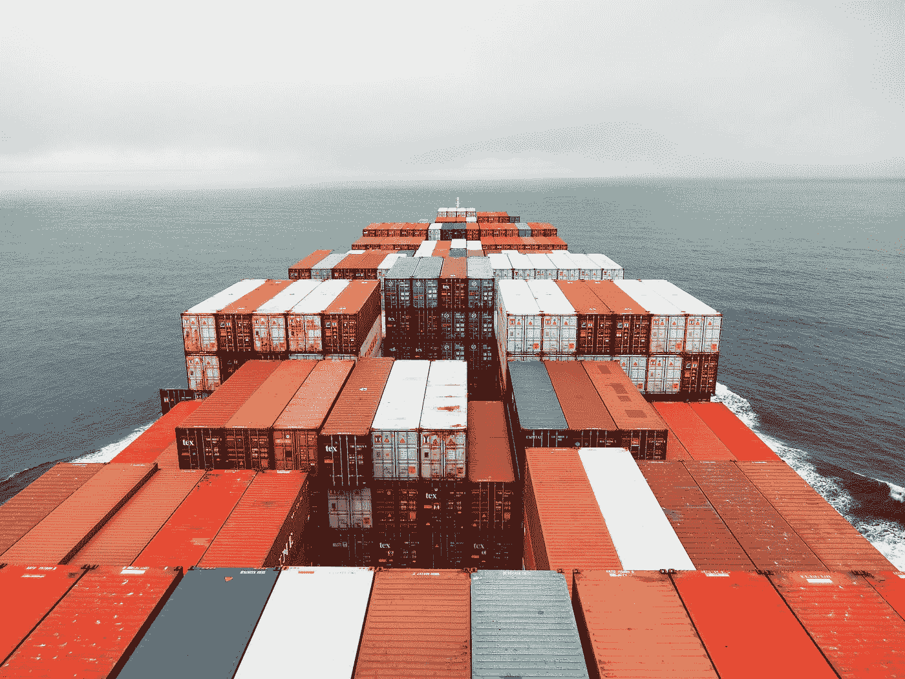
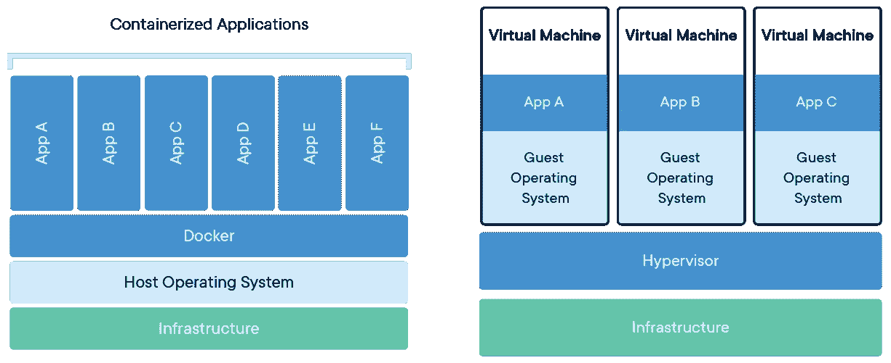

# Docker 是什么？我应该在乎吗？

> 原文：<https://blog.devgenius.io/what-is-docker-should-i-care-81ab6f4d874d?source=collection_archive---------47----------------------->

照片由 [Unsplash](https://unsplash.com?utm_source=medium&utm_medium=referral) 上的 [Rinson Chory](https://unsplash.com/@nessa_rin?utm_source=medium&utm_medium=referral) 拍摄

在本文中，我们将简要介绍 docker 容器。首先，我想从码头集装箱的起源说起:

## **起源/类比**

历史上，将货物从一个港口移动到另一个港口是一个麻烦且昂贵的过程，需要人工劳动，例如码头工人，在每个转运点用手装卸物品。联运集装箱的引入彻底改变了运输业。

这些集装箱有标准尺寸，设计用于以最少的人工在不同的运输方式之间移动。此外，冷藏和保温集装箱可用于运输对温度敏感的货物，如食品和药品。这意味着运输行业可以让货物的生产者担心集装箱的内容，这样它就可以专注于集装箱的移动和存储。

Docker 的目标是将容器标准化的好处带给 IT 行业。

现代系统可能包括 Javascript 框架、NoSQL 数据库、消息队列、REST APIs 和用不同编程语言编写的后端。我们可能需要这个堆栈完全或部分运行在各种硬件之上，从开发人员笔记本电脑和内部测试集群到生产云提供商。这些环境各不相同，在不同的硬件上运行不同的操作系统和不同版本的库。

类似于联运集装箱简化了货物的运输，Docker 集装箱简化了软件应用程序的运输。现在，开发人员可以专注于构建应用程序，并通过测试和生产来交付它，而不必担心环境和依赖关系的差异。运营商可以专注于运行容器的核心问题，例如分配资源、启动和停止容器，以及在服务之间迁移容器。

## 什么是容器？

容器是映像的运行时实例(一个轻量级的独立可执行包，包含运行一个软件所需的一切，包括代码、运行时、库、环境变量和配置文件)。它完全独立于主机环境运行，仅在配置后访问主机文件和端口。换句话说，容器是应用程序及其依赖项的封装。

乍一看，它们似乎是虚拟机的一种轻量级形式——就像 VM 一样，容器保存操作系统的一个独立实例，我们可以用它来运行应用程序。

## 为什么是集装箱？

容器在主机的内核上运行应用程序。与仅通过虚拟机管理程序虚拟访问主机资源的虚拟机相比，它们具有更好的性能特征。容器可以获得本地访问，每个容器都在一个独立的进程中运行，占用的内存不比任何其他可执行文件多。因此，它们可以在几分之一秒内停止和启动。

容器与虚拟机

*容器可以终结“但是它在我的机器上可以工作！”。*容器的可移植性可以消除运行环境中细微变化引起的一整类 bug。

*容器的轻量级特性*意味着开发人员可以同时运行十几个容器，从而使模拟一个生产就绪的分布式系统成为可能。

*容器对于终端用户和开发人员来说，除了部署到云之外，还有其他优势。*用户可以下载并运行复杂的应用程序，而无需花费数小时解决配置和安装问题，也无需担心系统所需的更改。反过来，这种应用程序的开发人员可以避免担心用户环境的差异和依赖性的可用性。

# 现在让我们去码头

Docker 于 2013 年由 dotnet 作为开源项目发布。Docker 将现有的 Linux 容器技术(LXC)包装起来，并以各种方式进行扩展——主要是通过可移植的图像和用户友好的界面。Docker 依赖于 Linux 内核特性，如名称空间和 cgroups，以确保资源隔离，并打包应用程序及其依赖项。

Docker 平台有两个不同的组件:

*   负责创建容器的 Docker 引擎。
*   Docker Hub，一个用于分发 Docker 容器的云服务。

## 基本 Docker 命令

*docker —版本*:返回你正在运行的 docker 的版本。

*docker run<image>*:获取一个图像，从该
图像创建一个容器并启动它(多次运行它将在每次运行时创建一个容器)。

*docker start<image | id>*:启动一个现有的容器。

*docker stop<image | id>*:停止正在运行的容器。

列出有多少集装箱正在运行。

*码头工人 ps -a* :列出停止和运行的集装箱。

*docker RM<name | id>*:移除或删除一个集装箱。

*docker images* :列出最近创建的图像。

*docker 登录*:创建一个新账户或使用现有凭证
登录 docker hub。

*docker 附加 Python* (将 i/o 附加到图像)。

其他命令可以在这里找到。

## Dockerfile 文件

Docker 映像从一个基本映像开始，该映像包括您的应用程序所需的平台依赖性。基础映像被定义为 Dockerfile 文件中的指令。Dockerfile 是一个说明列表，描述了如何部署您的应用程序，它遵循一个特定的格式和一组说明，您可以在 Dockerfile reference 中找到。

docker build -t <build-directory>:构建一个 docker 文件(-t 参数允许您为图像和标签指定一个友好的名称，通常用作版本号)。</build-directory>

## 结论

Docker 允许你在相同的硬件上运行比其他技术更多的容器。它帮助开发人员创建现成的容器化应用程序，使开发和管理应用程序变得更加容易管理。最近，许多公司已经开始使用 Docker 来运行他们的服务器应用程序，包括 Paypal、纽约时报、优步和许多其他公司。