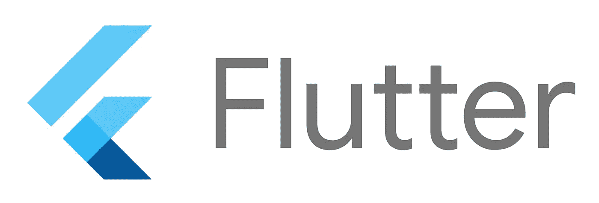

# 什么是颤振？如何入门？

> 原文：<https://blog.devgenius.io/what-is-flutter-how-to-get-started-33eb09963502?source=collection_archive---------26----------------------->

颤振发展的基础。

嘿，伙计们

欢迎回来，所以今天我们要谈谈颤振！是的，Flutter 是一个不断发展的开发工具，我们可以用相同的代码库创建跨平台的应用程序。Flutter 是 Google 为 Android 和 iOS 开发打造的。Flutter 不仅适用于 Android 和 iOS，也适用于构建 web、桌面、mac 和 Linux 应用程序。现在 flutter 社区发布了 Flutter web 的测试版。



# 什么是颤振？

**Flutter** 是由 **Google** 打造的开源 UI 软件开发包。它用于从单一代码库为 Android、iOS、Linux、Mac、Windows、Google Fuchsia 和 web 开发应用程序。Flutter 使用 dart 编程语言来创建应用程序。Dart 为 flutter 应用程序提供了许多功能。Flutter 支持两组小部件，它们是实现谷歌设计语言的**材质设计**和来自苹果 iOS 的**库比蒂诺小部件**。当我们开发本地应用程序时，我们必须等待至少 5 分钟才能编译代码。如果我在应用程序中做了任何小的改变，我必须等待一段时间才能看到我的应用程序中的变化，但在 Flutter 中，我们没有这种问题😀因为他们正在使用**即时**执行，即所谓的有状态**热重启**和**热重载**，这将帮助我们即时看到变化。我们可以在 Visual Studio 和 Android studio 这两个 IDE 中使用这个框架。让我们从 Flutter 开始。

# 如何入门？

我们可以从名为 [flutter.dev](https://flutter.dev/) 的 Flutter 网站开始使用 flutter [官方文档](https://flutter.dev/docs)，或者我们可以观看来自 Flutter 社区的 Youtube 视频。是的，Flutter 社区在他们的[频道](https://www.youtube.com/channel/UCwXdFgeE9KYzlDdR7TG9cMw)上创建并上传视频。好了，现在让我们进入编码部分。让我们创建一个 Hello world 应用程序。

```
**import** 'package:flutter/material.dart';
 2 
 3 void main() => runApp(HelloWorldApp());
 4 
 5 **class** **HelloWorldApp** **extends** StatelessWidget {
 6   @override
 7   Widget build(BuildContext context) {
 8 
 9     *//MaterialApp acts as a wrapper to the app and* 
10     *//provides many features like title,home,theme etc* 
11     **return** MaterialApp(
12       title: 'Hello World App',
13 
14       *//Scaffold acts as a binder that binds the appBar,*
15       *//bottom nav bar and other UI components at their places* 
16       home: Scaffold(
17 
18           *//AppBar() widget automatically creates a material app bar*
19         appBar: AppBar(
20           title: Text('Hello World App'),
21         ),
22 
23         *//Center widget aligns the child in center*
24         body: Center(
25           child: Text('Hello World'),
26         ),
27       ),
28     );
29   }
30 }
```

开始了。现在我们使用 Flutter 创建了 hello world 应用程序。通过使用这段代码，我们可以在手机上运行这个应用程序😀。在这里，您可以看到我们在顶部使用了 import。

```
**import** 'package:flutter/material.dart';
```

这将为我们的应用程序导入材质小部件。通过使用这个导入，我们可以使用来自 [Material.io](https://material.io/) 的材质应用特性，比如图标、按钮等等。

```
void main() => runApp(HelloWorldApp());
```

这里我们将 Main 函数清空。我们都知道每一种编程语言都是从 Main 函数开始的。在这里，我们也遵循这条黄金法则。所以在这里你可以看到 **runApp** 它将在应用程序初始化时被执行。在里面，我们有 **HelloWorldApp()** ，它被称为 dart 类。我们可以用无状态和有状态小部件来扩展这个类。这里我们用一个无状态的小部件来扩展它。在其中，我们有一个返回小部件的构建方法。

```
@override
Widget build(BuildContext context) {}
```

在构建方法中，我们有 **Buildcontext** ，它将帮助我们识别页面上下文。 **Context** 仅仅是应用程序屏幕的标识符，换句话说就是标识父窗口部件和子窗口部件。

```
**return** MaterialApp();
```

在 Flutter 中，我们使用逗号[，]来分隔部件。这里我们在构建方法中返回 **MaterialApp** 。这个 **MaterialApp** 用来实现材质应用的特性，这里我们有一些属性叫做 home，theme 等等。通过使用那个 **home** 属性，我们将创建我们的屏幕，在这个例子中，是第一个页面。

```
home: Scaffold(
          *//AppBar() widget automatically creates a material app* 
         appBar: AppBar(
           title: Text('Hello World App'),
         ),

         *//Center widget aligns the child in center*
         body: Center(
           child: Text('Hello World'),
         ),
       ),
```

这里我们有一个 **Scaffold** 小部件，它包含了许多属性，比如 App bar、body 等等。大多数情况下，我们在每一页上都使用这个脚手架。在这个主体中，我们将添加小部件，这些小部件位于父和子的结构中。在这里，我使用了**居中小部件**来居中我的文本，这个**居中部件**现在是父部件，而**文本小部件**包含了一些被称为“Hello world”的文本。这个文本小部件是中心小部件的子小部件。这就是我们如何构建我们的第一个 hello world 应用程序。要了解更多关于 Flutter 的信息，你可以在 Twitter、LinkedIn 或 Youtube 上关注我。