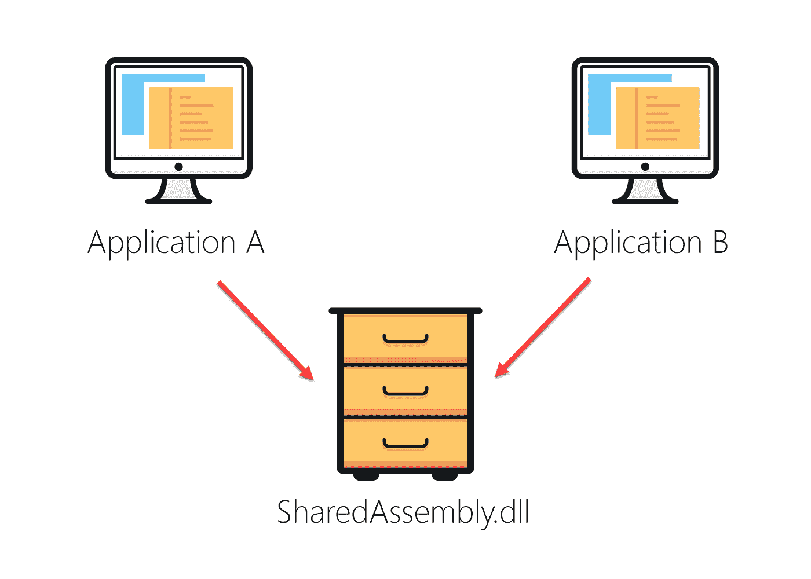

# 什么是广汽？

> 原文：<https://blog.devgenius.io/what-is-gac-859f7348169b?source=collection_archive---------3----------------------->


全局程序集缓存(GAC)是由。NET Framework，其中将存储指定由系统上执行的所有应用程序共享的强名称程序集(它们的名称由程序集名称、版本号、区域性和公钥标记组成)。

GAC 的概念是。NET 架构的设计解决了 COM(组件对象模型)中存在的 DLL hell 问题。

# DLL 地狱是什么？

DLL Hell 是指当多个应用程序试图共享一个公共动态链接库(DLL)时引起的一系列问题。使用 COMs，当一个应用程序试图安装一个已经存储在注册表中的 DLL 时，系统会用最新的版本覆盖最旧的版本，让最新的版本占优势。由于 DLL 没有任何用于向后比较的内置机制，这种覆盖导致依赖共享 DLL 的现有应用程序崩溃。通过强命名每个动态链接库(。dll)，GAC 解决了这个问题。

# 例子

DLL 地狱发生的一种情况是:

1.  在你机器上有一个应用程序使用了一个叫做 SharedAssembly.dll 的程序集
2.  我安装了一个新的应用程序，该应用程序安装了一个新版本的 SharedAssembly.dll，从而替换了现有的 DLL
3.  由于 SharedAssembly.dll 的更新版本，第一个应用程序停止正常工作。



图 DLL 地狱的例子

# GAC 工具(gacutil.exe)

全局程序集缓存工具是随 Visual Studio 自动安装的工具，它允许开发人员检查程序集是否存在，查看和操作全局程序集缓存的内容。

若要运行该工具，请以管理员身份打开 Visual Studio 的开发人员命令提示符，并执行该命令

```
gacutil
```

将立即提示一个助手，其中包含所有可用的标志及其相关描述。

```
**********************************************************************
** Visual Studio 2019 Developer Command Prompt v16.2.5
** Copyright (c) 2019 Microsoft Corporation
********************************************************************** C:\Windows\System32>gacutil
Microsoft (R) .NET Global Assembly Cache Utility.  Version 4.0.30319.0
Copyright (c) Microsoft Corporation.  All rights reserved. Usage: Gacutil <command> [ <options> ]
Commands:
  /i <assembly_path> [ /r <...> ] [ /f ]
    Installs an assembly to the global assembly cache. <assembly_path> is the
    name of the file that contains the assembly manifest.
    Example: /i myDll.dll /r FILEPATH c:\projects\myapp.exe "My App"
 /il <assembly_path_list_file> [ /r <...> ] [ /f ]
    Installs one or more assemblies to the global assembly cache.
    <assembly_list_file> is the path to a text file that contains a list of
    assembly manifest file paths. Individual paths in the text file must be
    separated by CR/LF.
    Example: /il MyAssemblyList.txt /r FILEPATH c:\projects\myapp.exe "My App"
      myAssemblyList.txt content:
      myAsm1.dll
      myAsm2.dll /u <assembly_display_name> [ /r <...> ]
    Uninstalls an assembly. <assembly_name> is the name of the assembly
    (partial or fully qualified) to remove from the Global Assembly Cache.
    If a partial name is specified all matching assemblies will be uninstalled.
    Example:
      /u myDll,Version=1.1.0.0,Culture=en,PublicKeyToken=874e23ab874e23ab
      /r FILEPATH c:\projects\myapp.exe "My App" /uf <assembly_name>
    Forces uninstall of an assembly by removing all traced references.
    <assembly_name> is the full name of the assembly to remove.
    Assembly will be removed unless referenced by Windows Installer.
    !! Warning: use the /uf command with care as applications may fail to run !!
    Example: /uf myDll,Version=1.1.0.0,Culture=en,PublicKeyToken=874e23ab874e23ab /ul <assembly_display_name_list_file> [ /r <...> ]
    Uninstalls one or more assemblies from the global assembly cache.
    <assembly_list_file> is the path to a text file that contains a list of
    assembly names. Individual names in the text file must be
    separated by CR/LF.
    Example: /ul myAssemblyList.txt/r FILEPATH c:\projects\myapp.exe "My App"
      myAssemblyList.txt content:
      myDll,Version=1.1.0.0,Culture=en,PublicKeyToken=874e23ab874e23ab
      myDll2,Version=1.1.0.0,Culture=en,PublicKeyToken=874e23ab874e23ab /l [ <assembly_name> ]
    Lists the contents of the global assembly cache. When the optional
    <assembly_name> parameter is specified only matching assemblies are listed. /lr [ <assembly_name> ]
    Lists the contents of the global assembly cache including traced reference
    information. When the optional <assembly_name> parameter is specified only
    matching assemblies are listed. /cdl
    Deletes the contents of the download cache /ldl
    Lists the contents of the download cache /?
    Displays a detailed help screen Old command syntax:
  /if <assembly_path>
    equivalent to /i <assembly_path> /f
 /ir <assembly_path> <reference_scheme> <reference_id> <description>
    equivalent to /i <assembly_path> /r <...> /ur <assembly_name> <reference_scheme> <reference_id> <description>
    equivalent to /u <assembly_path> /r <...> Options:
  /r <reference_scheme> <reference_id> <description>
    Specifies a traced reference to install (/i, /il) or uninstall (/u, /ul).
      <reference_scheme> is the type of the reference being added
        (UNINSTALL_KEY, FILEPATH or OPAQUE).
      <reference_id> is the identifier of the referencing application,
        depending on the <reference_scheme>
      <description> is a friendly description of the referencing application.
    Example: /r FILEPATH c:\projects\myapp.exe "My App"
 /f
    Forces reinstall of an assembly regardless of any existing assembly with
    the same assembly name. /nologo
    Suppresses display of the logo banner /silent
    Suppresses display of all output
```