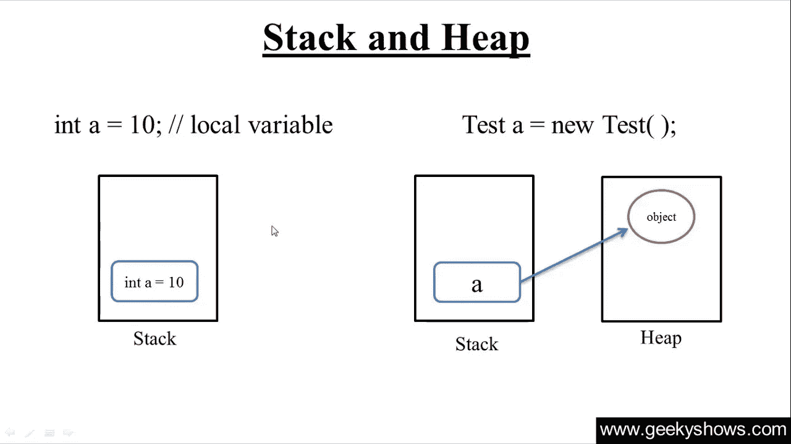
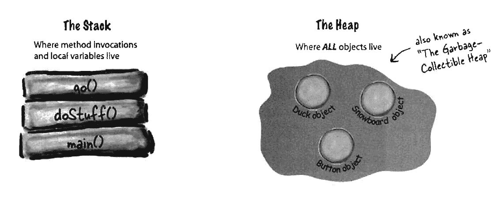
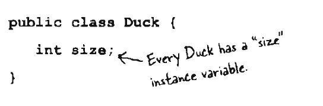
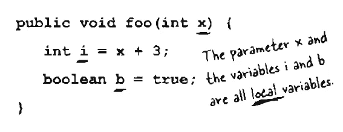
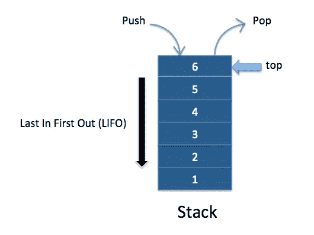
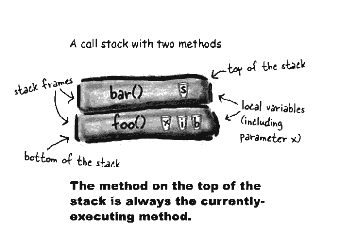
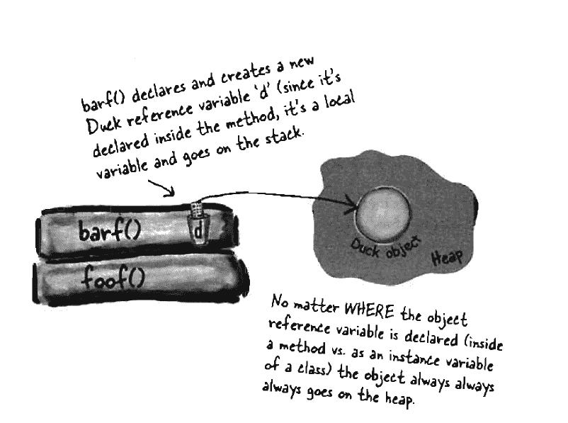

# JAVA 中的对象在哪里？JAVA 中的垃圾收集器、栈、堆是什么？

> 原文：<https://blog.devgenius.io/what-is-garbage-collector-stack-heap-in-java-80c33c2a0234?source=collection_archive---------4----------------------->

## **简介:**

在这篇文章中，我将解释堆和栈以及 java 如何使用它们，Java 中的垃圾收集器是什么，在应用程序中将做什么，以及我们的应用程序中对象的生命周期是什么。

## Java 中的堆栈和堆:

JVM (Java 虚拟机)将内存分为两部分:堆栈内存和堆内存。

栈和堆是 Java 中方法、对象和变量的生命所在

当运行你的 Java 应用程序时，JVM (Java 虚拟机)会检查你操作系统中的内存，并使用它来运行 Java 应用程序。

所有将在 java 应用程序中初始化的对象都在堆中，但是变量在堆栈中，方法在堆栈中，

但并不是所有的变量都像集合一样存在于堆栈中，字符串变量存在于堆中。

请看下图，它代表了 java 应用程序中的堆和栈。

好，现在我们有了变量类型，我们关心它们

*   实例变量
*   局部变量

> *现在我们来谈谈上述类型的变量*

## 实例变量:

我们将在类中而不是在方法中声明一个实例。

关于这个证明，实例变量属于对象，因此将存在于堆中。

## 局部变量:

局部变量在方法内部声明，方法内部的参数是局部变量，如果方法死了，局部变量也会死，因为局部变量依赖于方法，在这种情况下，如果方法从堆栈中删除，局部变量也会被删除。

> *好了，现在我们知道方法在哪里，对象在哪里了*

## 栈是什么？堆栈是如何工作的？

堆栈是一种线性数据结构，用于存储对象集合。

堆栈遵循 LIFO(后进先出)原则，即最后插入的元素是第一个出来的元素。

请看下图，了解它们是如何堆叠工作的。

**举例:**

在上图中，我们在堆栈中有两个方法 **bar()** 和 **foo()**

bar 上有一个名为 **S** 的局部变量，而 **foo()** 则有三个局部变量 **x，I，b**

在图像的情况下，堆栈将执行 **bar()** 方法，因为它是顶部的，当完成时，堆栈将使用局部变量 **S** 弹出 **bar(** )方法。

> *例如，我们将 object 作为局部变量，在方法*中定义的这种情况下会发生什么

## 对象作为局部变量:

在这种情况下，该方法将初始化一个非原始变量，它将指向堆内的对象。

方法不能从堆中看到原始对象，但非基元值可以。

非原始值具有对堆中原始对象的引用。并且具有相同的值。

**举例:**

请看下图，以便更好地理解。

在上图中，我们有堆栈和堆，堆栈有方法 **barf()** 有**非原语**变量，因为它是来自 **Duck 类**的**对象**的引用，而 **foof()** 没有任何局部变量。

> *我们来谈谈实例变量*

## 实例变量在哪里？

当创建对象时，java 会调用这个类的构造函数，如果这个类没有，任何构造函数都会创建一个默认的构造函数并执行它，在构造函数中我们可以为一个类的变量设置一个值，这些变量在对象实例中是活的，如果对象死了，这个变量也会死。

如果变量是基元的，java 将根据基元类型为实例变量腾出空间。 **int** 需要 **(32 位)** **long** 需要 **(64 位)**等等。

java 不关心**原语**中的值是什么，只关心用于创建空格的原语的类型。

> *构造器将执行每个新的关键字*
> 
> 你创建的每个类都有一个构造函数，即使你不是自己写的。

就像我最后说的，创建对象后将默认执行该类的构造函数，在这一步中 **JVM** ( **Java 虚拟机**)将设置值，在完成进程之前，我们的对象将在堆中注册。

## 一个物体能活多久？

对象的生命依赖于引用它的引用，如果引用死了，那么对象也会死。

## 垃圾收集(GC)的任务是什么？

这是 Java 虚拟机(JVM)中垃圾收集(GC)的任务，用于自动确定 Java 应用程序不再使用哪些内存，并回收这些内存用于其他用途。

## 总结:

在这篇文章中，我解释了垃圾收集(GC)和变量的类型，什么是堆和栈，变量在哪里，对象在哪里，我们知道一个对象有多长的寿命，垃圾收集会自动运行，我对此没有任何控制。