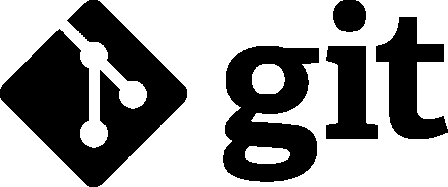
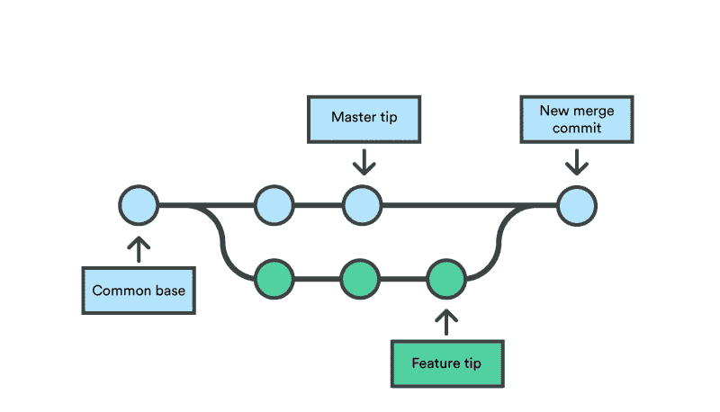

# 什么是“饭桶”？

> 原文：<https://blog.devgenius.io/what-is-git-a4ec39b40ca8?source=collection_archive---------34----------------------->

“Git 是一个免费的开源分布式版本控制系统，旨在快速高效地处理从小到大的所有项目。”

但是这到底意味着什么呢？

Git 是一个工具，这个工具的主要目的是帮助实现代码组织及其版本。

从最基本的开始，无论什么时候一个项目被执行，它都有几个阶段，从最简单的开始，比如初始化项目，它的目录和一些根文件。这些文件总是由一个人更新，如果是这样，只有一个人不会有问题，因为只有他改变了项目。

反过来，如果有两个人，无论何时他们触摸了某个东西，他们都必须告知他们在哪里更改了它，以便伴侣知道，这开始变得复杂，并且即使是一个人，很多时候这个人也不会制作文件的副本，也没有在哪里进行了更改的历史细节。

Git 在在线仓库的帮助下解决了这个问题，仓库不同于 git attention，但是我们把它留到后面。我们做了一个变更，把它发送到存储库并把更新保存在那里，这带来了安全性，一个变更日志，并解决了我解释过的团队合作中的一个严重问题。

想象一下，在“测试”文件的第 4 行中，我写道:

public void end(){}

我的同事在“测试”文件的第 4 行写道:

n = 3+4；

那么，如果我们都更新了存储库，测试文件会变得混乱，并警告我们只能有一行 4，我们需要修改文件的一小部分，会发生什么呢？

**在这个简单的解释之后，让我们稍微改变一下 git 词汇:**

-更新或更改文件并将其发送到存储库称为“提交”；

-将文件从存储库复制到本地机器称为“克隆”；

-将文件或项目的两个更新混合为一个称为“合并”；

-创建与原始代码分开工作的第二个分支称为“分支”。

等等，“分支”？是的，branch 是 git 中经常使用的一个术语。这个术语解释起来很简单，想象一下主“分支”中的主代码是完全功能性的，但是有必要进行一个大的改变，这个改变可能有很大甚至很小的影响，但是要保持代码主分支被创建，我们称之为新功能。

**我们的新功能分支有两种可能性:**

-发展和被接受并与主分支混合；

-跑发展不好被删。

允许控制这一点，我们的代码总是安全的，因为如果它出错了，只需删除分支并返回到主代码，如果它运行良好，我们只需合并它来混合两个分支。

我希望您喜欢 git，并希望它对您的开发有用。

感谢您的阅读。