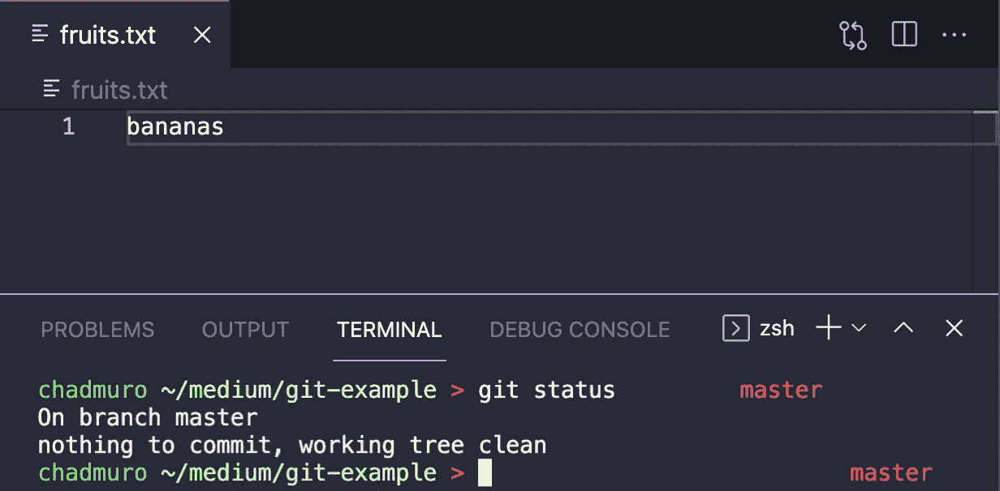
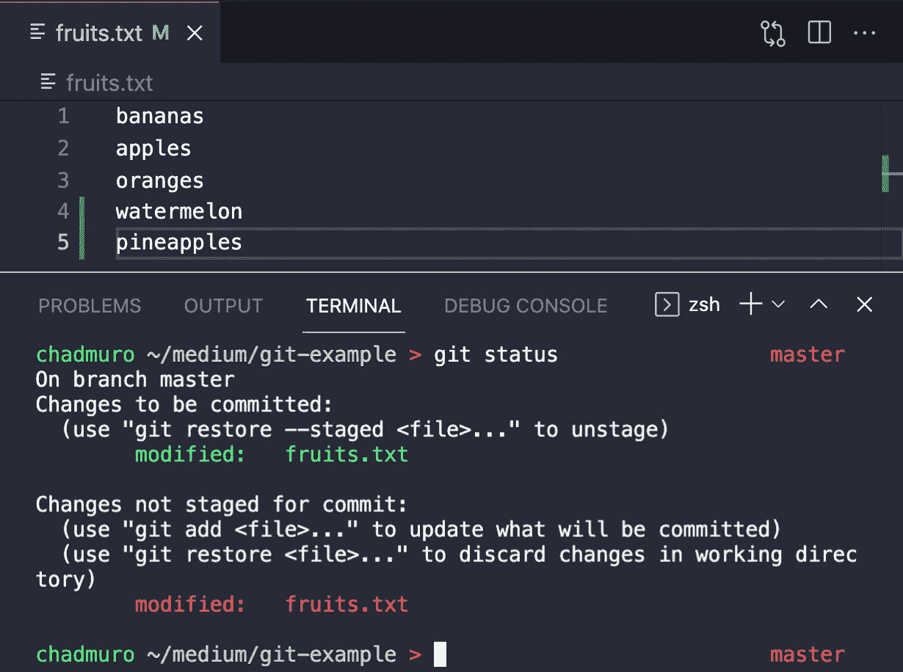
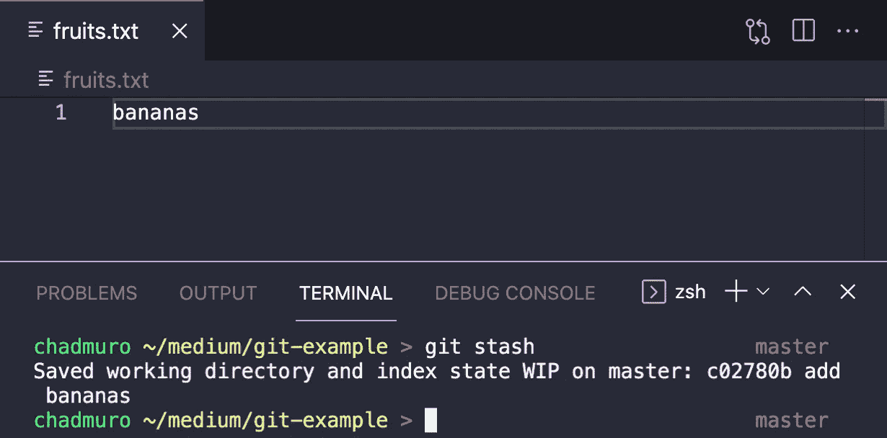
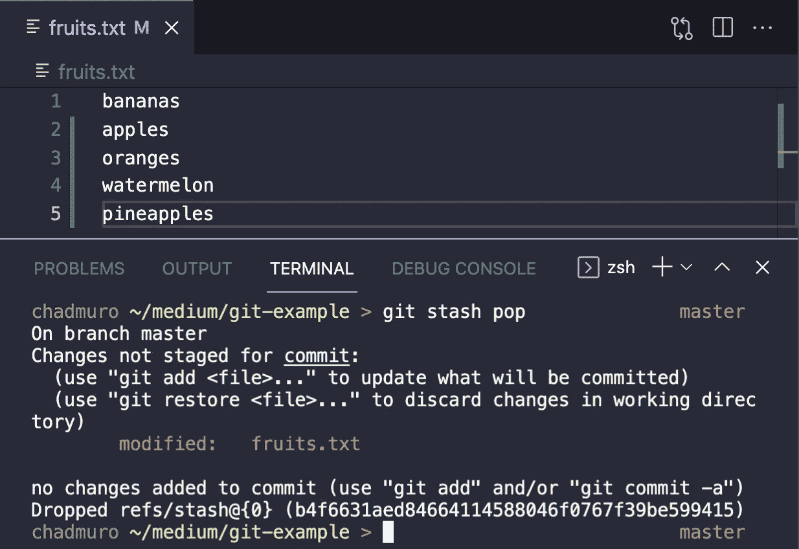

# 什么是 Git Stash，我们如何使用它？

> 原文：<https://blog.devgenius.io/what-is-git-stash-and-how-do-we-use-it-7cc04fecd3c4?source=collection_archive---------2----------------------->

## 作为开发人员，使用 git stash 来改进您的工作流程

[艾莉·约翰逊](https://unsplash.com/@lejo?utm_source=medium&utm_medium=referral)在 [Unsplash](https://unsplash.com?utm_source=medium&utm_medium=referral) 上的照片

Git 是开发人员需要的最重要的技能之一。

当我开始做前端开发人员的第一份工作时，我很快意识到 Git 是一项非常重要的技能，我希望我能学习更多。你可以在下面的文章中了解更多我的经历。

 [## 我希望在开始我作为开发人员的第一份工作之前多学习一点

### 对此有更深入的了解会让我现在的生活轻松很多

blog.devgenius.io](/the-one-thing-i-wish-i-studied-more-before-starting-my-first-job-as-a-developer-edcc14f54e5) 

在过去的一个月里，我学习了很多关于 Git 和如何使用不同命令的知识。我学到的最有用的命令之一是 Git stash。Git stash 不是你必须学习的基本命令，但它对改进我的工作流程很有帮助。

在本文中，我们将了解以下内容:

*   什么是 Git stash？
*   为什么我们应该使用 Git stash？
*   如何使用 Git stash 命令

# 什么是 Git stash？

根据 [Atlassian 的 Git 教程](https://www.atlassian.com/git/tutorials/saving-changes/git-stash)，

> Git stash 命令获取您未提交的更改(暂存的和未暂存的)，保存它们供以后使用，然后从您的工作副本中恢复它们。

基本上，这是一种存储任何未提交的更改并将文件恢复到上次提交的方法。在此期间，您可以执行任何其他 Git 命令。准备就绪后，您可以将存储的更改重新应用到工作目录中。

# 为什么我们应该使用 Git stash？

想象一下这个场景:您正在为一个项目开发一个新的特性分支。然后一个同事向你寻求帮助，希望你在另一个分支机构检查一些东西。但是，您在特性分支中所做的更改还没有准备好提交。

这就是 git stash 派上用场的地方。您可以使用 Git stash 来保存未提交的工作，而不是提交一个未完成的工作。然后，您可以安全地检查另一个分支。当你帮助完你的同事后，你可以回到你的分支机构，从你停止的地方继续。

# 如何使用 Git stash 命令

当使用 git stash 时，您将使用两个基本命令。

使用这个命令来隐藏你当前的工作。

`git stash pop` —使用此命令将你隐藏的工作重新应用到你的工作区域，并将其从隐藏中移除。

## **例子**

为了展示如何使用`git stash`和`git stash pop`的例子，我们将在这个 git 存储库中工作。如您所见，有一个文件，`fruits.txt`带有一个提交文本，*香蕉*。

然后，我们可以将*苹果*和*橙子*添加到列表中，并将它们添加到暂存区。然后，我们还会将*西瓜*和*菠萝*添加到列表中，但不会添加到暂存区。现在有阶段性和非阶段性的变化。

如果我们接着运行`git stash`，你会看到*苹果*和*橙子*已经从列表中移除。*西瓜*和*菠萝*也被从名单中剔除。`fruits.txt`文件已经被还原到最后一次提交，它只包含文本*香蕉*。

现在我们可以去其他分支机构做我们想做的事情。当我们准备好了，我们就可以使用`git stash pop`将隐藏的变更带回我们的工作区。

大多数时候，你只需要使用`git stash`和`git stash pop`就可以了。但是，还有一些其他命令可能会派上用场。

`git stash apply` —使用这个命令将你的隐藏工作重新应用到你的工作区域，而不需要从隐藏中移除它。

`git stash drop <hashid>` —使用该命令从贮藏列表中删除一个贮藏。

`git stash clear` —使用该命令来清除隐藏。

# 结论

感谢阅读！我希望这篇文章有助于您了解什么是 Git stash，以及如何使用它来改进您的工作流。

了解 Git 对于任何开发人员来说都是一项基本技能，所以花一些额外的时间来学习可能对您有帮助的命令是值得的。

查看下面的文章，继续学习更多关于 Git 的知识。

 [## 如何配置 Git 使用 VS 代码作为默认的文本编辑器

### 结束尝试使用 Vim 的斗争

levelup.gitconnected.com](https://levelup.gitconnected.com/how-to-configure-git-to-use-vs-code-as-the-default-text-editor-ea3670ab525a)