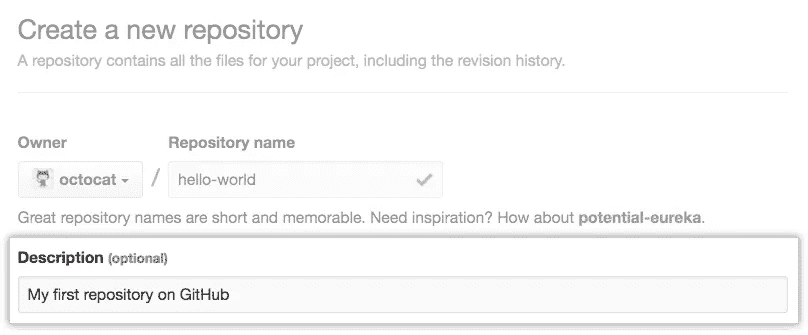

# GitHub 是什么，怎么用？

> 原文：<https://blog.devgenius.io/what-is-github-and-how-to-use-it-5dea070d2390?source=collection_archive---------9----------------------->

GitHub 是一个使用 Git 托管源代码和带有版本控制的文件的平台。它类似于一个协作的社交平台，程序员和企业在这里发布他们的代码开发项目。


# 我们为什么需要 GitHub？

信息技术的世界越来越拥挤，新技术层出不穷，速度惊人。人们越来越需要开发能够处理和控制这些技术的应用程序和程序。

面对如此多的竞争和多样性，你如何在这种环境中脱颖而出？在一些职业中，专业人士有一个作品集来宣传他们的工作是很常见的。

例如，音乐家和歌手在 SoundCloud 或 YouTube 上推广他们的歌曲。但是程序员呢？他们可以在哪里展示他们的程序和代码？这就是 GitHub 的用武之地！

但是，不谈论 Git 就没办法理解 GitHub，所以要理解 Git 从何而来，从 GitHub 而来，先简单说一下。

# Git 是什么？

Git 是一个文件版本控制库，用于**源代码版本控制**和**协同开发。**

它是由 Linux 内核的创造者 Linus Torvalds 于 2005 年创建的，用于托管 Linux 源代码并允许在其开发中进行合作，因为托管其代码的老公司 BitKeeper 希望对其服务收费。

# 如何安装 Git？

可以使用以下命令在 Linux/Debian 平台上安装 Git:

```
sudo apt-get install git
```

在 Windows 或 Mac 等其他平台上，您可以通过以下链接下载:

*   [用于 Windows 的 Git](https://git-scm.com/download/win)
*   [Mac 版 Git](https://git-scm.com/download/mac)

# GitHub 的重要性

GitHub 于 2008 年推出，是 Git 的网页版。

GitHub 上的项目大多是开源的，但也有可能让你的代码私有，只对少数人或通过创建团队可用。

GitHub 已经成为云中最大的代码库之一。

# GitHub 是干什么用的？

千万别忘了: **Git 和 GitHub 是两码事。**

您只能在本地计算机上使用 Git 进行版本控制。当你想分享你的代码或者把它放在云端的时候，就要用到 GitHub。GitHub 拥有 Git 的所有特性，并且还有下面列出的**许多额外特性**:

*   证明文件
*   问题跟踪
*   维基百科
*   带注释和代码审查的拉式请求
*   提交历史记录
*   电子邮件通知和表情符号
*   GitHub 页面:可以做小网站。

# 如何使用 GitHub？

让我们开始如何使用 GitHub 的教程。首先，你需要在[官方 GitHub 页面](https://github.com/)上创建你的个人账户或者团队账户。

它对个人和团队存储库完全免费，对团队和公司有一些更高级的付费计划。创建您的帐户后，使用平台的 Hello World 指南来学习如何创建您的第一个存储库、打开分支机构和打开拉取请求。

## 什么是存储库？



存储库是存储特定项目的所有文件的空间。

每个项目都有自己的存储库，您可以使用唯一的 URL 来访问它。

## 叉子是什么？

“分叉”是指基于另一个已经存在的项目创建一个新项目。这一特性极大地鼓励了社区或团队中的程序和项目的开发。

假设您在 GitHub 上找到了一个您想要参与的项目，您可以拆分存储库，进行所需的更改，并将修改后的项目作为新的存储库发布。

## 什么是拉取请求？

假设您已经创建了一个存储库，对项目做了很好的评审，并希望它得到最初开发人员的认可。您可以通过创建一个拉取请求来做到这一点。

原始资源库的作者可以看到您的工作，然后选择是否将其纳入正式项目。每当你提出一个 pull 请求时，GitHub 都会为你和主要项目维护者提供一个很好的相互沟通的方式。

# GitHub 也是一个社交网络

GitHub 还允许项目随着该工具的社交使用呈指数级增长。GitHub 上的每个用户都有自己的个人资料，就像任何社交网络一样，非常适合展示他们在其他项目中的工作和贡献。

项目修订可以公开讨论，有利于公众辩论和知识共享。GitHub 支持开发人员之间的交流，可以促进你的职业发展。

**没有什么比在社区中受欢迎且活跃的 GitHub 更能吸引招聘人员的注意了。**

# 在你的 GitHub 里放什么？

创建帐户后，你可能会问这个问题:在那里放什么？

用一个词概括:**一切！**

那个你认为没用的个人或大学项目，可能包含了某个公司正在寻找的某种编程理念或技术。

你有没有参加过一个需要开发项目的辅助编程课程？发布到 GitHub 上。你有正在开发的个人项目吗，也把它贴出来。

不仅你的代码对世界是可见的，而且人们也可以帮助你开发它。

如果你已经是一名程序员，为一家公司开发，你很可能无法发布你的代码。在这种情况下，用你正在使用的技术和方法创建简单的项目，并将它们发布在 GitHub 上，描述你所做的一切。

# GitHub 的自述文件

项目中一个并不总是得到足够重视的重要元素是自述文件。

自述是对你作品的第一印象。在项目的根中总是有一个。一个好的自述文件应该包含对用途、使用位置和方式、功能列表以及使用依赖关系的详细描述。使用的例子将是一个加号。

请记住，自述文件是一个总结，而不是项目的文档。对于文档，可以使用 GitHub 自己的 Wiki。

# 使用许可证

不要忘记为您的项目设置一个许可证。如果没有定义许可证，您可能会错过机会。[选择许可](https://choosealicense.com/)网站可以帮助您定义采用哪种许可。

要将许可证应用于您的项目，只需创建一个名为 license 的文件，并将确切的许可证内容粘贴到其中。仅当许可中有空格需要填写您的数据时，才更改它。

GitHub 会自动识别许可证，并在项目顶部添加一个小图标。如果没有出现这种情况，请修改文件。

# 结论

今天到此为止。现在，您对 GitHub 及其工作原理有了更多的了解，不要忘记探索它并亲自尝试，因为俗话说:*“熟能生巧”*。

感谢阅读！在这个平台关注我，阅读更多开发者内容。祝您愉快，再见！👋