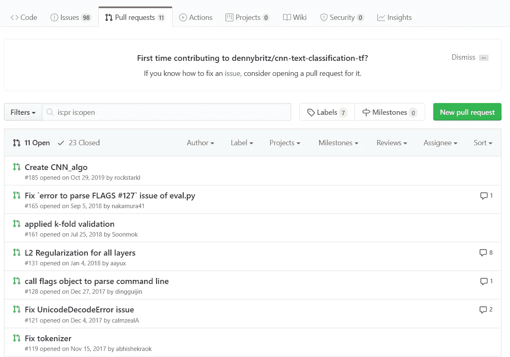

# 什么是 GitHub，为什么要使用它？

> 原文：<https://blog.devgenius.io/what-is-github-and-why-you-should-use-it-eb21cd2225af?source=collection_archive---------26----------------------->

## 快速入门指南。从初学者到专家。

在谈论 GitHub 之前，有必要提一下它的来源。Git 是一个版本控制软件，它允许开发者看到对他们的代码所做的修改，并与其他人合作，或者只是有一个地方来存储你的项目。

**GitHub** 是基于 Git 的版本控制软件。它创造了整个开发者社区，在那里人们可以改进彼此的项目并构建更好的东西。

有了这个又好又方便的软件，人们可以在团队中进行项目工作，并公开或私有他们的代码。

# 连接

这里发生了很多事情，但是现在还不要被这些花哨的词语所迷惑。

**存储库**仅仅是项目。所以一个存储库包含了关于一个程序的所有代码和描述信息。

每个存储库都有所有者和项目名称。在它的正下方，你可以看到一个简短的描述。

在描述下面可以看到**星星**。这只是显示了有多少人将该项目添加到了他们的收藏夹中。这样，人们以后就可以访问它了。它是衡量一个项目重要性的主要指标，因此星级越多越好。

然后我们可以看到**语言**，它是这个库中使用的主要编程语言(例如 Python、Java)。

之后，您可以看到一个存储库拥有的任何许可证和最后修改日期。

最后，我们有**拉请求**。使用 pull，GitHub 社区的成员可以建议对特定项目进行更改和修改。然后，这些拉动由所有者审查，可以应用也可以忽略。

# 承诺

每当一个开发人员想要修改代码时，他(她)必须**提交**所做的修改。GitHub 提供了一个非常有用的特性，可以让你看到代码中添加和删除了什么。在上面的例子中，你可以看到绿色的新增内容和红色的删除内容。通过这种方式，开发人员可以轻松地管理他们的项目并查找 bug。

# **分支和克隆**

任何公开可用的项目都可以下载和扩展。这对于那些想了解更多代码功能或者只是自己尝试一些东西的人来说是非常好的。研究人员和开发人员可以向项目添加一个分支，并进一步扩展可用的功能。

# 结论

GitHub 是一个广泛使用的共享项目的工具。任何开发人员都应该知道如何使用这个软件。凭借它的特性和大量可供选择的公开资源，任何人都可以成为创造者，并在实践中学习如何编码。

> 别人在****Hub 的时候，我们在 GitHub。
> 
> —一名程序员