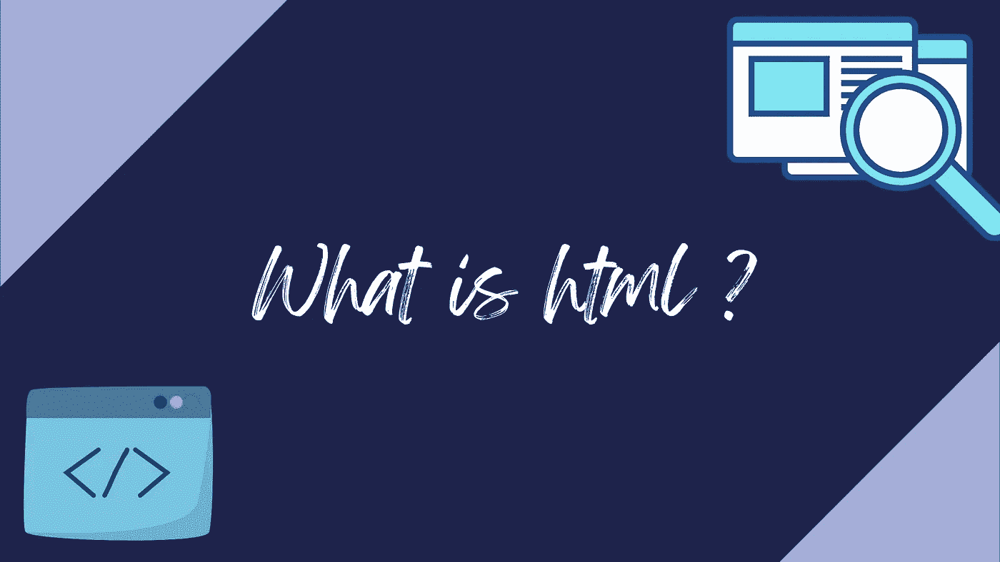
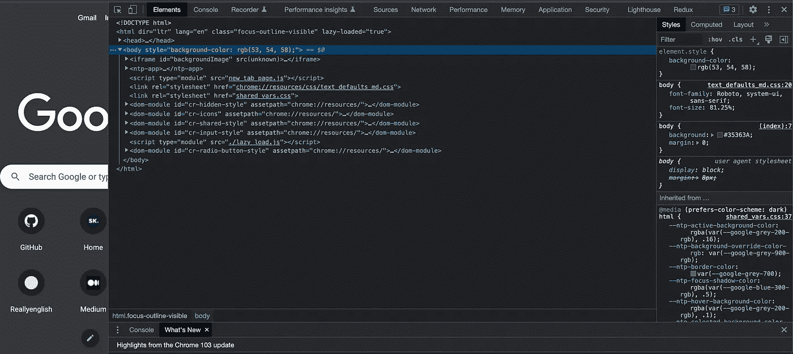
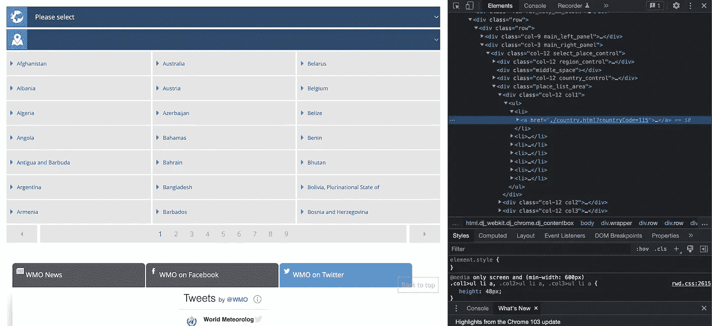

# 什么是 HTML？

> 原文：<https://blog.devgenius.io/what-is-html-5967451ea975?source=collection_archive---------8----------------------->

## 什么是 HTML 的快速介绍



## HTML 的历史

每次你访问一个网站，你都会接触到 HTML。由蒂姆·伯纳斯·李于 1993 年提出，HTML 代表超文本标记语言。那么 html 是用来做什么的呢？嗯，HTML 是所有网页的骨架，用于构建页面和显示内容。通过使用 HTML，我们可以添加和格式化文本，显示链接，列表，表格和表单，我们可以在网页上包含图像和视频。

自 1993 年以来，世界发生了很大的变化，技术也有了很大的发展。今天，当前的版本是 HTML 5，万维网联盟管理 HTML 的标准并决定它包含什么。

在你的浏览器中，你可以检查你访问的任何网站的 html。你可以使用任何浏览器，但我们将尝试使用 chrome。让我们试一试，去参观 google.com。我们只需右击任何页面并选择 inspect。出现一个显示元素的选项卡，我们可以看到页面的 html。



## 超文本标记语言

我们说 HTML 代表超文本标记语言，这是什么意思？嗯，超文本描述的是提供访问另一个页面的文本。这是通过一个叫做超链接的链接来实现的。如果我访问一个显示 https://worldweather.wmo.int/en/home.html[天气预报的网站，然后查看页面，这个国家就是一个超链接的例子，当我查看这些元素时，我可以确认这一点。当我点击按钮时，我被导航到一个新的页面。](https://worldweather.wmo.int/en/home.html)



标记语言是一种描述文本如何显示的计算机语言。就像你在文档中给一些文本加下划线或高亮显示一样，标记语言是一种指定结构和表示的计算机语言。我们将希望浏览器显示的文本包装在元素和标签中，以便浏览器知道如何正确显示它。

## HTML 元素

在 HTML 中，多个元素的组合构成了网页的整体结构。元素本身通常由一个开始和结束标记组成，可以认为是包装器或容器。

标签有多种类型，但大多数都遵循一段文本的结构，以开始标签开始，以结束标签结束。让我们从看开始标签开始。放在括号内的字符是标签的类型。因此，对于一个段落，我们将放置字母 p。除了我们在第一个括号后使用正斜杠之外，结束标记完全相同。

```
<p>Some text</p>
```

## 属性

属性使我们能够添加关于元素的更多信息。我们将属性放在开始标签中。为此，我们使用等号将名称和值连接在一起。名称是属性的类型，值是您希望分配的值。对于最佳实践，属性名应该小写并用双引号括起来。

```
<p id="message">Some text</p>
```

## 语义学

我提到了 HTML 自诞生以来的巨大发展。其中一个方面是，格式化的标签名已经开始倾向于我们所说的语义或者其他术语的含义。在过去，粗体文本被称为粗体，斜体被称为斜体，但我们仍然可以使用它们。这些天来，用“强”和“强调”这样的词来代替变得越来越普遍。

如果你想继续学习，我在[周日](https://www.udemy.com/course/html-a-crash-course-for-beginners/learn/lecture/32718880#overview)有一门课程。

我希望你喜欢这篇文章。请随时发表任何评论、问题或反馈，并关注我以获取更多内容！