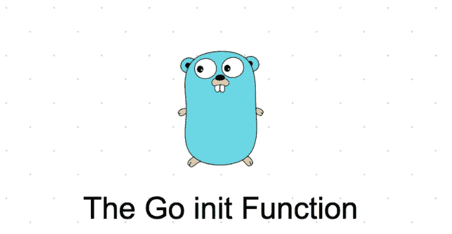

# [Golang]Golang 中的 init()是什么

> 原文：<https://blog.devgenius.io/what-is-init-in-golang-b806caa52822?source=collection_archive---------6----------------------->

顾名思义,`init()`用于用程序生命周期中可能需要的东西来初始化你的程序。`init()`可用于各种用例。其中一些可能是



## 例如:

1.  *建立数据库连接*
2.  *导出云凭据*
3.  *获取一些静态配置文件供您的程序使用*
4.  *为你的程序设置一些环境变量*
5.  *为你的程序定义一些全局的东西要用**`***package***`*
6.  **初始化*T3 的日志和日志级别*

*在你的程序中使用`init()`会有更多的用例。以上只是我能想到的几个例子。*

## *`init()`功能的一些关键属性:*

1.  *范围仅限于**包块***
2.  *只能调用**一次***
3.  *如果需要，根据**封装基础**定义`init()`*
4.  *Go 支持同一个**包**内的多个`init()`功能，但是，执行的顺序是**计算出来的***
5.  *Go 为我们隐式地处理了`init()`函数的执行*
6.  *这个函数既不接受参数也不返回任何值*

**根据定义* `*init()*` *可以用来定义或初始化* ***包内的任何东西。*** *通常，* ***事情*** *在你的程序的生命周期中需要或者将要需要一次**

*你可能已经注意到，我一直在用**粗体**说明**在包装内**。背后的原因是，任何初始化的、建立的东西都是在包的范围内导出的，它们不能在包之外被访问。要了解关于 Go 包初始化的更多信息，请参考[官方文档](https://go.dev/ref/spec#Package_initialization)*

*这意味着我们可以在我们的程序中分别为每个**包**定义`init()`函数，如果我们看到需求和`init()`函数将被调用一次，不管这个包被导入了多少次。`init()`可以在包中的任何`Go`文件中定义，`Go`会自动运行。*

## *多重`init()`功能*

*可以在一个文件或**包**中定义多个`init()`功能。执行顺序将决定为`init()`函数的声明顺序。*

*根据[包初始化](https://golang.org/ref/spec#Package_initialization)的 Go 语言规范，当一个包中遇到多个文件时，按字母顺序处理。因此，如果你在包内的多个文件中定义了多个`init()`函数，那么**要注意文件名。***

***例如:***

```
*package mainimport (
    "fmt"
)var Var1 string
var Var2 stringfunc init(){
    fmt.Println("First Init Function Called")
    Var1 = initialize()
}func init(){
    fmt.Println("Second Init Function Called")
    Var2 = Var1
}func main(){
    fmt.Printf("Going by the order and printing value of Var2: [%s]\n", Var2)
}func initialize() string {
    var e string
    e = "Executed by Init Function"
    return e
}*
```

***结果:***

```
*> go run initFunctions.go
First Init Function Called
Second Init Function Called
Going by the order and printing value of Var2: [Executed by Init Function]*
```

# *使用`init()`治疗副作用*

*有时我们只需要包处于某个特定的状态，然而，我们可能无论如何都不会在程序中使用包的其余部分。这种类型的导入被称为*副作用导入。**

****TL；dr:可能你是因为它的*** `***init()***` ***功能*** 才导入的*

```
*import _ "github.com/go-sql-driver/mysql"*
```

*Go 非常严格，不允许引用未使用的包。然而，您执行`init()`的需求需要导入该包来进行一些**初始化。**这就是我们使用[空白标识符](https://golang.org/ref/spec#Blank_identifier)(即`_`)来解决这个问题的地方。*

*软件包的`init()`功能是一个方便的工具，有时是必要的，但不应该过度使用。有时需要重新初始化，不能重新调用`init()`。*

*所以应该总是尝试使用显式调用，这样可以为你初始化一些东西，但是要知道有`init()`可以用于一些琐碎的事情*

# *编码快乐！！*