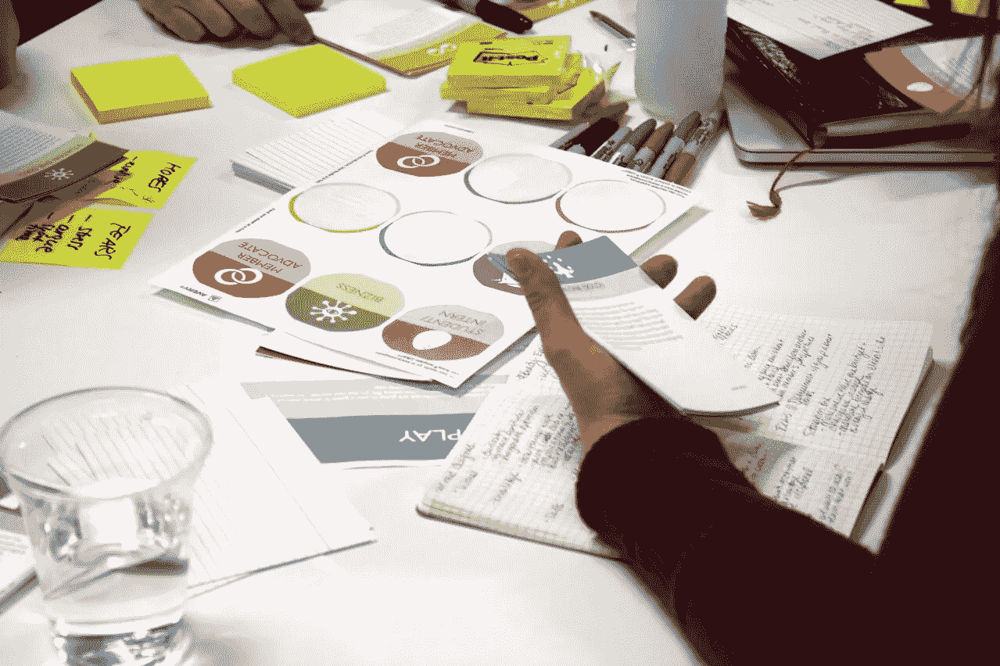
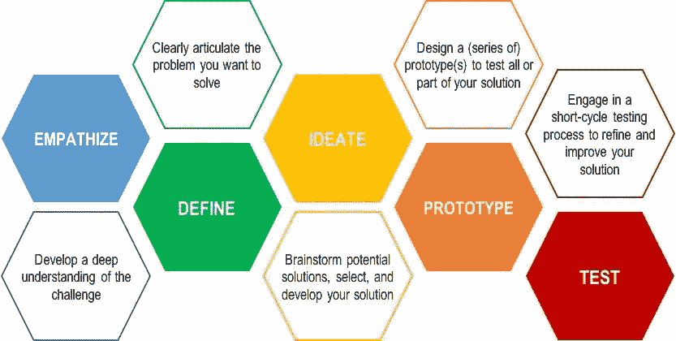

# 在设计思维项目中工作是什么感觉

> 原文：<https://blog.devgenius.io/what-is-it-like-to-be-working-in-a-design-thinking-project-8d0a5021b5f1?source=collection_archive---------2----------------------->

有一天，我接到部门主管的电话，告诉我从第二天起，我必须转移到一个新项目。该项目是一家当地银行的设计思路。当我第一次听说设计思维时，我关注的词是“设计”。我有一个软件设计和开发的 IT 专业硕士学位，所以我首先认为我的经理混淆了软件设计和图形设计相关的工作，除了基本的 photoshop 或使用 PowerPoint 编辑之外，我从来没有做过这些工作。我没有问这份工作是什么样的，但我内心充满了好奇。在接下来的两个月里，我在这个项目中度过的时光是我永远不会忘记的。

设计思维项目是我从未做过的事情，所以我把它作为对自己的挑战。正如我最初认为的那样，它与图形设计无关。设计思维背后的理念是与我们的用户感同身受，为他们创造一个令人愉快的解决方案。为了实现这一目标，用户需要参与端到端的流程，然后与关键利益相关方一起召开研讨会，并找到问题的解决方案。之后，我们必须根据研讨会的结果设计一个原型。

**设计是结果背后的意图**,可以是移动应用、网络应用，也可以是但不限于业务流程优化。我被分配到这个项目，通过与用户接触来帮助准备研讨会，通过进行采访从他们那里收集信息，对信息进行分析并提取见解。设计思维本身在行业中是一个新概念，没有多少人意识到这一点。成为这个项目的一部分是一次奇妙的经历。

> “设计思维就是头脑风暴和构思”

我从设计思维项目中学到的是，你不必成为一名设计师来进行设计思维(这是我的一个误解)。设计思维团队应该包含来自不同领域、具有不同专业知识的成员，以尽可能最好的方式解决问题，我认为这是我经历过的最神奇的想法。在我们的设计思维团队中，我们有设计师、业务分析师、数据分析师、营销专家和开发人员。我们所有人都可以为解决问题献计献策，从而迅速找到解决方案。我在学习和实践设计思维时学到的一件事是，问一些诸如为什么、如何等问题是没有坏处的。这类开放式问题有助于你拓宽思维和视野，并有助于你加深对问题的理解。设计思维就是识别问题并找到解决问题的方法。任何人都可以做设计思维。它有你必须遵循的步骤。这些步骤如下所示。

研讨会结束后，我们必须设计建议解决方案的用户流设计原型。这又需要大量的头脑风暴、思考和迭代。设计思维允许我们失败，但是失败得很快，这样你就可以快速迭代找到最好的用户体验。设计流程并不容易，因为它涉及许多限制，例如与客户进行会谈，确保他们与我们作为解决方案向他们提出的内容保持一致，以及它是否可以实施并可以集成到他们现有的系统中。

我们的团队夜以继日地工作，创建了一个输出原型，经过一轮又一轮的用户测试、反馈和修改，最终得到了客户的认可。最终，努力工作得到了回报，与专业人士和专业专家一起工作。总的来说，对于有开发背景的人来说，这是一次很好的学习经历。