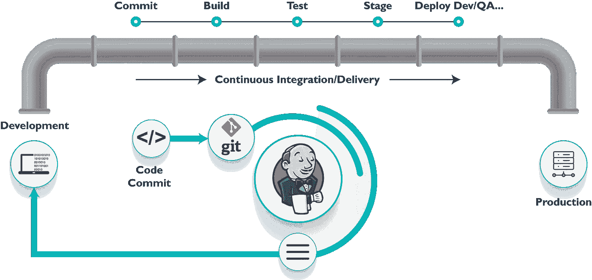

# 什么是 Jenkins 管道和 JenkinsFile？

> 原文：<https://blog.devgenius.io/what-is-jenkins-pipeline-and-jenkinsfile-96f30f3a29c?source=collection_archive---------2----------------------->



## 简介:

在这篇文章中，我将谈论 Jenkins 管道和我如何能写 Jenkins 文件，以及什么是 Jenkins 文件的语法。

读完这篇文章后，我想让你明白什么是 CI/CD 概念，什么是 Jenkins，你可以看看这个博客来了解这个主题[什么是 CI/CD 概念？](https://medium.com/@abdalrhmanalkraien/ci-cd-concept-with-pipeline-3408d2fff38)和[詹金斯是什么？](https://medium.com/@abdalrhmanalkraien/what-is-jenkins-bc8bebcc05cf)

## 詹金斯管道是什么？

流水线 it 是在软件从版本控制到最终用户的过程中，使用自动化工具进行自动化部署的作业搭配

这个特性用于将软件与连续交付相结合

## 我可以以两种方式使用管道

*   **第一路用管道**

第一种方式创建许多作业，每个作业都有一个任务，如测试作业 1 和构建作业 2，等等，然后创建管道以顺序方式运行这些作业，但这种方式是复杂的项目，我认为这很无聊

*   **第二种管道方式:**

我们可以使用 **Jenkins 管道项目**这是 Jenkins 为构建复杂项目提供的新功能

这种方式依赖于 **Jenkinsfile** 。

> *在本文中，我将解释构建我们的* ***管道*** *的第二种方法。*

## **现在我该如何通过声明式管道使用 Jenkins 管道项目呢？**

这个管道的关键特性是通过代码定义整个部署流程。

我们可以使用 **Jenkinsfile** 在将我的项目构建为工作流之前的编写所有阶段，现在我可以替换旧的方式，即创建作业，然后我需要将此作业放在 Jenkins 系统的管道中。

> ***Jenkins file****必须嵌入你的* ***版本控制*** *像****github****或者****gitlab****等等。*

## 什么是 Jenkinsfile？

一个 **Jenkinsfile** 是一个文本文件，它将整个工作流程存储为代码，并且可以在您的本地系统上签入一个 **SCM**

我可以随时打开 **Jenkinsfile** 并在上面编辑

**Jenkinsfile** 是使用 **Groovy** **DSL** 编写的，它可以通过文本/groovy 编辑器或通过 Jenkins 实例上的配置页面创建。它基于两种语法编写，即:

*   ***声明式管道语法***

这是一个支持管道作为代码概念的新特性，允许从版本控制(如 git)中获取代码

*   ***脚本化管道语法***

这是编写代码的传统方式

> *在这篇文章中我将解释关于* ***的声明式管道语法*** *用于构建我们的****Jenkins file****。*

现在我将解释一下**管道概念**:

*   **管道**

我们可以在管道块中定义所有的处理，比如构建、测试、编译和部署

在这里，我们可以在 **Jenkinsfile** 中定义收集阶段

```
pipeline{
​
}
```

*   **节点**

节点是执行整个工作流的机器。它是脚本化管道语法的关键部分。

```
node{
​
}
```

*   **代理**

有了代理，我们可以只用一个 **Jenkins** 实例运行多个构建

我们可以用代理运行几个带有一个 **Jenkins** 实例的项目，它指示 Jenkins**为构建分配一个执行程序**。

可以为整个管道指定单个代理，也可以分配特定的代理来执行管道中的每个阶段。一些参数

*   **任何**

在任何可用的代理上运行管道/阶段。

*   **无**

此参数应用于管道的根，它表示整个管道没有全局代理，每个阶段都必须指定自己的代理。

*   **标签**

在标记的代理上执行管道/阶段。

*   **码头工人**

此参数使用 docker 容器作为管道或特定阶段的执行环境。

这个映像现在可以用作运行多个命令的执行环境。

```
pipeline{ agent{ docker{ image 'ubuntu' } }}
```

*   **阶段**

这个块有运行**管道**所需的所有任务，这里我需要一个指定的工作流来像一个阶段一样运行管道。

我可以定义许多阶段，每个阶段都有特定的任务。

```
pipeline{
   agent any
   stages{ stage ('build'){ steps{
          ...

         }

      }

   }}
```

*   **阶段**

步骤取决于**阶段**，在这里我们可以定义阶段内的新阶段以及我们需要在该块内做什么。

*   **步骤**

步骤是依赖于**阶段**的，我们可以在一个**阶段**中定义一系列步骤，当我们需要执行**阶段**时**会执行**这个**步骤**在**序列**中，步骤块中必须至少有一个步骤

为了更好地理解阶段和步骤，请看下面的例子

## 结论

在这篇文章中，我解释了 Jenkins 和什么是 Jenkins 和 Jenkins 文件中的管道，以及我如何编写它。

Jenkins 在这里建立了依赖的 **CI/CD 概念**

你可以看看这篇文章了解什么是[什么是 CI/CD 概念？](https://medium.com/@abdalrhmanalkraien/ci-cd-concept-with-pipeline-3408d2fff38)，而你可以看到这篇文章来了解[詹金斯是什么？](https://medium.com/@abdalrhmanalkraien/what-is-jenkins-bc8bebcc05cf)