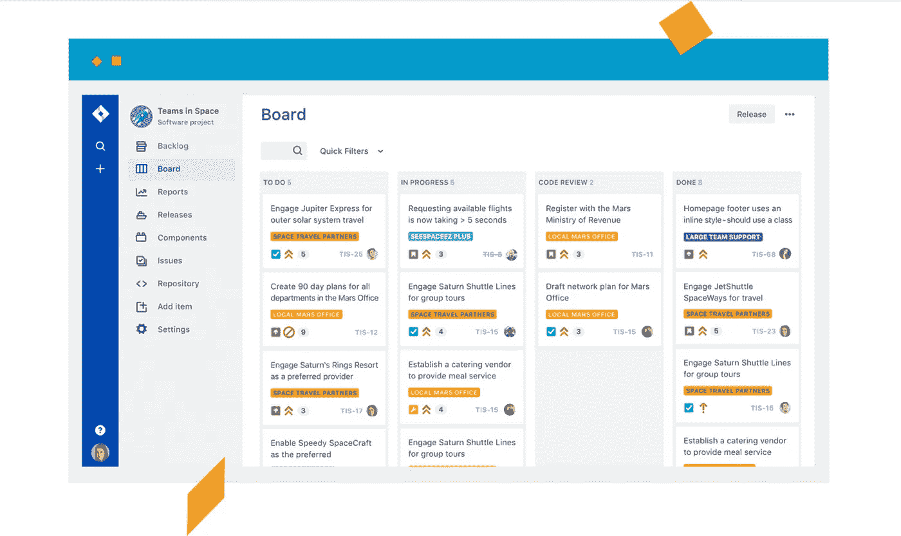
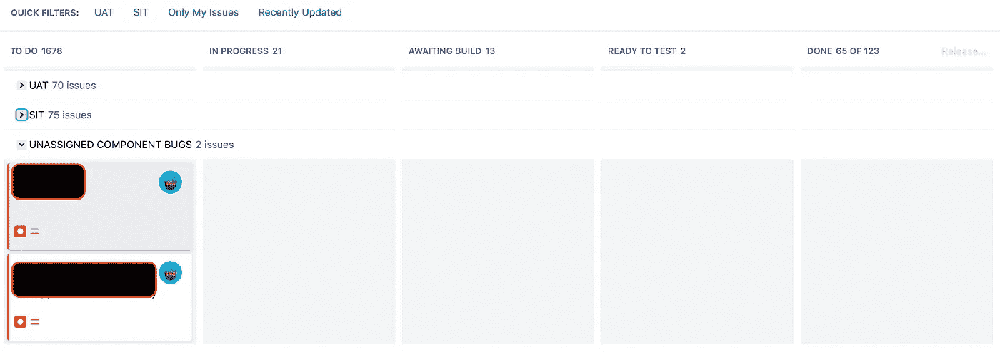

# 什么是 JIRA 软件？(主板版本)

> 原文：<https://blog.devgenius.io/what-is-jira-software-boards-version-d9107bf99fc5?source=collection_archive---------1----------------------->

吉拉是由 Atlassian 开发的专有问题跟踪产品，允许 bug 跟踪和敏捷项目管理。

吉拉允许跟踪 bug，直到它们达到“完成”的状态。这样做并在团队的工作流程中了解 bug 状态是很好的。吉拉软件中的过渡问题会触发通知，并自动通知下一个团队成员关于错误的当前状态

对于 bug 跟踪，有很多方法可以让它变得更舒服，更容易理解。用户可以按照他们自己的方式编辑公告板，他们希望项目如何运行以及如何查看。

一些用户添加状态来让他们的开发人员和测试人员有一个更好的一步一步来进行项目。

我们通常与项目经理、开发人员和测试人员密切合作，以了解他们希望公告板看起来是什么样子，因此我们甚至增加了更多的栏目，以便更容易解决提出的 bug 标签。

正如你在上面的图片中看到的，我们已经编辑了电路板，添加了多个列，如 **To Do、In Progress、waiting Build、Ready to Test 和 Done** 。

此外，我们还有 3 个泳道，分别是 SIT、UAT 和未分配的组件错误。

泳道是 Scrum 板或看板板上的活跃冲刺中问题的横向分类。您可以使用泳道来帮助您区分不同类别的任务，例如工作流、用户、应用领域等。

在显示的图像中，为了区分任务，我们使用了基于组件，而用户、测试人员或开发人员在 UAT 设置了组件，它将显示在 UAT 泳道中，但如果它被设置为 SIT 组件，它将显示在 SIT 泳道中，如果没有，它将显示在未分配的组件 bug 中。

这只是让用户更容易管理票证并能够区分它们的一种方式。让你更容易管理你的董事会的其他方法是使用快速过滤器。

快速过滤器允许你(或任何使用这个板的人)进一步过滤 Scrum 板或看板上出现的问题集合。使用快速过滤器在不同的问题类型之间切换(例如，只显示 bug)，或者显示一个共同的 backlog 的团队特定的视图。

我们区分泳道的方法也用于区分快速过滤器。你也有标准过滤器是【T2 仅我的问题】和最近更新的。

这两个过滤器显示不同的内容，而“仅我的问题”显示分配给您的问题，但“最近更新”显示最近更改或更新的所有问题。

我们下一篇关于吉拉的文章也将为你提供一些新的信息，因为我们今天讨论的是关于主板的。

对于刚刚推出新网站或新应用程序的公司，我们为您提供了优惠。如果您不确定您的网站/移动应用程序是否安全无故障，我们可以为您提供免费的基础设施测试审计。

所以你可以知道你的应用程序是否让你的潜在客户感到沮丧。要申请免费审计，请发邮件到 stackedqa@gmail.com 给我们，并注明你的主题为“免费测试审计”

在社交媒体上关注我们:

[脸书](https://www.facebook.com/StackedQA)，[推特](https://twitter.com/stackedqa)， [Instagram](https://instagram.com/stackedqa) ，& [Linkedin](https://www.linkedin.com/company/stackedqa)