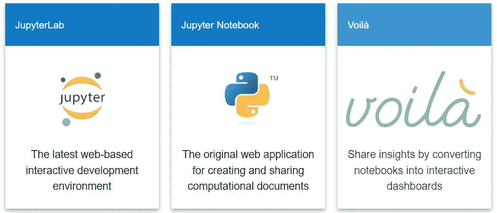

# 朱庇特是什么？朱庇特实验室？Jupyter Lite？瞧。

> 原文：<https://blog.devgenius.io/what-is-jupyter-762642b41163?source=collection_archive---------7----------------------->

## 如何安装 Jupyter/JupyterLab/JupyterLite/Voila 软件？


照片由[星球卷](https://unsplash.com/@planetvolumes?utm_source=medium&utm_medium=referral)上的 [Unsplash](https://unsplash.com?utm_source=medium&utm_medium=referral)

**Jupyter 项目**是一个广泛的合作项目，开发用于交互式和探索性计算的开源工具，涉及 100 多种计算机语言，重点是 Python 语言(参见 [Jupyter Edu 的书](https://jupyter4edu.github.io/jupyter-edu-book/))。它包括三个主要应用程序，分别是(1) **Jupyter Notebook** 、( 2) **Jupyter Lab** 和(3) **Jupyter Lite** 。

**Jupyter Notebook** 是用于创建和共享计算文档的原始 web 应用程序，它提供了简单、精简、以文档为中心的体验(参见 [Jupyter Notebook](https://jupyter.org/#:~:text=Jupyter%20Notebook:%20The%20Classic) )。

**JupyterLab** 是最新的基于网络的交互式笔记本、代码和数据开发环境，它包含灵活的界面，允许用户配置和安排数据科学、科学计算、计算新闻和机器学习的工作流(参见 [JupyterLab](https://jupyter.org/#:~:text=JupyterLab:%20A%20Next) )。

**JupyterLite** 是一个***非官方的 JupyterLab 发行版*** ，它完全在使用 JupyterLab 组件和扩展完全构建的浏览器中运行(参见 [JupyterLite](http://jupyterlite.readthedocs.i) )。换句话说，JupyterLite 是一个完全静态的 Jupyter 发行版，运行在浏览器中，无需在主机上启动 Python Jupyter 服务器(参考 [JupyterLite —静态 Jupyter 发行版](https://jupyterlite.readthedocs.io:~:text=static Jupyter distribution))。

除了上述应用， **Jupyter** 还推出了 **Voila** ，一款将笔记本转换成交互式仪表盘的应用。瞧，数据呈现对网络用户来说更具交互性。它可以作为独立应用程序安装，也可以作为 Jupyter 服务器扩展安装(参见 [Voila 安装](https://voila.readthedocs.io/en/stable/using.html))。



# (1)如何安装 Jupyter/JupyterLab/JupyterLite？

**(1.1)用 pip 安装(参见** [**Jupyter 安装**](https://jupyter.org/install) **)。**

Jupyter 笔记本:

```
pip install jupyter notebook
```

JupyterLab:

```
pip install jupyter jupyterlab
```

瞧:

```
pip install voila
```

**(1.2)或者，使用 Conda(参考** [**Anaconda —安装 Jupyter**](https://anaconda.org/anaconda/jupyter) **)。**

Jupyter 笔记本:

```
conda install -c conda-forge jupyter notebook
```

JupyterLab:

```
conda install -c conda-forge jupyter jupyterlab
```

瞧:

```
conda install -c conda-forge voila
```

通过叫他们的名字来运行程序。

```
# run jupyter notebook
jupyter notebook
```

控制台将输出带有令牌参数的应用程序 URL。


将整个文本复制到网络浏览器。


```
# run jupyterlab
jupyter-lab
```


**(1.3)锂皂石**

对于 JupyterLite，请阅读位于[https://github.com/jupyterlite/jupyterlite](https://github.com/jupyterlite/jupyterlite)的文档。

或者，试试试玩网站:
(1)[Jupyter 笔记本 JupyterLite 版](https://jupyter.org/try-jupyter/retro/tree/index.html)。
(2)[JupyterLab 的 JupyterLite 版本](https://jupyter.org/try-jupyter/lab/)。

在某些情况下，开发人员可能希望在 Jupyter 笔记本中包含 HTML 和 JavaScript 代码。这有点棘手，因为默认情况下，Jupyter 不会识别这些代码。需要导入一个额外的库，即 IPython.display。

以下是使用显示 Javascript 库运行 JavaScript 代码的示例。

```
from IPython.display import Javascript

Javascript('alert("hello world");')
```

以下是使用显示 HTML 库运行 HTML 代码的示例。

```
from IPython.display import HTML, display

display(HTML("""
<script src="https://ajax.googleapis.com/ajax/libs/jquery/3.6.1/jquery.min.js"></script>
<h1>hello</h1>
<button id="btn1">click me</button>
<script>
$(document).ready(function(){
$("#btn1").click(function(){
  alert("The button was clicked.");
});
});
</script>
"""))
```

也可以从文件中运行脚本。

```
from IPython.display import HTML, display
display(Javascript(filename="sample.js"))
```

上面的代码从文件`sample.js`运行 JavaScript 代码。

```
//sample.js
let output=999;
element.innerHTML = output;
```

*注:IPython.display 也适用于 Colab 笔记本(参考* [*Colab 代码示例*](https://colab.research.google.com/notebooks/snippets/advanced_outputs.ipynb) *)。然而，Chrome Web 浏览器禁用了警告和弹出对话框，因此这些在浏览器中不起作用。*

# (2)使用码头集装箱

**(2.1) Jupyter 图像**

Project Jupyter 提供了各种基于 Jupyter 的图像以及特定的包分发。

*   [https://hub.docker.com/r/jupyter/datascience-notebook](https://hub.docker.com/r/jupyter/datascience-notebook)
*   [https://hub.docker.com/r/jupyter/all-spark-notebook](https://hub.docker.com/r/jupyter/all-spark-notebook)
*   [https://hub.docker.com/r/jupyter/pyspark-notebook](https://hub.docker.com/r/jupyter/pyspark-notebook)
*   [https://hub.docker.com/r/jupyter/scipy-notebook](https://hub.docker.com/r/jupyter/scipy-notebook)
*   [https://hub.docker.com/r/jupyter/base-notebook](https://hub.docker.com/r/jupyter/base-notebook)
*   [https://hub.docker.com/r/jupyter/minimal-notebook](https://hub.docker.com/r/jupyter/minimal-notebook)
*   [https://hub.docker.com/r/jupyter/tensorflow-notebook](https://hub.docker.com/r/jupyter/tensorflow-notebook)

**(2.2)康达集装箱**

Docker Publisher，[continumio](https://hub.docker.com/u/continuumio)，提供了支持 Jupyter 安装的基于 conda 的映像；(1) Anaconda 和(2) Miniconda(进一步阅读[什么是 conda？迷你康达？蟒蛇？](https://medium.com/@mohamad.razzi.my/what-is-conda-miniconda-anaconda-5630e70ef2d9))。

下面是一个运行 Miniconda 容器的示例，该容器安装 jupyter notebook 并将应用程序映射到本地主机上的端口 8887。Conda 报告安装的总大小为 223.8 MB。

```
docker run -i -t -p 8887:8888 continuumio/miniconda3 /bin/bash -c "conda install jupyter notebook -y --quiet && mkdir -p /opt/notebooks && jupyter notebook --notebook-dir=/opt/notebooks --ip='*' --port=8888 --no-browser --allow-root"
```

下面是一个运行 Miniconda 容器的示例，该容器安装了 jupyter jupyterlab 并将应用程序映射到本地主机中的端口 8886

```
docker run -i -t -p 8886:8888 continuumio/miniconda3 /bin/bash -c "conda install jupyter jupyterlab -y --quiet && mkdir -p /opt/notebooks && jupyter lab --notebook-dir=/opt/notebooks --ip='*' --port=8888 --no-browser --allow-root"
```

如果您正在寻找启动 JupyterLab 的简单快捷的步骤，那么 Miniconda 容器方法可能是实用的解决方案。