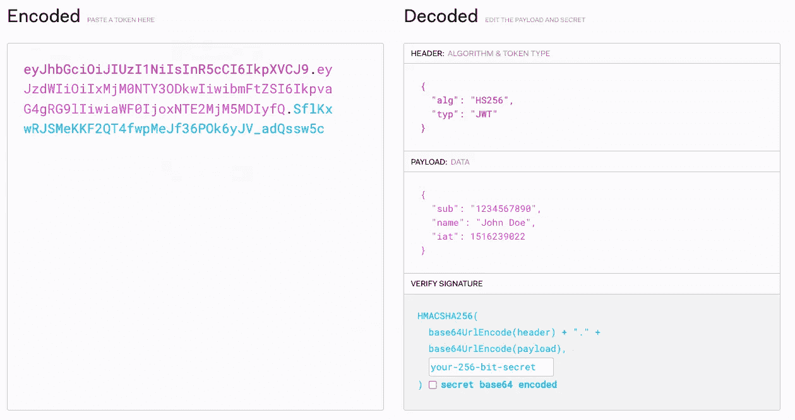

# 什么是 JWT &它是如何工作的？

> 原文：<https://blog.devgenius.io/what-is-jwt-how-does-it-work-f6877a73e705?source=collection_archive---------14----------------------->

由[乌列尔 SC](https://unsplash.com/@urielsc26?utm_source=medium&utm_medium=referral) 在 [Unsplash](https://unsplash.com?utm_source=medium&utm_medium=referral) 上拍摄的照片

# JWT 是什么？

JWT(JSON Web Token)是一种身份验证方法，它以令牌的形式将用户的会话信息完全存储在客户端。

# 它与会话认证有什么不同？

会话身份验证将会话信息存储在数据库中。登录后，浏览器上会存储一个 cookie。cookie 存储服务器发送的 session_id。在来自该客户端(同一站点)的每个后续请求中，浏览器还会在请求中附加会话 id cookie。然后，服务器使用 cookie 从数据库中查询会话信息。

然而，JWT 不再需要使用数据库来存储会话信息。因为关于经过身份验证的用户和令牌到期日期的实际信息是以令牌的形式存储在客户端的。

# 令牌是如何创建的？

JWT 令牌由点分隔的三部分组成。

1.  第一部分，即标头，是关于所用哈希算法的 base64 编码信息。
2.  第二部分是有效负载，是关于会话的 base64 编码信息(user_id、令牌发布日期或到期日期、令牌类型:访问或刷新)
3.  第三部分，即哈希值，是第一部分和第二部分使用服务器的秘密密钥的哈希输出。

# 服务器如何用令牌授权用户？

1.  当您使用凭据登录时，服务器会创建两个令牌(访问和刷新)并将它们发送给客户端。
2.  客户端存储这些令牌，并在其所有后续请求中向服务器发送访问令牌。
3.  服务器获取令牌的第一部分和第二部分，并使用秘密密钥对其进行哈希处理。如果输出与最后一部分匹配，那么令牌未被篡改，信息是可信的。
4.  它还可以读取有效载荷数据以检查令牌是否过期。
5.  当访问令牌过期时，客户端将使用刷新令牌请求新的访问令牌。当刷新令牌过期时，用户必须再次登录。

# 使用 JWT 代币有什么好处？

1.  不需要表格来存储会话信息。
2.  因为验证完全依赖于秘密密钥，所以我们可以拥有一组具有相同秘密密钥的分布式服务器。并且由其中一个服务器创建的令牌将被另一个服务器识别。此外，重要的是提醒您要对密钥保密。