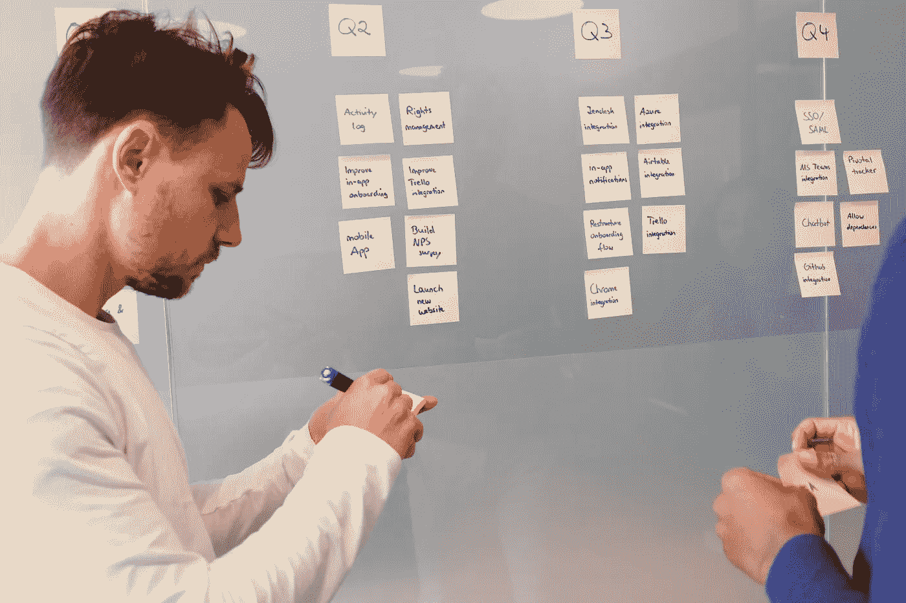

# 让我们转向看板

> 原文：<https://blog.devgenius.io/what-is-kanban-e02a99254a11?source=collection_archive---------22----------------------->

## 看板概述

在 [Unsplash](/s/photos/kanban?utm_source=unsplash&utm_medium=referral&utm_content=creditCopyText) 上[空中聚焦](https://unsplash.com/@airfocus?utm_source=unsplash&utm_medium=referral&utm_content=creditCopyText)拍摄的照片

## **什么是看板？**

看板是一个日语单词，意思是“视觉信号”，它用于实现敏捷软件开发，是项目管理中流行的框架之一。看板是由大野泰一在制造业中引入的。David J. Anderson 是在 2004 年将看板概念应用于 IT 的人。

能力的实时交流和工作需求的透明性，工作项目在看板上直观地表现出来。看板允许团队随时看到每件工作的状态。看板也可以被称为视觉系统，它可以在工作通过流程时管理工作。它将工作流程和通过该流程的实际工作可视化。

*看板的目标*

*   识别工作流程中的潜在瓶颈并解决它们，以便工作能够以最佳速度经济高效地进行。

看板方法无论是软件开发、人员配备、招聘、采购等都可以适用。

**什么是看板？**

它是一个敏捷的项目管理工具，旨在帮助可视化工作，限制工作进展，并最大化工作流程。

**看板板的要素**

*   视觉信号
*   在制品限制
*   卡片
*   列
*   承诺点
*   交货地点

**看板的核心原则**

*   从你现在正在做的事情开始

看板自然会强调需要解决的问题，并且直接应用到当前的工作流程中。看板的灵活性允许它覆盖在现有的工作流程、系统和流程上，而不会中断已经成功完成的工作

*   **同意追求渐进式变革**

看板方法的设计是为了满足最小的阻力，因此鼓励对当前流程进行持续的小增量和变革。一般来说，大规模的变革是不被鼓励的，因为它们通常会因为恐惧或不确定性而遭遇阻力。

*   **最初，尊重当前的角色、职责和职称**

与不同的策略相比，看板本身不会强制任何组织变革。这样，改变你目前的角色和能力并不重要，因为它们可能会表现得很好。该小组将合作区分和执行任何需要的进展。这三个标准帮助协会战胜典型的情绪抵制和对变化的恐惧，这种情绪抵制和恐惧通常伴随着协会中的任何变化活动。

*   **鼓励各级领导的行为**

看板鼓励组织各个层面的持续改进，它帮助你记住最好的权威来源于个人对其团队第一线人员日常行为的普通示范。所有级别的人都可以提供想法并展示领导力来实施变革，以不断改进他们交付产品和服务的方式。

**使用看板的好处**

*   灵活性
*   团队变得更加积极
*   团队可以专注于完成工作，以提高协作和生产力