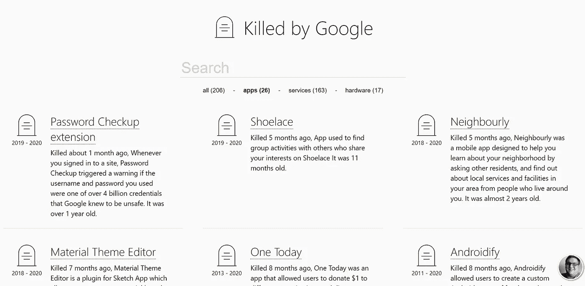

# 什么是 KilledByGoogle.com，为什么它这么酷？

> 原文：<https://blog.devgenius.io/what-is-killedbygoogle-com-and-why-is-it-so-cool-d98e2c861f6b?source=collection_archive---------5----------------------->

最近在 medium 上看一篇文章时，我看到一个评论提到了这个网站[killedbygoogle.com](https://killedbygoogle.com/)。起初，我认为这应该是一个笑话或讽刺，但后来我开始探索，发现这是真实的。很有趣，对吧？

Killed by google 是一个以一个墓地为主题的网站，这个墓地是谷歌拥有或购买的产品和服务，后来因为这样或那样的原因而停止了。我喜欢这个网站的设计方式。只有天才才会有这样的想法，并停止数字项目，把它们放在像这样的数字墓地里。该网站也有这些产品，服务和硬件的年初和年末。到目前为止，当我们写这篇文章的时候，网站上已经有了 206 个废弃产品和硬件的目录。这是在 22 年的时间里(1998 年(谷歌成立的那一年)——2020 年)。

来自网站的快照

# 这个网站有什么酷的？

这只是我们如何看待和感知周围事物的问题。对我来说，这个网站是设计、创新和创造力的杰作。我个人喜欢这个想法，如何在网站上列出所有死亡的项目，以及网站如何如此乏味，但同时又非常有吸引力。这让我想起了我们小时候经常看的闹鬼的卡通片。

# 产品为什么会死？

产品生命周期可以分为 5 个阶段。

1.  简介(阿尔法和贝塔产品)
2.  增长
3.  成熟
4.  下降
5.  死亡

有些产品甚至在进入成熟期之前就达到了衰退期，而有些产品只是继续成长和成熟，从未达到衰亡期。这真的取决于你的产品是什么，何时推出。有时候这只是运气和与之相关的好时机的问题。

例如，[IBM 于 1992 年推出了第一款智能手机](https://www.businessinsider.com/worlds-first-smartphone-simon-launched-before-iphone-2015-6#:~:text=Rob%20Stothard%2FGetty%20People%20didn,before%20Apple%20released%20the%20iPhone.)，但它从未获得足够的掌声，因为它远远领先于时代，而当时的人员和基础设施还没有做好准备。从 1994 年 8 月(第一次发行)到 1995 年 2 月停产，它在 6 个月的时间里只卖出了 50，000 台。

与此相反，一些产品，如脸书，YouTube 等，只是随着时间的推移不断成长和成熟，偶尔会有新的更新。

# 结论:

产品确实会死，这没什么不好。我们不应该为此哭泣，而应该努力向前，在特定的时间里寻找更好的机会。有了**的努力**、**的好时机**和**的好运气**产品可能会成功。话虽如此，我还是很喜欢 KillByGoogle 这个网站，把墓地和它所包含的单调主题仅仅用一种颜色联系起来的想法让它更有吸引力。向它背后的开发者致敬。

快乐阅读。