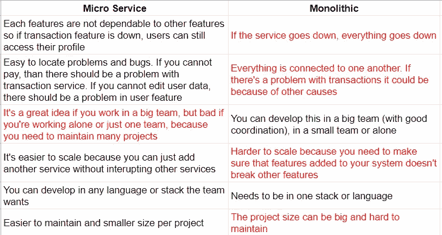

# 什么是微服务？

> 原文：<https://blog.devgenius.io/what-is-micro-service-1207125b3a23?source=collection_archive---------7----------------------->

现在，微服务是许多软件开发架构的宣传。这是最流行的架构，但它是什么呢？

> 微服务是一种开发架构模式，它根据项目的功能将大项目(整体的)分成更小的项目。(我的定义)

几年前，人们习惯于在同一个项目中从后端到前端开发程序。当 PHP 和 Javascript 刚开始兴起时，开发人员习惯于由一个团队或一个人(现在称为全栈开发人员)将它们组合在一个项目(monolithic)中。从前，没有后端开发者，也没有前端开发者。软件更新并不经常，开发需求也不像今天这样。

随着时间的推移，现在我们突然有三个主要平台来访问一个应用程序。普通 web、iOS 应用和 Android 应用是目前使用的主要平台。这导致了图形用户界面和逻辑或数据库的分离。这就产生了两个新的职位，即后端和前端开发人员，其中后端程序员创建主要的数据逻辑，而前端则更侧重于向用户显示数据。

照片由[弗兰·霍根](https://unsplash.com/@franagain?utm_source=medium&utm_medium=referral)在 [Unsplash](https://unsplash.com?utm_source=medium&utm_medium=referral) 上拍摄

随着用户越来越多，许多科技公司都在竞相为用户提供最独特、最有用的功能。这导致公司强烈要求创造新功能并在竞争中领先。需求的增加产生了一个反斜杠，即系统容易出现错误。一家公司的平均功能更新可能是每两周一个功能，我认为这是一个很短的时间，特别是如果它很复杂的话。为了解决这个问题，使用了微服务模式。

微服务模式将这个大的后端项目分成小块作为一个新项目。每个微服务不应该相互依赖，所以如果一个微服务关闭或有错误，它不会影响整个应用程序，而只会影响特定的服务。

# 利弊

例如，我们有一个电子商务应用程序。一个电子商务有许多功能，如产品，交易，用户，购物车，等等。这可以使用整体方法或整个服务的一个项目来完成，或者我们可以使用微服务来完成。让我们讨论一下使用整体方法和微服务的利弊。

微服务和单体利弊(红色突出对我来说是不利的)

这是个人观点，看起来是微服务赢了，但是有一个问题。微服务的一个缺点是你需要考虑的主要问题。不建议自由职业开发者或单人开发者或小组开发者采取微服务的方式。这并不理想，它不会提高你的工作效率，反而会慢慢地把你生吞活剥。如果你在一个程序中有十个主要特性，并且作为一个单独的后端程序员，维护和开发一个项目是一个很大的任务。

维护相同规模的多个项目将是一场噩梦。此外，计划您需要如何在服务之间进行通信也不是一件容易的事情。您还需要在项目之间切换，记忆项目结构和代码，等等。这根本说不通。如果你是一个单独的后端开发人员，你可能想做的是，首先制定一个整体的方法，随着你的程序员(尤其是后端程序员)的成长，开始将重要的功能块分离到一个新的服务中。

# 结论

微服务是一个很好的架构，它现在到处都在使用，如果你在维护一个大的应用或服务，这是一个非常有用的方法。不过，要考虑的最重要的事情之一是开发人员的规模。如果你有一个小团队或者是一个单独的开发人员，你可能不想使用这种方法，因为它只会破坏你的生产力，而只能使用传统的方法。

我希望你们觉得这篇文章充满希望，干杯！

凯利·西克玛在 [Unsplash](https://unsplash.com?utm_source=medium&utm_medium=referral) 上的照片