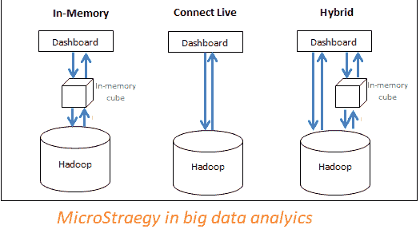

# 大数据分析中的微观策略是什么？

> 原文：<https://blog.devgenius.io/what-is-microstrategy-in-big-data-analytics-d87de241d803?source=collection_archive---------6----------------------->

Microstrategy 是一个全球性的企业级 BI 应用程序平台，它让决策者能够进行分析，从而做出更好的决策。它还利用内存技术的高性能特性和查询优化来更快地提供解决方案。大数据通常会消耗传统系统无法处理的大量数据。此外，大数据需要最新的技术来存储、处理、分析和显示大型数据集。

**MicroStrategy 大数据连接器**

大数据生态系统由各种 SQL 引擎组成，如 Hive、Impala、Drill 等。允许用户共享对大数据源的 SQL 查询。他们像分析传统的关系数据库一样分析这些数据。此外，用户还可以利用与通过 SQL 访问结构化数据时相同的分析框架。MicroStrategy 还支持并验证与几个大数据 SQL 引擎的连接。与传统数据库相当，与这些引擎的连接是通过 ODBC 或 JDBC 驱动程序实现的。

要深入了解微观战略，您可以报名参加 [**微观战略培训**](https://onlineitguru.com/microstrategy-online-training-placement.html) 的现场演示

MicroStrategy 还提供了一种允许用户直接从 HDFS 导入数据的方法。这只能通过使用 MicroStrategy Hadoop 网关来实现，该网关支持客户端传递 SQL 查询引擎。然后将数据直接从 HDFS 文件系统加载到 MicroStrategy 内存立方体中进行分析。

**选择数据访问模式**

MicroStrategy 帮助用户有效地利用大数据和 BI 系统的资源，以提供最佳性能来运行分析。此外，用户还可以选择以下选项:

**将数据带入内存**:

用于分析的数据直接来自内存中的多维数据集。微策略允许用户将数百 GB 的数据子集从大数据源提取到内存立方体中。并从该多维数据集中构建报告和仪表板。通常，多维数据集被配置为定期发布，并存储在服务器的主内存中。此外，它避免了查询大数据数据库的耗时需求。

**从数据源**访问/连接数据:

数据只能从数据库中访问。Micro Strategy 提供了与不同大数据源的连接，以便针对实时数据源运行报告/仪表盘。

**采用混合方法**

这里，我们需要从内存立方体和数据库中获取数据。混合方法有效地利用了上述两种方法的力量。它允许用户根据提交的查询在两种方法之间不断切换。此外，MicroStrategy 拥有智能寻源技术，可以识别特定的查询是否可以由多维数据集或数据库来回答。因此，它可以分别引导查询。

通过 [**微观战略课程**](https://onlineitguru.com/microstrategy-online-training-placement.html) 将您的职业生涯推向新的成功高度

**微观战略用例**

以下元素与业务分析直接相关，并且与微观策略有用的用例相关。比如:

HDFS :

HDFS 或 Hadoop 分布式文件系统是在集群上运行的应用程序使用的数据存储文件系统。HDFS 集群包括一个 NameNode & DataNode，分别存储 HDFS 和实际数据存储的元数据。此外，该系统帮助我们存储从 HDFS 环境之外的应用程序导入的大型文件。它还通过各种 Hadoop 应用程序执行导入文件流程的暂存。

**纱线**

YARN 是一个跨 Hadoop 集群交付运营、安全和其他数据管理工具的中央平台。这是为在 Hadoop 环境中运行的应用程序执行的。它还提供了资源管理工具。它允许将数据存储在 HDFS 进行处理，并由不同类型的数据处理引擎运行。

**MapReduce:**

它是运行在大型集群上的 DDP 模型和执行生态系统之一。此外，它使用 Map-Reduce 算法，将所有操作划分为 Map 和/或 Reduce 函数。

**蜂巢:**

Hive 是一个流行的分布式数据仓库，构建在 HDFS 系统之上。它可以轻松地管理和组织大量数据。此外，Hive 为大量原始数据提供了基于模式的数据存储，并提供了一个类似 SQL 的生态系统来对 HDFS 的原始数据执行分析和任务查询。除此之外，Hive 还可以用于将各种 SQL 查询引导到各种查询引擎。如；Map-Reduce、Tez、Spark 等。

**火花:**

它是一个 DDP 引擎&一个集群计算框架。它提供了一个简单而富于表现力的编程模型，支持大范围的应用程序。此外，它还包括 ETL、ML、流处理和图计算等。

**HBase** :

这是一个开源的分布式数据库，用于随机和实时访问数据库。它是用 Java 编写的，并在商用集群上托管大型表。此外，它工作在 HDFS 和 Hadoop 之上，不支持像 SQL 这样的查询语言。

在此获取更多信息 [**Microstrategy 认证**](https://onlineitguru.com/microstrategy-online-training-placement.html)

**微策略如何与大数据解决方案结合使用？**

任何没有分析的数据都是没有用的，同样，为了分析，我们需要一些数据。微观策略工具为业务实体提供了开发和部署分析所需的所有能力。它还通过部署移动应用程序来帮助业务实体转变和加快业务流程。凭借与技能、角色或职能无关的分析能力，微策略产品可以帮助您的企业实体成为情报公司。

许多驱动程序和供应商支持大数据。如；交互式 SQL、批处理 SQL、非 SQL、清理和加载数据到内存等。

**单独探索大数据**

微观战略大数据帮助商业实体和不同的团队快速连接、显示和准备存储在大数据生态系统中的数据。用户还可以使用它来生成多通道 SQL 通道，并利用 MicroStrategy 的采购能力挖掘不同的区域。

**将大数据转变为敏捷数据**

大数据发展非常缓慢。即使是 Hadoop 查询也可能无法提供某些用例所需的高速交互性。

Micro Strategy Analytics 智能地将大数据 PB **s** 转变并组合成内存中数据的 destiny GBs，适合敏捷数据发现。此外，它获得了足够的细节，有助于深入调查。此外，它还可以轻松找到业务见解，同时解决大数据的工作挑战。

**数据发现**

数据发现功能使 Micro Strategy 能够连接任何数据源并混合来自不同来源的数据。它可以连接到各种平台，例如关系数据源、大数据源、社交媒体和云系统等等。

**数据挖掘和预测分析**

MicroStrategy 具有广泛的分析能力，可以轻松调用第三方数据挖掘和建模工具。不同的业务用户、报表开发人员和分析师使用数据挖掘服务来查看和开发预测分析。他们还将这些报告分发给任何设备上的用户。

微策略大数据轻松连接任何业务资源。它还包括数据库、云应用程序等等。微策略大数据平台使商业实体能够开发一个将大数据和 Hadoop 发行版运用到极致的应用。

随着版本 10 的新发布，Micro Strategy 继续扩展其集成软件套件，涵盖所有类型的信息访问。它还包括

*   具有新的数据参与功能的数据发现。
*   数据显示与 D3 库集成。
*   具有复杂预测算法库的高级分析。
*   具有易于使用的 HTML5 界面的交互式和更好的仪表板。
*   这是一个移动商务智能和企业报告平台。

微策略 10 还通过大数据引擎提供了与 HDFS 的直接连接。这种策略对于借助 Hadoop 开发数据湖的企业非常有用。

因此，多工具环境的使用将使下一代受益匪浅。从任何可信的数据开始，用许多有用的东西充实它，可以给企业带来丰硕的成果。

**结论**

因此，上述文章解释了大数据分析中的微观策略及其在商业实体中的用途。这是一个分析平台，帮助企业进行预测分析。此外，它还为参与大数据之旅的业务实体提供了出色的解决方案。所以，这一举措可以很好地改变这个行业的面貌。要了解大数据分析中的微观策略，应该参加 [**微观策略在线培训**](https://onlineitguru.com/microstrategy-online-training-placement.html) 。这种学习可能会带你进入微观战略和大数据的更深层次。