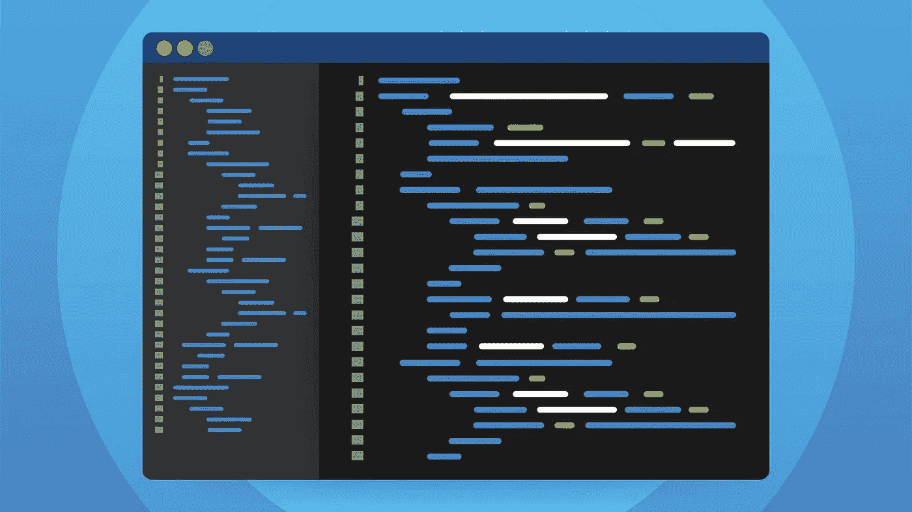
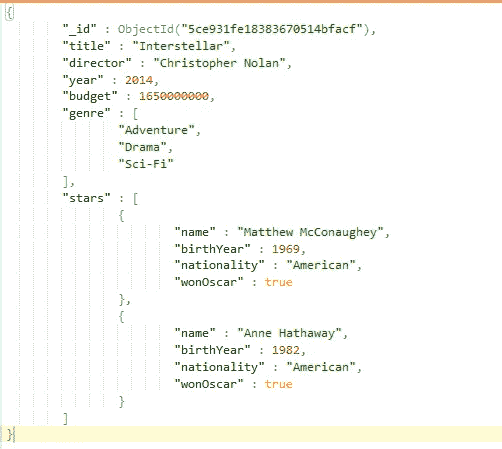
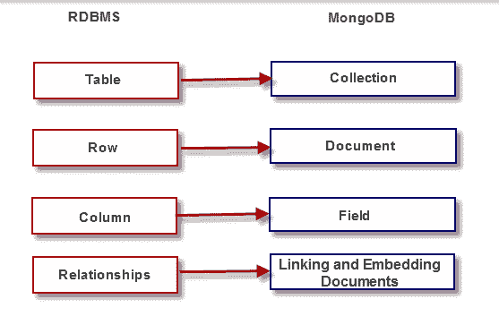
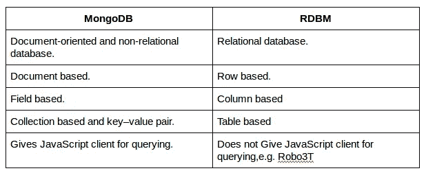
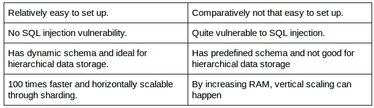
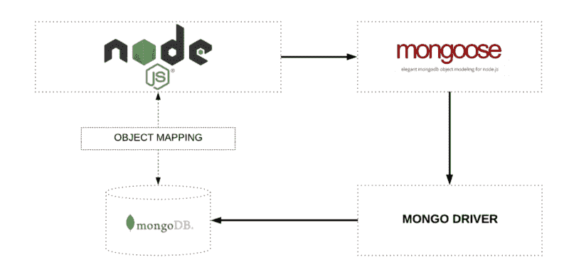

# 什么是 MongoDB & Mongoose？

> 原文：<https://blog.devgenius.io/what-is-mongodb-mongoose-17e0af3191ad?source=collection_archive---------2----------------------->

## MongoDB 和 Mongoose 概述

随着世界各地数据的增长，人们对非关系数据库的兴趣明显增加，也称为“ [NoSQL](https://intellipaat.com/blog/nosql-database-tutorial/) ”。企业和组织正在寻找新的方法来管理大量的数据，并被不同于传统关系数据库系统的替代数据库管理工具和系统所吸引。MongoDB 出现了。在这篇文章的后面，我们将谈论猫鼬。

在这个博客中，您将了解 MongoDB 和 Mongoose。

# 什么是 MongoDB？

MongoDB 是一个开源的、面向文档的 NoSQL 数据库，它以文档和集合的形式存储数据。文档只不过是一个记录，包含了关于它自身的所有信息。一组文档，称为一个集合。MongoDB 显然是一个数据库，它是一个所谓的 NOSQL 数据库。它包含以下功能:

*   即席查询
*   索引
*   负载平衡
*   多台服务器上的复制文件存储
*   数据聚合
*   服务器端 JavaScript 执行
*   封顶系列
*   高性能
*   更少的模式数据库

MongoDB 是一个*基于文档*的数据库管理系统，它利用一种被称为 ***二进制 JSON*** 或 [BSON](https://en.wikipedia.org/wiki/BSON) 的 [JSON](https://en.wikipedia.org/wiki/JSON) 风格的存储格式来实现高吞吐量。BSON 使应用程序能够轻松提取和操作数据，并允许高效地索引、映射和嵌套属性，以支持复杂的查询操作和表达式。

下面是 MongoDB 中的一个样本文档:

# 了解 MongoDB 存储结构

在关系数据库中，我们使用数据库模式。如这里中的[所述，数据库模式可以定义如下:](https://www.lifewire.com/definition-of-a-schema-in-a-database-1019262)

> 数据库模式是描述数据库中对象和信息之间关系的数据库元数据的集合。设想模式的一个简单方法是把它想象成一个包含表、存储过程、视图和相关数据资产的盒子。一个模式定义了这个盒子的基础结构

但是，在 MongoDB 中没有模式的概念。它主要使用数据库、集合和文档的概念。以下是对其中每一项的详细描述。为了更好地理解，我们将通过与结构化查询语言(SQL)的比较来定义这些术语。

**数据库**:数据库是集合的物理**容器**。

**集合:**集合是一组 MongoDB 文档。在 SQL 术语中，这类似于数据库的**表。**

**文档:**文档是一组键值对。在 SQL 术语中，这类似于数据库表中的**行**。

**字段:**字段是文档中的关键字。在 SQL 术语中，这类似于数据库表中的**列**。

**嵌入文档:**嵌入文档是多个文档的拼接。在 SQL 术语中，这类似于连接几个数据库表。

# 将关系数据库映射到 MongoDB

**MongoDB 中的集合**相当于 RDBMS 中的表。MongoDB 中的
**文档**相当于 RDBMS 中的行。MongoDB 中的
**字段**相当于 RDBMS 中的列。

# MongoDB 比 MySQL 或其他任何 RDBMS 好吗？

关系数据库(例如 MySQL)的典型模式显示了表的数量以及表之间的关系，但是 MongoDB 并不遵循关系的概念。

浏览下表，了解像 MongoDB 这样的专家 NoSQL 数据库与 RDBMS 有多么不同。该表显示了两者之间 9 种完全不同的比较。

# 什么是猫鼬？

Mongoose 是一个[**对象数据建模(ODM)**](https://www.geeksforgeeks.org/definition-and-overview-of-odbms/) 库，用于 MongoDB & NodeJS，一个更高层次的抽象。它管理数据之间的关系，提供模式验证，并用于在代码中的对象和 MongoDB 中这些对象的表示之间进行转换。有点像**快递**和**节点**的关系。所以 Express 是常规节点上的抽象层，而 Mongoose 是常规 MongoDB 驱动程序上的抽象层。

通过 Mongoose 管理节点和 MongoDB 之间的对象映射

对象数据建模库只是我们编写 JavaScript 代码，然后与数据库交互的一种方式。因此，我们可以只使用常规的 MongoDB 驱动程序来访问我们的数据库，它会工作得很好，但我们使用 Mongoose，因为它为我们提供了更多现成的功能，允许我们更快、更简单地开发应用程序。Mongoose 允许快速简单地开发 MongoDB 交互。除了 MongooseJS，还有其他几个为 MongoDB 开发的 ODM，包括[教义](https://github.com/doctrine)、 [MongoLink](http://mongolink.org/) 和 [Mandango](https://mandango.org/) 。

**特性**——对数据和关系建模的模式、简单的数据验证、简单的查询 API、中间件等。

与原生 Mongoose 相比，使用 Mongoose 的四个主要优势是:

1.  MongooseJS 在 MongoDB 之上提供了一个抽象层，消除了使用命名集合的需要。
2.  Mongoose 中的模型执行为文档属性建立默认值和验证数据的大部分工作。
3.  在 MongooseJS 中，函数可以附加到模型上。这允许新功能的无缝结合。
4.  查询使用函数链接，而不是嵌入式助记符，这使得代码更加灵活和可读，因此也更易于维护。

在 Mongoose 中，一个**模式**是我们建模数据的地方，因此我们在那里描述数据的结构、默认值和验证。然后，我们获取该模式，并从中创建一个模型。该模型基本上是模式的包装器，它允许我们实际上与数据库交互，以便创建、删除、更新和读取文档。

# 结论

因此，在本文中，我们研究了什么是 MongoDB，它的特性和结构。此外，我们还讨论了 MongoDB 和 RDBM 之间的差异。最后，我们对猫鼬及其优点进行了概述。此外，如果你有任何疑问，欢迎在评论区提问。

这就是这篇文章的内容。你可以看看我的其他文章。下次见！

**感谢您阅读我的帖子。如果你喜欢这篇文章，请广而告之。要获得我的新故事的更新，请在** [**中**](https://adityayaduvanshi.medium.com/) **和** [**推特**](https://twitter.com/fixslyr) **上关注我。**