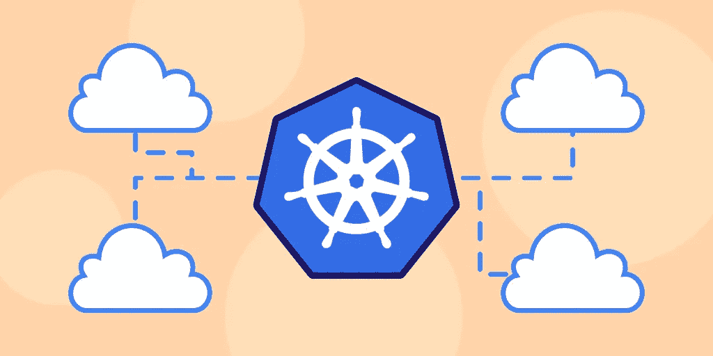

# 什么是多云？

> 原文：<https://blog.devgenius.io/what-is-multi-cloud-bfc7624e13c3?source=collection_archive---------1----------------------->

我们离新年只有几个月了，这意味着是时候开始展望将在 2022 年主导软件行业的技术趋势了。随着新年的临近，我们希望帮助您熟悉即将到来的趋势，以便您可以做好准备，并开始将您的技能提升到一个新的水平。

今天我们就来讨论一下 ***多云*** 。多重云是一种利用两个或更多云平台的云计算模式，允许您利用不同云提供商提供的资源。多重云可以帮助组织降低云成本，提高弹性和灵活性，等等。Gartner 估计，到 2022 年底，超过 75%的云客户将采用多云战略。随着它越来越受欢迎，这是一个重要的概念知道！

**我们将介绍**:

*   什么是多云环境？
*   多云环境的优势
*   多云和混合云
*   多云 Kubernetes
*   总结和后续步骤

# 什么是多云环境？

多云云计算模式**利用两个或多个云平台**。多云战略不是依赖单一的云提供商，而是依赖不同的云提供商来利用这些提供商提供的各种云服务。多重云可以指软件即服务(SaaS)、基础设施即服务(IaaS)和平台即服务(PaaS)模式的组合。常用的云提供商包括谷歌云平台(GCP)、亚马逊网络服务(AWS)、微软 Azure、IBM Cloud 和 VMware。

不同的云提供商提供不同的云资源，例如云存储、机器学习、大数据分析、无服务器计算、数据库等等。大多数迁移到云的企业都会实施某种形式的多云模型。**多云解决方案**是一种可在许多不同的云基础设施之间转移的解决方案。这些解决方案通常利用**云原生技术**并帮助管理跨许多不同云的工作负载。

> ***什么是云原生技术？***
> 
> *Cloud-native 是一种利用云计算交付模式的应用开发方法。云原生技术使用容器化、服务网格、声明式 API 和微服务等工具来构建、部署和管理高影响力的应用程序。根据云本地计算基金会(CNCF)的说法，这些技术“使组织能够在现代的动态环境(如公共云、私有云和混合云)中构建和运行可扩展的应用程序。”*

# 什么是多云管理？

多云管理是一组**程序和工具**，我们可以使用它们来管理和保护跨多个云的各种应用。多云计算管理平台可能难以实施。很难跨不同平台一致地维护云安全，跨各种环境部署应用程序，并在单个界面上可视化来自各种云的信息。一个有效的多云管理解决方案可以做到以下几点:

*   从单一界面管理多个云
*   支持多个云提供商或平台
*   支持像 Kubernetes 这样的容器化工具
*   提供云资源的可见性
*   提供人工智能和分析资源

# 多云环境的优势

采用多云策略有很多优势。让我们来看看一些主要优势:

*   **自由和灵活性**:单个提供商可能无法提供你想要的所有云服务。多重云允许您利用广泛的资源，并且它还防止供应商锁定。
*   **灾难恢复**:当利用来自多家云供应商的资源时，您很有可能会遇到并发停机或中断。许多顶级云提供商提供服务级别协议，保护您免受停机时间的影响。
*   **投资回报优化**:借助云计算基础设施，您可以有选择地在组织内使用您想要的解决方案。你可以有效地分配你的资源，只为你使用的东西付费。
*   **可靠性**:多重云降低了意外故障关闭整个企业的几率。您可以创建冗余来降低失败的风险。
*   **影子 IT** :影子 IT 是在没有得到正式授权的情况下使用 IT 服务、技术、基础设施和项目。多重云使您能够了解所有正在使用的云服务，识别违规行为，并实施安全策略。
*   **可移植性**:容器化技术和微服务可以在不同的云提供商之间轻松移植，这有助于减少集成问题。
*   **弹性**:多重云允许您合理分配资源，构建基础设施，确保一切顺利运行，并确保业务在发生干扰时能够快速恢复。

# 多云和混合云

混合云方法经常与多云方法混淆，但两者有重大区别。混合云环境**同时使用公共云和私有云**。这允许您在内部云解决方案或私有云内维护私有数据的安全性。混合云解决方案利用私有数据中心，同时利用公共云提供商提供的资源。

多云不需要使用私有云或协调操作来在不同的云环境之间工作。也就是说，多云基础设施可以实现杂交，这有时被称为 ***混合多云*** 。这意味着他们同时使用公共云和私有云，并且这些不同的云环境在两者之间有一定程度的协调，允许您在单个云 IT 基础架构内工作。混合多云环境允许您轻松集成 Agile 和 DevOps 的最佳实践，在各种环境中安全、一致地部署和扩展数据，并完全控制您的工作负载。

# 公共云和私有云

公共云是一种云部署模式，其中**资源由云服务提供商**托管，并在多个组织间共享。公共云允许组织在不增加更多物理资源的情况下扩展其资源，并且仅在必要时使用云资源。这也意味着组织节省了资金，因为组织只在他们需要的时候支付资源费用，他们没有在物理硬件或软件包上花同样多的钱。

私有云是一种云部署模式，其中**资源由组织自己的基础设施**托管。私有云通常托管在组织自己的数据中心或第三方机构中。这种环境通常受到物理保护。使用云服务的组织通常管理私有云，包括执行维护、升级、软件和云数据管理等。私有云允许组织以较低的成本获得与正常内部环境相同的控制和安全级别。

# 多云 Kubernetes

容器编排技术，如 Kubernetes，在有效的多云架构中扮演了重要角色。多云可能很难实施，因为云越多，就越难持续管理它们。Kubernetes 可以帮助**减少实施多云架构的一些复杂性**。

多重云的一个主要难题是供应。有了 Kubernetes，您可以**在其上托管您的所有工作负载**，并在您的多云架构中为您的所有云使用相同的配置。如果您**组织您的工作负载在 Kubernetes** 中运行，您只需要配置您的监控工具来监控 Kubernetes，这将减轻您监控整个基础设施的压力。Kubernetes 还帮助**加强安全性**，因为你可以标准化配置，以减少疏忽的机会。Kubernetes 也有自己的安全特性，您可以利用这些特性来保护您的基础设施。

# 总结和后续步骤

祝贺您迈出了云计算的第一步！随着云继续接管业务领域，多云模式将继续流行。采用多云架构有许多好处和使用案例，可以实现更好的业务连续性、灾难恢复、灵活性和弹性。将容器化技术(如 Kubernetes)与多重云相结合，可以让您在不同的云之间移动包含的应用程序，同时仍然具有完整的功能。这是多云部署的关键部分。关于云，还有很多需要了解的。接下来推荐的主题包括:

*   使用 Kubernetes 增加网络延迟
*   部署自动化
*   AWS 和 Azure 连接