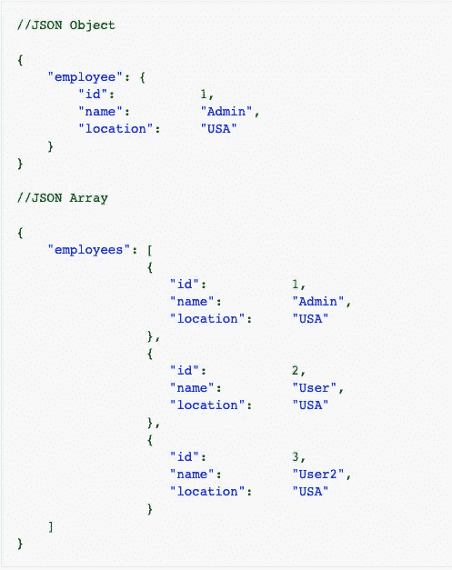

# iOS 中的联网是什么

> 原文：<https://blog.devgenius.io/what-is-networking-in-ios-2dc67f27d1b1?source=collection_archive---------9----------------------->

【Swift 5 的 iOS 开发网络基础概述

> 大多数应用程序需要网络来连接外部服务和数据源。“联网”意味着通过“http”(超文本传输协议)交换信息，这是最常用的协议之一。每次打开浏览器并检索或发送数据时，您都在使用 HTTP 作为协议。在本文中，您将通过查看以下选项，了解如何在 iOS 中使用网络:

> 有一些方法可以让你继续联网:HTTP，RestAPIs，NSURLSession，Alarmofire 等等

# **HTTP**

这是最流行的协议之一。如果您正在阅读本文，那么您正在使用 HTTP 从 Sitepoint 服务器检索 HTML 页面。

您的客户端(浏览器)向服务器发送请求，服务器返回关于所请求资源的信息。在移动应用程序的上下文中，它将请求数据列表，服务器用请求的数据进行响应。这些被称为**获取**请求。

有时你必须从应用程序向服务器发送一些数据，比如更新。这些被称为 **POST** 请求。

还有很多其他的*要求*:

*   **获取**
*   **发布**
*   **头**
*   **放**
*   **补丁**

# **Rest API 的**

REST API 是一种简单而标准的数据交换方式。您在服务器上有一些数据，并希望在应用程序中检索这些数据。首先，你需要知道如何构建你的 API，或者“应用编程接口”。

JSON API 模块公开了数据存储和数据结构的实现，比如实体类型、包和字段。

## JSON

JSON (JavaScript Object Notation)是 web 上最广泛使用的数据交换格式。这种数据交换可以发生在不同地理位置的两个计算机应用程序之间，也可以发生在同一台硬件机器上。

好的一面是 JSON 是一种人和机器都可读的格式。因此，虽然应用程序/库可以解析 JSON 数据，但人类也可以查看数据并从中获取意义。

JSON 文档可能包含文本、花括号、方括号、冒号、逗号、双引号，还可能包含一些其他字符。

JSON 主要建立在两种结构之上:

1.  名称/值对的集合。在各种语言中，这被实现为对象、记录、结构、字典、哈希表、键列表或关联数组。
2.  值的有序列表。在大多数语言中，这被实现为数组、向量、列表或序列。

JSON 文档的一个示例:

> **nsursession**

当一个 iOS 开发者想要从某个 URL 中检索内容时，他们选择使用 NSURLConnection。在较新的 iOS 中，苹果建议使用 NSURLSession，NSURLSession 就像一种改进，或者你可以认为是一种重构。

> **阿拉莫菲尔**

Alamofire 是一个固执己见的库，旨在使 iOS 网络更简单。如果您打算使用更多的自定义网络，例如使用不同的协议，这个库可能不适合您。但是如果你打算使用传统的 REST APIs 和简单的网络，那么我推荐你试试 Alamofire。

领英:-[T3【linkedin.com/in/my-pro-file】T5](https://www.linkedin.com/in/my-pro-file)