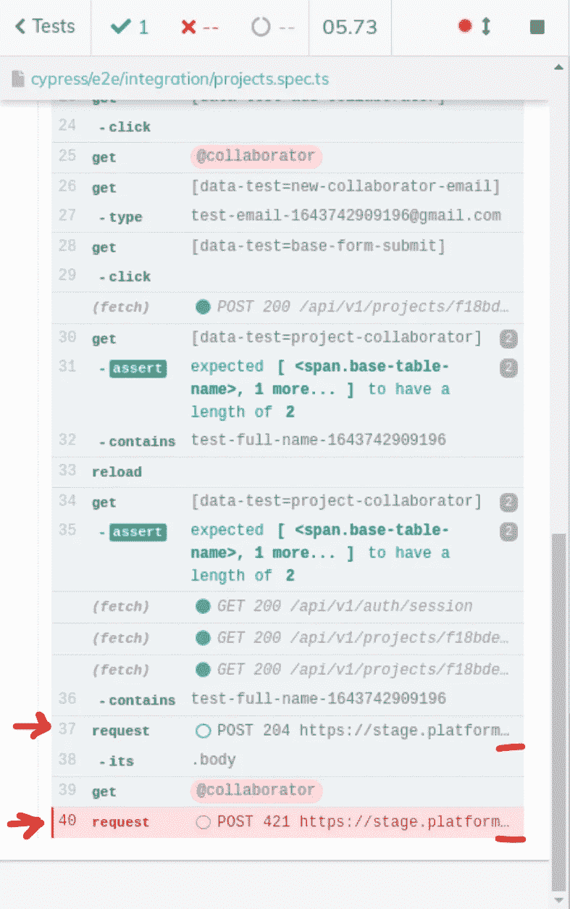

# cypress:v 9 . 5 . 0 & v 9 . 5 . 1 有什么新功能？

> 原文：<https://blog.devgenius.io/what-is-new-in-cypress-v9-5-0-v9-5-1-28890906f0c8?source=collection_archive---------11----------------------->

这是 Cypress.io 上的更新，发生在去年二月。这些是您可以在 cypress.io 变更日志文档中找到的变更日志。

# v9.5.1

*2022 年 2 月 28 日发布*

错误修复:

*   在插件流程中添加了一个`ready`事件，以确保在加载配置和测试开始之前，所有插件都已成功启动。固定在 [#19792](https://github.com/cypress-io/cypress/issues/19792) 中。
*   这修正了一个问题，插件永远不会被执行，使 Cypress 停留在初始化阶段，用户只能看到加载微调器。
*   这使得能够支持插件节点的实验性`--loader`标志。
*   对 DNS 查找进行了更改，以提高利用 VMWare CBCloud SaaS 解决方案的 macOS 计算机上的测试性能和可靠性。在此更改之前，观察到了随机测试失败，以及挂起测试和最初挂起的 HTTP 和 HTTPS 响应。固定在 [#20062](https://github.com/cypress-io/cypress/issues/20062) 中。
*   修复了 [9.5.0](https://docs.cypress.io/guides/references/changelog#9-5-0) 中的回归，其中 ANSI 颜色未从`cy.fixtures()`错误代码帧中移除。修复了 [#20208](https://github.com/cypress-io/cypress/issues/20208) 。
*   修复了 [9.5.0](https://docs.cypress.io/guides/references/changelog#9-5-0) 中的回归，其中测试配置覆盖错误的格式不正确。修复了 [#20208](https://github.com/cypress-io/cypress/issues/20208) 。
*   修复了 Cypress 在用布尔值或数字报告或包装错误时会抛出错误的问题。修正了 [#19561](https://github.com/cypress-io/cypress/issues/19561) 。

依赖关系更新:

*   将`url-parse`依赖从`1.5.2`升级到`1.5.6`，以避免通过用户控制的密钥绕过授权，从而解决这个 [NVD 安全漏洞](https://nvd.nist.gov/vuln/detail/CVE-2022-0512)。此问题已在 [#20270](https://github.com/cypress-io/cypress/issues/20270) 中解决。

# v9.5.0

*2022 年 2 月 15 日发布*

特点:

*   对运行模式和打开模式中的错误体验进行了增强，以提高可读性并提供有意义的堆栈跟踪。已在#20124 中解决。

A.当涉及到用户代码时，许多错误被错误地构造，这使得堆栈跟踪变得模糊不清

B.大多数较新的错误具有不一致且任意的样式和格式

C.在桌面 GUI 中传播的错误呈现不正确

D.ANSI 样式并不总是从堆栈中删除

E.许多堆栈跟踪是完全错误的

F.呈现了多个堆栈跟踪(来自原始错误和内部处理的 cypress 错误)

G.错误在`stdout`中被勾回，用于 markdown，而不是 ANSI 样式

H.源自桌面 GUI 中用户代码的错误隐藏了最重要的细节(堆栈跟踪),需要“打开”错误细节——而`Stack Trace`细节按钮重复了相同的包装错误，没有提供任何好处

*   更新了`cy.request()`日志消息，当它匹配浏览器来源时隐藏来源，以使调试更容易。这减少了日志消息的长度，如果请求长 URL，日志消息可能会被部分隐藏。已在#20009 中解决。

当我使用`cy.request`时，它在日志中显示为一个完整的 URL，包含方案、域等。我觉得还是用和`fetch`一样的方式，只用路径名来展示比较好。

**为什么需要这样做？**

当我试图通过查看截图来调查问题时，使用`cy.request`总是很痛苦。你必须进入测试，以匹配步骤的顺序，并理解这些请求是什么。

*   进行了更新，将`ShadowRoot`和`Document`元素记录为 HTML 元素。以前，这些将被记录为枚举对象，很难评估。已在#20049 中解决。

在旧版本中，当 ShadowRoot 渲染到命令日志时，它会将其视为 Javascript 对象，并枚举其属性，如下所示:

更改后，它被视为 HTML 元素，导致在命令日志中显示以下内容:

一个`Document`也是如此。它们现在将内部 HTML 呈现到命令日志中，而不是详细列举它们的属性(包括 inner HTML)。

*   更新了在 Cypress 运行模式下生成的终端输出，以降低运行标题中的`node`路径的重要性。已在#20120 中解决。

系统节点路径都是白色的，它本身没有什么价值。它应该像浏览器上的`headless`一样静音。

错误修复:

*   修正了附加的文件`.selectFile()`可能有错误的`File`原型的问题。修复了 [#20003](https://github.com/cypress-io/cypress/issues/20003) 。
*   更新了`.select()`,只在所选选项不是当前所选选项时调度`change`和`input`事件。这一变化使`.select()`与浏览器保持一致。修复了 [#19494](https://github.com/cypress-io/cypress/issues/19494) 。
*   更新了`.type(' ')`以符合 W3C 标准，当按下空格键且当前焦点位于类型为`button`、`image`、`submit`或`reset`的状态改变元素上时，应调度 click 事件。修复了 [#20067](https://github.com/cypress-io/cypress/pull/20067) 。

 [## 每当侯赛因·巴申发表文章时，就收到一封电子邮件。

### 每当侯赛因·巴申发表文章时，就收到一封电子邮件。通过注册，您将创建一个中型帐户，如果您还没有…

husseinbaashen.medium.com](https://husseinbaashen.medium.com/subscribe)