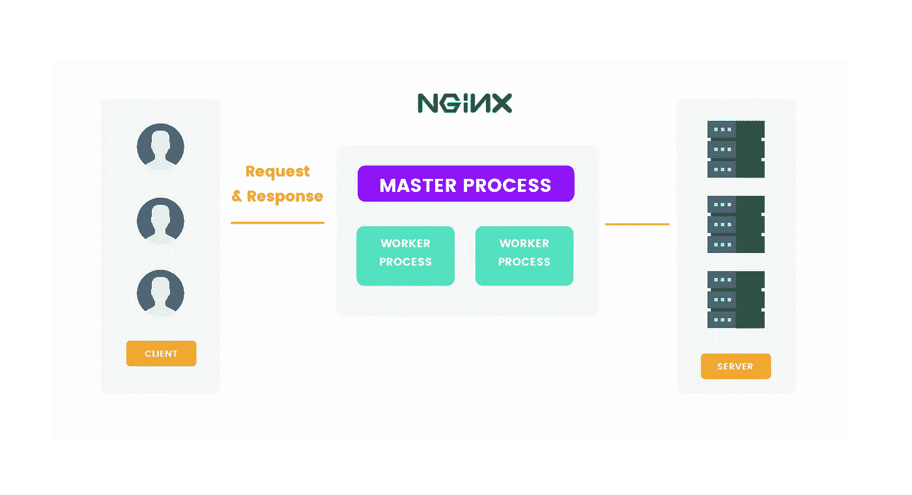

# NGINX 是什么？

> 原文：<https://blog.devgenius.io/what-is-nginx-8f3ac60e557a?source=collection_archive---------15----------------------->

[Duomly —编程在线课程](https://www.duomly.com)

本文原载于[https://www . blog . duomly . com/6-most-popular-back end-问答-初学者/# what-is-nginx-教程-初学者](https://www.blog.duomly.com/6-most-popular-backend-questions-and-answers-for-beginners/#what-is-nginx-tutorial-for-beginners)

NGINX 开始被称为开源 web 服务器，但现在它也被用作反向代理、HTTP 缓存和负载平衡器。作为一个网络服务器，它被设计为最高的性能和稳定性。

为了简单易懂，让我解释一下 web 服务器是如何工作的。当您尝试打开一个网站时，浏览器向服务器发送一个请求，然后服务器查找请求的源并将其返回给浏览器。当然，请求通常要复杂得多。

上面描述的过程是一个单线程，通常，web 服务器为每个请求创建一个线程，但是 NGINX 以不同的方式进行处理。

NGINX 将类似的线程作为一个进程工作者来管理，每个进程工作者有更小的单元，称为工作者连接。进程连接将请求传递给工作进程，工作进程将请求传递给主进程，请求返回给浏览器。

NGINX 可以处理成千上万的请求。

让我们来形象地展示 NGINX 在应用程序中的用法。

NGINX 是什么？

[Duomly —编程在线课程](https://www.duomly.com/?code=lifetime-80)

感谢您的阅读，
来自 Duomly 的安娜