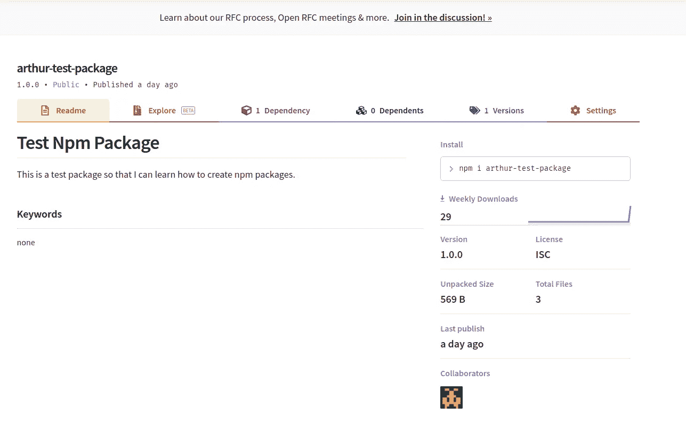

# Npm，package.json，package-lock.json，node_modules。这一切意味着什么？创建您的第一个 npm 包。

> 原文：<https://blog.devgenius.io/what-is-npm-d5b5cf898985?source=collection_archive---------0----------------------->

好的，在这篇博文中，我想谈谈 NPM。它是如何工作的？它与 package.json、package-lock.json 和 node_modules 目录有什么关系？

我还将讨论“什么是包，什么是模块？”此外，我们将创建自己的非常简单的 npm 包并发布它。

# 介绍

我已经使用了像 React 和 Vue 这样的 Javascript 库将近两年了——也使用了 NodeJS for APIs。我对安装包并将它们导入到我的项目中有一点了解。能够导入代码库和即插即用使得构建应用程序更加容易和快速。然而，当一个包出现问题时，它是如此令人沮丧，因为，一，我对 NPM 没有深入的了解，二，我不熟悉该包的代码(导入的代码不是我的代码)。

对于包不是我的代码，我真的做不了什么，但是我认为通过熟悉`npm`我可以变得更擅长处理包和调试任何错误。

就在昨天，我试图建立一个 Vue 项目的 Docker 映像，我在使用`npm`时遇到了问题。在执行`npm run build`命令期间，我使用的名为`v-calendar`的依赖项出现了问题。我从不再可用的 v-calendar 模块中导入了一个 CSS 文件。此外，软件包的用法已经更新，使用 v-calendar 组件的代码被破坏。

在我解决了这两个问题之后，`npm run build`命令可以工作了，但是这需要大量的谷歌搜索和几个小时不必要的代码调试。相反，如果我了解 npm 是如何工作的，我就可以很容易地看到 npm 错误消息并解决我的问题。

所以说了这么多，今天，我想理解`npm`的基础，因此，能够轻松地解决依赖或包相关的问题。

此外，包管理器在今天的任何现代编程语言中都有涉及。Ruby bundler，Python PiP，NodeJS npm。我学到的关于 npm 的知识可以很容易地转移给其他的包管理人员，所以`npm`将是一个很有用的东西。

*注意:我想我还应该注意，我不会太关注 npm 命令，因为你可以很容易地在文档中找到它们。相反，我将关注这些不同的 npm 组件的“什么”以及“如何”。*

# NPM 到底是什么？

所以我认为我们首先应该谈论的是 NPM。NPM 到底是什么？

主要是两个不同的(或者三个)东西。

1.  我们用来安装软件包的 **CLI** (命令行界面)，例如`npm install some_module`
2.  **注册表**=>JS 包上传到的公共数据库。
3.  (网站)

## 重要定义:模块与包

**打包** = >一个由`package.json`描述的文件或目录。

**模块**=>`node_modules`目录中任何可以用 Node.js 程序中的`require()`加载的东西。

Nodejs require()可以加载什么？

*   一个带有`package.json`的文件夹，里面装着`main`
*   一个文件夹，里面有一个`index.js`文件
*   js 文件

## 有什么区别？

大多数 npm 包都是模块。然而，一些 npm 包不能被加载，例如`cli`包只包含一个可执行的命令行界面，不提供用于 NodeJS 程序的`main`字段。

一个例子:

> 例如，如果你在`node_modules/foo.js`创建了一个文件，然后有一个程序做了`var f = require('foo.js')`，它将加载模块。但是，`foo.js`在这里不是一个“包”,因为它没有 package.json。
> 
> 或者，如果您创建的包在`package.json`文件中没有`index.js`或`"main"`字段，那么它就不是一个模块。即使安装在`node_modules`里，也不能成为`require()`的参数。

在 NodeJS/npm 应用程序的上下文中，当我们运行`npm install some-package`时，我们正在从 npm 注册表安装一个包。然后这个包被添加到我们的 node_modules 目录中。这个包现在也是我们应用程序的一个模块，我们可以使用`const somePackage = require(‘some-package’);`将它加载到我们的应用程序中。

# package.json 是什么？

既然我们知道包只是一个包含 package.json 文件的目录，接下来我们想知道 package.json 文件到底是什么？？

**Package.json 是描述 npm** 的包的 json 文件。我认为创建和发布我们自己的包将很容易演示 package.json 如何与包相关联，所以让我们在这里这样做。

1.  首先，**在网站上创建一个 npm 账户**。[https://www.npmjs.com/](https://www.npmjs.com/)
2.  接下来，**创建你的包** a .创建你的目录`mkdir arthur-test-package && cd arthur-test-package` b .创建你的 package.json 文件`npm init` 日志会提示你描述你的包，即`name`等信息。对于所有提示，您只需按 enter 键，并使用默认字段。需要注意的重要事情是`name`和`main`字段。该名称将用作发布到注册表时的名称，而`main`字段是导入的**文件**当用户执行`require(‘your-module’).` *时，您也可以使用* `npm init -y` *创建一个带有默认字段*的 package.json

c.在您的“主”文件(默认为 index.js)中创建代码。我的看起来是这样的(*这是不言而喻的，但请确保您的包中有您需要的任何依赖项，以便您的 packge.json 文件将列出这些依赖项。)*

4.现在我们有了自己的包，我们只需要**登录**就可以将它发布到注册表中，`npm login`并输入您的用户名和密码

5.**将**发布到 npm 注册表。`npm publish`

就是这样！创建和发布 npm 包非常容易。我们可以很容易地在国家预防机制网站上通过导航到我们的个人资料下的“包”部分来查看我们的包。

参见[文档](https://docs.npmjs.com/packages-and-modules/contributing-packages-to-the-registry)了解更多关于发布你的包到 npm 的细节！

我们也可以在单独的 NodeJS 项目中打包。

在另一个初始化了 npm 的 NodeJS 项目中，我们可以运行`npm install arthur-test-package`并在代码中使用 arthur-test-package。

现在，当我们运行这个文件`node someotherfile.js`时，它使用我们在 arthur-test-package 中创建的函数记录日期字符串。

所以在创建了我们自己的包及其附带的 package.json 文件后，我们知道 **package.json 文件只是一个向 NPM 描述包的 json 文件。**

*   包的名称
*   包需要的任何依赖项
*   `main`字段描述了使用`require`加载该包时导入的文件

## npm 命令如何使用 package.json 文件

其他一些需要知道的事情是 npm 命令如何处理 package.json 文件。

跑`npm install`会怎么样？

`npm install` = >会将 package.json 文件中“dependencies”下列出的任何包安装到 node_modules 目录中，以便您可以开始在应用程序中使用这些模块！

`npm install some-package` = >会将特定的包安装到 node_modules 目录中，还会在 package.json 中的“依赖项”下列出该包，以便 npm 知道该包需要某个包才能正确运行。

# 最后，package-lock.json 是什么？

第一次运行`npm install`时，npm 会自动创建一个 package-lock.json 文件？

**如果我们有描述我们需要的任何依赖项的 package.json，为什么我们需要 package-lock.json？？**

文件上说:

> 对于 npm 修改`node_modules`树或`package.json`的任何操作，都会自动生成`package-lock.json`。它描述了生成的确切的树，使得**后续安装能够生成相同的树，**而不管中间的依赖关系更新。

如果我们读得更多，就会发现 package-lock.json:

> 描述依赖关系树的单一表示，从而保证队友、部署和持续集成安装完全相同的依赖关系。

换句话说，package-lock.json 确保任何运行`npm install`的人都会生成一个相同的**依赖树。这很重要，因为你的项目可能需要同一个包的几个不同版本。为了确保这些依赖需求得到解决，我们需要依赖树，任何想要运行你的程序的人也需要生成精确的依赖树。**

解析不同的依赖版本被称为“依赖地狱”。你可以在他们的文档中读到更多关于什么是依赖地狱以及 npm 如何解决依赖地狱的内容。[https://NPM . github . io/how-NPM-works-docs/NPM 2/how-NPM 2-works . html](https://npm.github.io/how-npm-works-docs/npm2/how-npm2-works.html)

## 为什么要把 package-lock.json 文件提交给 GitHub？

我总是有点不确定是否应该将 package-lock.json 文件提交给 GitHub，但是在理解了它们的作用之后，就明白了为什么应该提交它们。

之前的:

> [packge-lock.json]描述了依赖关系树的单一表示，从而确保队友、部署和持续集成安装完全相同的依赖关系。

*   此外，package-lock.json 提供了我们的依赖关系树的历史，而不必提交整个 node_modules 目录。

因此，提交我们的 package-lock.json 提供了 GitHub 存储库中依赖树的历史记录，并允许其他人在 node_modules 中生成精确的依赖树。

## 最后的想法…

好了，至此，我想我们对 npm 的工作原理以及 package.json、package-lock.json 和 node_modules 有了一个很好的理解。

*   npm 是一个公共注册中心，软件包在这里发布到
*   npm 也是我们用来下载软件包的 CLI
*   package.json 是一个 json 文件，它向 npm 描述了我们的包
*   node_modules 是 npm 安装我们的包的目录，也是 NodeJS 寻找模块的地方
*   最后，package-lock.json 是一个描述 npm 生成的确切依赖树的文件；它确保了使用该应用程序的其他人在安装包时创建相同的依赖树！

最初，我也想进入`npm scripts`，具体来说，React 和 Vue `run`和`build`脚本，以及它们到底是如何工作的，但我认为这个帖子已经够长了。此外，分解这些脚本本身所做的事情似乎已经足够广泛了，所以希望我可以在另一个时间讨论这个问题。