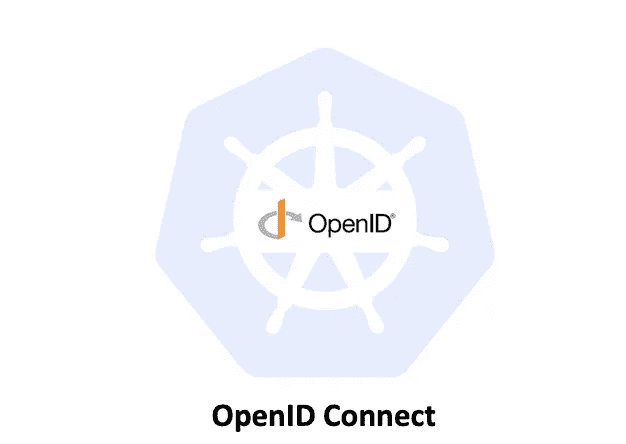
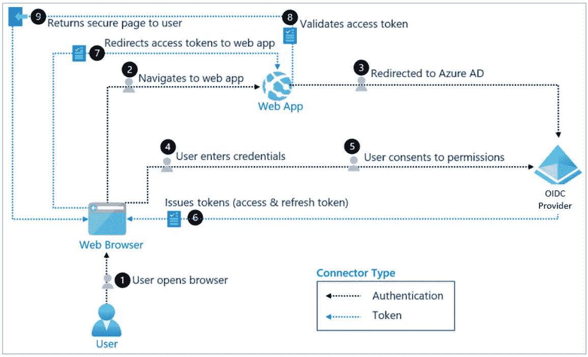
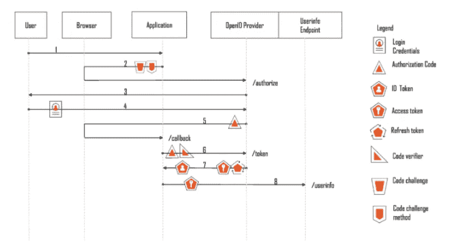
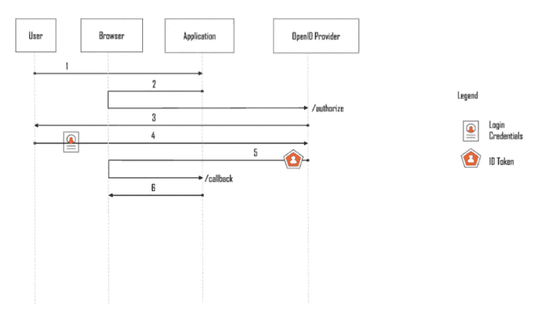
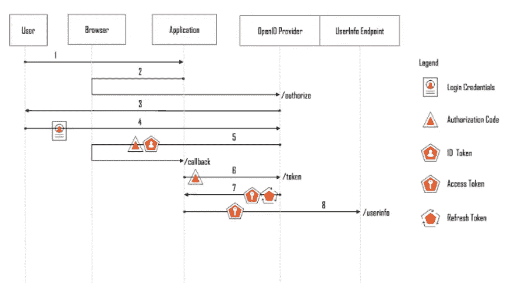
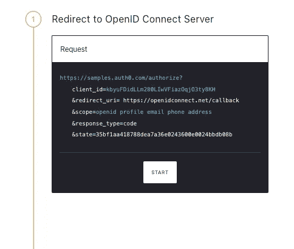
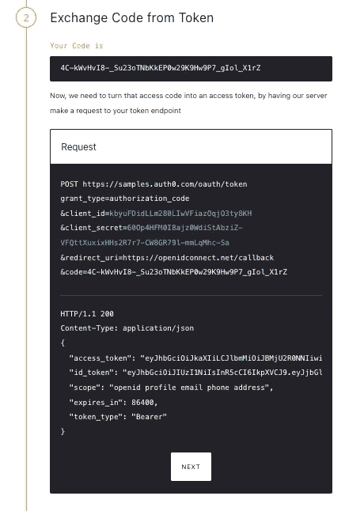
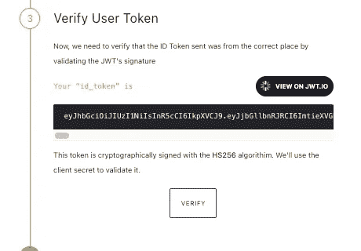
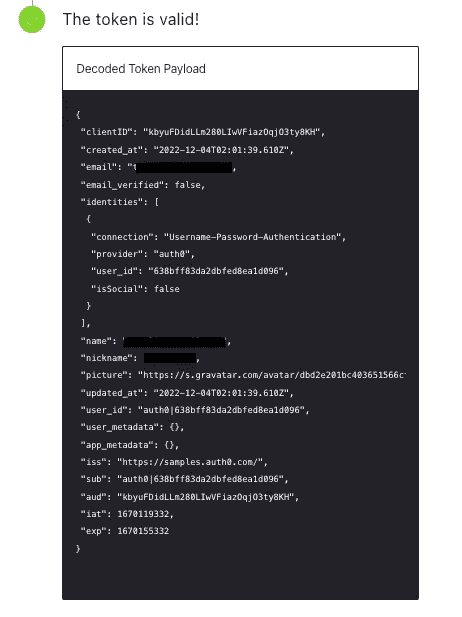

# 什么是 OpenID 连接

> 原文：<https://blog.devgenius.io/what-is-openid-connect-3c7e0463b684?source=collection_archive---------2----------------------->

## OIDC 简介



# 什么是 OpenID 连接

OpenID Connect (OIDC)是一个工作在 OAuth 2.0 框架之上的开放认证协议。针对消费者，OIDC 允许个人使用单点登录(SSO)来访问使用 OpenID 提供商(OPs)的依赖方网站，例如，电子邮件提供商或社交网络 loing，以验证他们的身份。

OIDC 为应用程序或服务提供有关用户的信息、他们的身份验证的上下文以及对他们的配置文件信息的访问。

因为 OIDC 是 OAuth 2.0 之上的一层，所以应用程序可以使用 OpenID 提供者进行用户身份验证和授权，以调用 OpenID 提供者的 API。

# OIDC 解决了什么问题？

OIDC 的设计目标是“让简单的事情变得简单，让复杂的事情变得可能”。OIDC 旨在解决的场景包括一个用户/客户端需要通过身份验证才能访问给定的应用程序。它使应用程序能够将用户身份验证委托给 OAuth 2.0 授权服务器，并以标准格式返回经过身份验证的用户和身份验证事件。

下图显示了 OIDC 工艺流程:



图片来自 [Azure doc](https://learn.microsoft.com/en-us/azure/active-directory/fundamentals/auth-oidc)

根据上图，当用户访问应用程序时，它会将用户的浏览器重定向到实现 OIDC 提供者的授权服务器。OpenID 提供者与用户交互以对他们进行身份验证(假设他们还没有登录)。

身份验证后，用户的浏览器被重定向回应用程序。应用程序可以请求在一个称为 ID 令牌的安全令牌中返回关于经过身份验证的用户的声明。

或者，它可以请求一个 OAuth 2.0 访问令牌，并使用它来调用 OpenID 提供者的 UserInfo 端点以获得声明。

# OIDC 组件

## 角色

在 OIDC，有三种不同类型角色:

*   **最终用户:**待认证的用户
*   **OpenID Provider (OP):** 一个 OAuth 2.0 授权服务器，它实现了 OIDC，可以认证用户并返回声明
*   **依赖方(RP):**OAuth 2.0 客户端/应用程序，将用户认证委托给 OpenID 提供者，并向 OpenID 提供者请求关于用户的声明。

## OIDC 身份证令牌

OIDC 为 OAuth 2.0 使用授权码、访问令牌和刷新令牌，并定义了 ID 令牌。

*   **ID Token:** 用于向依赖方(应用)传达关于认证事件和被认证用户的声明的令牌。
    ID 令牌是 OpenID 提供者使用的安全令牌，用于向应用传达关于认证事件和认证用户的声明。ID 标记以 JSON Web 标记(JWT)格式编码。
    例如:

```
Header
{
  "alg": "RS256"
  "Typ": "JWT"
}
Payload
{
  "acr": "1",
  "aid": "default",
  "amr": [
    "pwd"
  ],
  "aud": "default-demo",
  "auth_time": 1631696786,
  "email": "",
  "email_verified": false,
  "exp": 1631700395,
  "iat": 1631696795,
  "idp": "default",
  "iss": "https://identity.oidc-verify.com",
  "jti": "261e658f-b40a-42f5-9e98-3eb022dfccac",
  "name": "John Doe",
  "nbf": 1631696795,
  "nonce": "c50rf23o825ulrjk38qg",
  "rat": 1631696795,
  "scp": [
    "email",
    "openid",
    "profile"
  ],
  "st": "public",
  "sub": "user",
  "tid": "cloud-user"
}
Signature
...
```

JWT 格式旨在传达双方之间的权利主张。作为 JWT，ID 令牌由报头、有效载荷和签名组成:

*   **报头:**包含关于对象类型(JWT)和用于保护有效载荷中声明完整性的特定签名算法的信息
*   **有效负载:**包含关于用户和认证事件的声明。
*   **签名:**包含基于 ID 令牌的有效负载部分的数字签名和 OpenID 提供者已知的秘密密钥

# OIDC 是如何运作的

最初的 OIDC 核心规范定义了以下流程:

*   授权代码流
*   隐式流
*   混合流

## 授权代码流

为了认证用户，应用程序首先将用户的浏览器重定向到 OpenID 提供者。OpenID 提供者对用户进行身份验证，并使用授权码将用户的浏览器重定向回应用程序。然后，应用程序使用授权码获得一个`ID Token`和`Access Token`:



图片来自伊冯娜·威尔逊

## 隐式流

传统上，隐式流由不能安全存储机密的应用程序使用。使用这个流不再被认为是请求访问令牌的最佳实践。
`Implicit Flow`的过程看起来是这样的:



图片来自伊冯娜·威尔逊

# OIDC 混合流

混合流是 OpenID 连接流，它结合了隐式流和授权代码流的特征。它使客户端能够直接从授权端点获取一些令牌，同时仍有可能从令牌端点获取其他令牌。
`Implicit Flow`的过程看起来像是:



图片来自伊冯娜·威尔逊

# OpenID 演示

你可以用下面的网站自己玩:[https://openidconnect.net/](https://openidconnect.net/)

