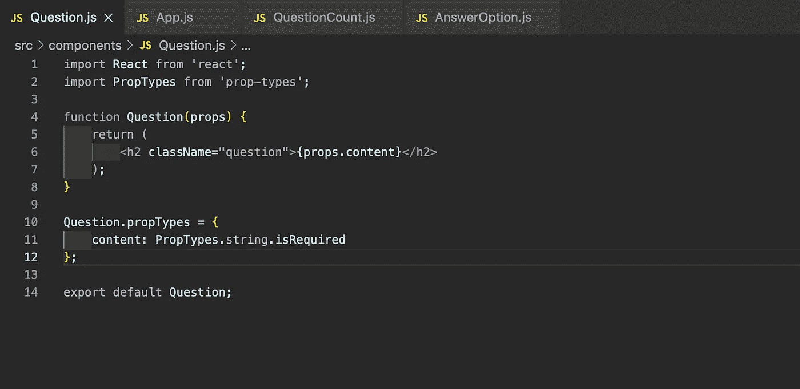

# React 中的属性类型是什么

> 原文：<https://blog.devgenius.io/what-is-proptypes-in-react-593147a7254a?source=collection_archive---------9----------------------->


最近，当我在学习[这个教程](https://mitchgavan.com/react-quiz/)的时候，我偶然发现了一个叫做[道具类型](https://github.com/facebook/prop-types)的 React 库。我以前从未使用过这个库，所以我快速研究了为什么我们需要道具类型以及如何使用它。

JavaScript 是一种所谓的“非类型化”语言。这意味着 JavaScript 将计算出您拥有的数据类型，并使一个函数无需任何必要的调整即可工作。例如，它可以将一个数字转换成一个字符串，如果这是函数所期望的。听起来很棒，对吧？然而，它可以是一种祝福，直到它变成一种诅咒。

随着应用程序的增长，当我们期望的数据类型不是我们传递的数据类型时，这个 JavaScript 特性可能会导致错误。因此，检查数据类型似乎是一个明智的决定。这就是 React 内置类型检查功能发挥作用的地方。`PropTypes`是一个帮助检查你传递的道具是否有你在等的类型的库。

反正我们的**第一步**就是装库。

```
npm install — save prop-types
```

**第二步**是导入库。

```
import PropTypes from 'prop-types';
```

我们的**第三步也是最后一步**是分配特殊的`propTypes`属性。这个库提供了大量的验证器来确保你收到的数据是有效的。我们需要做的就是调用组件的`propTypes`属性并指定数据类型。

这是我为我最近的项目准备的。我有一个问题组件，它的 prop.content 应该是一个字符串。现在，如果我传递一个不同类型的对象，我会得到一个警告。还有，我补充。是确保在没有提供 props 的情况下显示警告所必需的。



希望这篇短文对你有所帮助！


**来源:**

1.  [什么是 PropTypes](https://dev.to/cesareferrari/what-is-proptypes-and-how-to-use-it-in-react-2eml)
2.  [React 文档](https://reactjs.org/docs/typechecking-with-proptypes.html#proptypes)
3.  [在 React 中掌握道具和道具类型](https://www.smashingmagazine.com/2020/08/mastering-props-proptypes-react/)