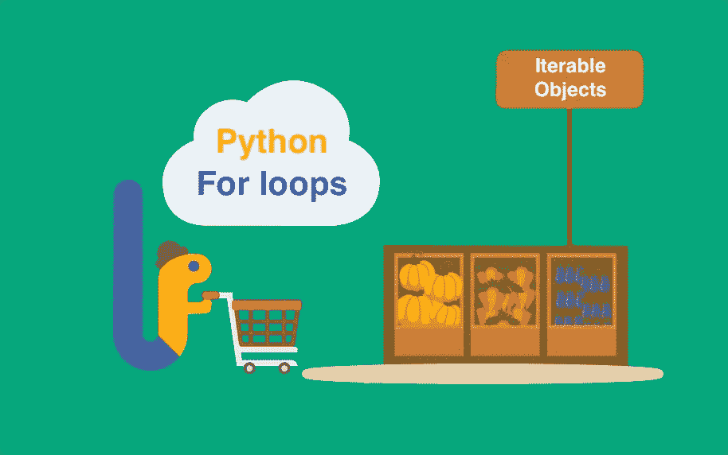
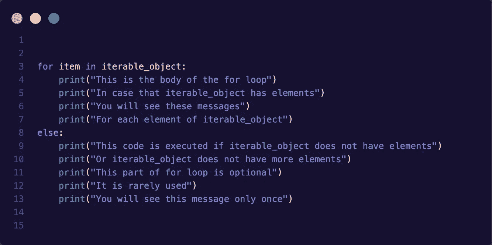

# Python for loop 是什么？

> 原文：<https://blog.devgenius.io/what-is-python-for-loop-72faa2c0d470?source=collection_archive---------13----------------------->

理解 Python 中的循环



Python for 循环

Python 中的 For 循环允许我们迭代任何 iterable 对象返回的值，换句话说，任何可以产生一系列值的对象。这是 Python 和其他编程语言中 for 循环的主要区别，传统的 for 循环只是在每次迭代中增加和测试一个变量。

可迭代对象的一些示例如下:

*   列表[ ]
*   元组( )
*   用线串
*   范围函数

Python 中 for 循环的一般形式是:



以下代码逐个打印字符串列表:

```
x = ["This", "is", "a", "Python", "for loop"]for item in x:
    print(item)Output:This
is
a
Python
for loop
```

# 使用 for 循环的方法

这些是 Python 中对可迭代对象使用 for 循环的最常见方式。

**范围功能**

当你需要用显式指数循环时，*范围*函数是你的选择。range 函数基本上*返回一系列数字*，这些数字取决于 range 函数期望的三个参数。

*   参数 1:该参数是结果序列的起始编号。它是一个*可选参数*。
*   自变量 2:这第二个数是结果序列的最后一个数*，它不包含在序列中。*
*   参数 3:该参数给出了一个*步长值*，通过该步长值在范围函数中进行计数。是一个*可选参数*。

这些参数的一些规则是:

*   这些参数必须是正数或负数。
*   参数 2 必须大于参数 1，除非第三个参数为负，否则可以忽略此规则。
*   参数 3 不应大于参数 1 和参数 2 之间的范围。
*   参数 3 必须是非零的正数或负数。

示例#1:

```
for x in range(-5, 2):
    print(x)Output:-5
-4
-3
-2
-1
0
1
```

示例 2:

```
for x in range(2, 8, 2):
    print(x)Output:2
4
6
```

例 3:

```
for x in range(5, 0, -1):
    print(x)Output:5
4
3
2
1
```

实施例 4:

```
for x in range(4):
    print(x)Output:0
1
2
3
```

**元组/列表解包**

元组或列表解包允许我们使 for 循环更干净，尤其是当我们有一个元组或列表的列表时。

示例:

```
x = [(1, 2), (3, 4), (5, 6)]for i, l in x:
    print("({}, {})".format(i, l))

Output:(1, 2)
(3, 4)
(5, 6)y = [[7, 8], [9, 0], [10, 11]]for i, l in y:
    print("[{}, {}]".format(i, l))Output:[7, 8]
[9, 0]
[10, 11]
```

**枚举功能**

enumerate 函数允许循环遍历 iterable 对象、它们的项和索引。因此，该函数返回(index，item)的元组。

示例:

```
x = [1, 3, -7, 4]for i, l in enumerate(x):
    print("Index: {}, Item: {}".format(i, l))Output:Index: 0, Item: 1
Index: 1, Item: 3
Index: 2, Item: -7
Index: 3, Item: 4
```

**Zip 功能**

在循环遍历两个或多个可迭代对象之前，这个函数对于组合它们很有用。Zip 获取每个 iterable 对象的每个元素，并将它们组合成元组，直到到达最短 iterable 的末尾。

示例:

```
x = [1, 3, 4]y = [5, 6]for i, l in zip(x, y):
    print("({}, {})".format(i, l))Output:(1, 5)
(3, 6)
```

最后，我想说的是，for 循环可能是最重要的迭代循环，因此，我们需要详细了解它，尤其是当我们想要编写干净、可读的代码时。在未来，我将写关于列表和字典理解，使用 for 循环作为基础的结构，它们帮助我们写干净和可读的代码。

另一方面，请随意评论本文中没有提到的任何细节，我相信您的贡献将是非常有价值的。

非常感谢你来到这里。😊 👈

这篇文章是受这本书的启发📖"[快速 Python 之书](https://books.google.co.cr/books/about/The_Quick_Python_Book.html?id=urVEzQEACAAJ&source=kp_book_description&redir_esc=y)"📖如果你想了解这门语言的基本概念，同时想了解其他高级主题，我向你广泛推荐。