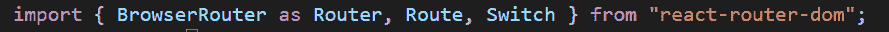
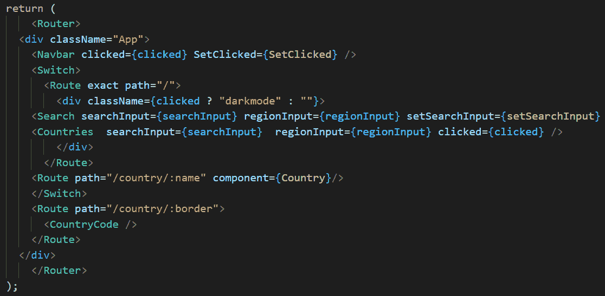
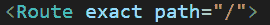
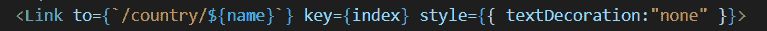
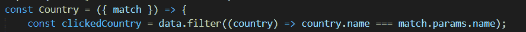

# 什么是 React 路由器，如何使用？

> 原文：<https://blog.devgenius.io/what-is-react-router-and-how-to-use-it-aceaddb062d8?source=collection_archive---------5----------------------->

React 是基于组件的，这意味着 React 应用程序的不同部分被分解成更小的组件，然后组织在更高级别的组件中。即使我们的 react 驱动的应用程序包含多个组件，我们也没有必要向用户显示所有这些组件。

例如，我们创建了一个简单的 react 应用程序，它包含三个不同的组件，即国家列表组件、国家组件和搜索组件。

当用户点击国家列表中的一个国家时，只有一个国家组件对他或她是可见的，其余的组件对他或她是隐藏的，关于一个国家的细节对他或她是显示的。

为了完成这项工作，我们将利用路由。要在 react 应用中使用路由，我们必须安装所有与路由相关的包。在这种情况下，我们将使用 React-Router，这是一个非常著名的库，用于在 react.js 应用程序中实现路由。

**怎么用？**

**第一步:npm 安装 react-router-dom (** 确保您已经安装了 react-router)

**第二步:**导入必要的钩子为你的应用程序创建路径。

**第三步:**确保用 Router 包装你的代码。

如上图所示，第一个导航栏被添加在路由器标签之后，它不在交换机内部，这意味着即使我们更改路由，导航栏组件也将保留。

就在导航栏之后，你会看到我已经创建了一个开关，并在里面填充了 Route。

**下一步:****第一条路线就像我们的主页，我在里面放了搜索和国家组件。**

****

**只要我们打开 localhost:3000，我们就会看到导航栏、搜索和国家组件。**

****

****下一步:**假设当我们在主页时，我们想从国家列表中单击一个国家，然后我们必须创建一个如上所示的链接，以转到国家/国家/名称页面。**

**如果您检查第二个路径 **path** ="/country/:name "**

**我们称 go to country 组件带有一个参数:name。**

****最后一步:****

****

**我们现在在国家组件，我们需要的是学习名称！用户到底点了什么？**

**访问 param 的最简单的方法是您应该获取 match as props，它是一个对象，然后访问 match.params.name。**

**在我的例子中，我根据 param 过滤了数组，并在浏览器上显示了一个国家。请看看下面已完成的项目。**

**[点击这里。](https://cyf-yunusfirat-countries-react.netlify.app/)**

**谢谢你**

**尤努斯**