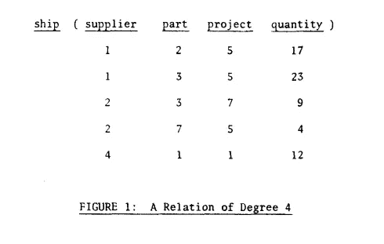

# 关系数据库的关系是什么？

> 原文：<https://blog.devgenius.io/what-is-relational-about-a-relational-database-a8ce35d88f32?source=collection_archive---------37----------------------->


托拜厄斯·菲舍尔在 [Unsplash](https://unsplash.com?utm_source=medium&utm_medium=referral) 上的照片

维基百科将**关系数据库**定义为基于数据[关系模型](https://en.wikipedia.org/wiki/Relational_model)的数字[数据库](https://en.wikipedia.org/wiki/Database)。关系模型认为所有的数据都是用[元组](https://en.wikipedia.org/wiki/Tuple)来表示的，这些元组组合成[关系](https://en.wikipedia.org/wiki/Relation_(database))。

一切似乎都很神秘？你并不孤单。让我们启动时间机器，回到数学课本第 11 标准第 2 章，标题为“关系和函数”。是啊！正是这种“关系”将 R 放在 RDBMS 中。

两个集合之间的关系是包含来自每个集合的一个对象的有序对 *(x，y)* 的集合。如果对象 *x* 来自第一集合，而对象 *y* 来自第二集合，那么如果有序对( *x* ， *y* )处于关系中，则称这些对象是相关的。

考虑两组*X =【1，2，3】*和*Y =【a，b】。*

***x ∈ X*** *(x 属于 X)*

***y ∈ Y*** *(y 属于 Y)*

***X * Y****= {(1，a)，(2，a)，(3，a)，(1，b)，(2，b)，(3，b)}*

***X * Y*** *是 X 和 Y 的*笛卡尔积。

任何关系 ***R*** 都是来自 ***X * Y*** *的有序对的子集。*

***r****⊆****x * y***

这里有一个关系 ***R1*** 的例子，它是 ***X * Y*** 的子集

```
+---+---+
| X | Y |
+---+---+
| 1 | a |
| 3 | b |
| 2 | a |
+---+---+
```

注意，尽管元组中元素的排序很重要，但元组本身的排序并不重要。


埃德加·考德在他的论文中解释说，他在这个非常数学的意义上使用了“关系”这个术语。我们之前看到的关系是两个集合之间的**二元关系**。n 个集合(不一定是不同的)之间的关系称为 n 元关系。



四元关系。

假设供应商、零件、项目和数量都是定义关系的集合。

*供应商= [1，2，3，4]*

part = [1，2，3，4，5，6，7]

项目= [1，2，3，4，5，6，7]

数量= [1，2，3，…。, 100]

所以这 4 个集合的笛卡尔积将是{(1，1，1，1)，(1，1，1，2)，…。, (4, 7, 7, 100)}.它将有 4 * 7 * 7 * 100 个 4 元组。它的任何子集都是这 4 个集合上的一个关系。

我们做笛卡尔积的每个“集合”，通常代表我们的**表/视图**中的一个**列**。因此表/视图的内容是关系**和**。因此也是关系数据库。