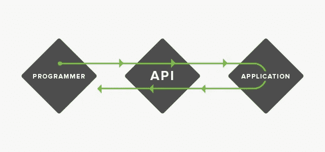
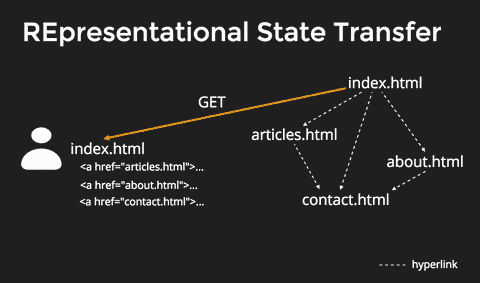
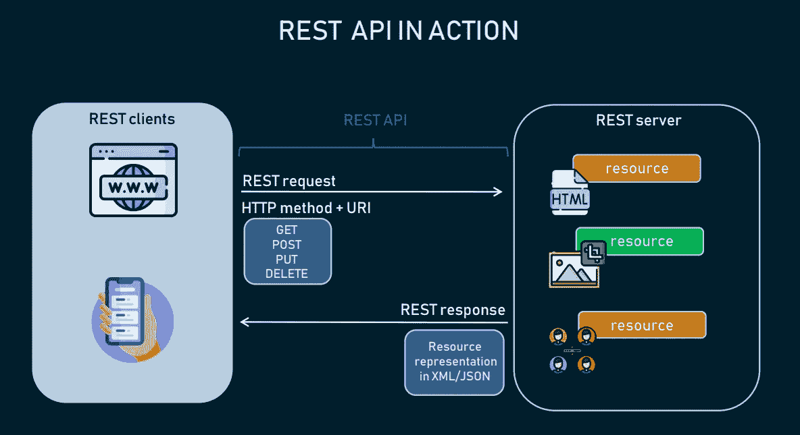
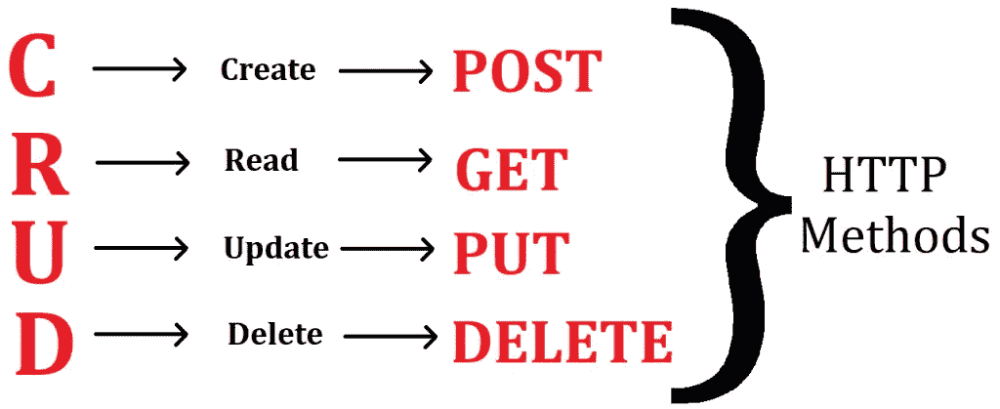

# 什么是 REST API？

> 原文：<https://blog.devgenius.io/what-is-rest-api-466cbc112916?source=collection_archive---------4----------------------->

## REST API 简介

如果你从事开发已经有一段时间了，你可能听说过术语“API”或者“REST API”或者“RESTful API”。如果你想知道它们的意思，这篇文章可以帮助你理解这些术语。自从互联网发明以来，我们一直在使用不同的应用程序和网页来获取各种资源的数据。但是，你有没有想过，这个数据是从哪里来的？我们从服务器上获取数据。因此，在这篇关于什么是 REST API 的文章中，让我们看看客户机如何与服务器通信来提取所需的信息。

在我们深入什么是 REST API 之前，我想澄清一些关键术语:

1.  **客户端** —客户端是使用 API 的人或软件。它可以是一个开发者，例如你，作为一个开发者，可以使用 Twitter API 从 Twitter 中读取和写入数据，创建一个新的 tweet，并在你编写的程序中执行更多的操作。你的程序会调用 Twitter 的 API。客户端也可以是网络浏览器。当你去 Twitter 网站的时候，你的浏览器就是调用 Twitter API 的客户端，使用返回的数据在屏幕上渲染信息。
2.  **资源—** 资源是某种东西的对象或表示，它具有与之相关联的数据。任何可以被命名为资源的信息。一个资源可以是一个用户，一张照片，一个标签。每个资源都有一个唯一的标识符。标识符可以是名称或号码。

# 什么是 API？

API 代表应用程序编程接口。它是一个软件，可以被另一个软件使用，以允许应用程序相互通信。例如，想象一个像餐馆菜单一样的 API。菜单提供了您可以点的菜肴列表，以及每道菜的描述。当你指定你想要的菜单项目时，餐馆的厨房会做这项工作，并为你提供一些成品菜肴。你不知道餐馆是如何准备食物的，你也不需要知道。

类似地，API 列出了开发人员可以使用的一系列操作，以及这些操作的描述。例如，开发人员不一定需要知道操作系统是如何构建并显示“另存为”对话框的。他们只需要知道它可以在他们的应用程序中使用。

这并不是一个完美的比喻，因为开发人员可能必须向 API 提供他们自己的数据来获得结果，所以这可能更像是一家高级餐厅，在那里您可以提供一些自己的厨房将使用的食材。

API 是超集，而 REST API 是子集。这意味着所有的 REST API 都是 API，而不是所有的 API 都是 REST API。

简单来说，API 的功能就是通过授予所有需要的权限，将一个应用程序与另一个应用程序的数据和服务连接起来。因此，它是两个应用程序之间的连接器，是任何应用程序开发的重要组成部分。REST API 是一个 web 服务 API，它使用 URIs 和 HTTP 协议以及 JSON 作为数据格式。使用 REST APIs 优于其他 API 的原因是因为它在有限的资源和更少的安全需求、浏览器兼容性、可伸缩性方面的开发简单性，所有这些都是 web 服务所期望的。

# 什么是 REST API？

REST 代表代表性状态转移。这是 web 服务开发中经常使用的一种架构风格和通信方法。它基本上是一种以逻辑方式构建 web API 的方法，使它们易于使用，因为 REST 使用更少的带宽，使其更适合高效的互联网使用。RESTful APIs 也可以用 JavaScript 或 Python 等编程语言构建。

如果我必须定义 REST，那么，表述性状态转移也称为 REST，它是一种架构风格，也是一种用于通信目的的方法，经常在各种 web 服务开发中使用。

让我们把网页网络看作一个虚拟的状态机。
每页代表一个**州:**

作为表示的状态转移

1.  首先，**用户接收第一状态**作为索引状态。

2.然后，用户通过**选择一个链接**(这里是关于页面链接)来浏览应用程序

3.导致下一个**状态被转移**给用户。转移的“关于”页面现在表示应用程序的当前状态**。**

状态的表示可以是 JSON 格式，可能对大多数 API 来说确实如此。它也可以是 XML 或 HTML 格式。

构建 RESTful API 意味着 API 遵循 REST 架构，我们只需要遵循几个原则。所以让我们了解一下原则。

# REST API 的原理

有 6 个基本的 web 基础可以用来创建 REST 服务。

## 1.客户端-服务器

该约束基于**关注点分离**原则。
这允许组件独立进化。当构建我们的 API 时，它就像一个服务于许多客户端的服务器。

## 2.无国籍的

客户端和服务器之间的通信必须是无状态的。这意味着从客户端到服务器的每个请求都必须包含完成事务所需的所有信息。

这种约束的主要优点是系统能够更好地伸缩，因为服务器不必在请求之间存储客户机状态。不必记住客户机状态信息释放了服务器资源，因此它可以同时为更多的客户机服务。

## 3.可缓冲的

为了提供更好的性能，应用程序通常是可缓存的。这是通过隐式或显式地将来自服务器的响应标记为可缓存或不可缓存来实现的。如果响应被定义为可缓存的，那么客户机缓存可以在将来为等效的响应重用响应数据。

## 4.统一界面

为了在网络中实现高效的缓存，组件必须能够通过统一的接口进行通信。有了统一的接口，有效载荷可以以标准的形式传输。

**4.1。资源的识别** 这意味着任何可以命名的信息都可以是资源(图像、文档、像人一样的概念甚至是其他资源的集合)

**4.2。通过表示操纵资源** 一个资源可以用许多不同的方式来表示。
例如 HTML、XML、JSON 甚至 JPEG 文件。这个规则意味着客户通过他们的表示与资源交互，这是一个从他们的交互中抽象出资源概念的强大方法。

**4.3 第三，自描述性消息** 这意味着资源可以在请求消息中描述，服务器也可以用描述性状态消息来响应。是的，HTTP 头和响应代码是这个规则的很好的实现。

**4.4 超媒体必须是应用程序状态的引擎** 这实际上意味着应用程序应该由链接驱动，允许客户通过超链接发现资源。

如您所见，这些规则中的许多都可以在 HTTP 协议中找到。因此，当一个 API 正确使用 HTTP 时，它就向 RESTful 迈进了一大步。

## 5.分层系统

在分层系统中，利用 web 的统一接口，可以在客户机和服务器之间放置中介，如代理。
分层系统的优势之一是中介可以出于特定目的拦截客户端-服务器流量；例如缓存。

## 6.按需编码

这是一个可选的约束，它允许客户端下载程序在客户端执行。最好的例子是前端 JavaScript 应用程序。这对我们来说可能听起来很明显，但在互联网的早期，这是一个不断发展的概念，它是互联网架构的一个有用的部分。

# 创建 RESTful Web 服务

RESTful web 服务**请求**包含:

## **一个端点 URL :**

您感兴趣的资源的标识符。这是资源的 URL，也称为**端点**。事实上，URL 代表统一资源定位器。

## **HTTP 方法:**

您希望服务器在该资源上执行的操作，以 **HTTP 方法**或**动词**的形式。常见的 HTTP 方法是 GET、POST、PUT 和 DELETE (CRUD)操作。

CRUD 操作

*   GET 请求用于**到** **从指定资源的服务器中检索数据。**
*   POST 请求用于**到**向 API 服务器**发送数据。**
*   PUT 请求用于**到**更新或创建一个资源。
*   补丁请求仅用于**到** **对资源应用部分修改。**
*   删除请求用于**删除指定 URL 上的资源。**

## **HTTP 头**。

诸如身份验证令牌或 cookies 之类的信息可以包含在 HTTP 请求头中。

## **身体数据**。

数据通常以与 HTML `<form>`提交相同的方式在 HTTP 主体中传输，或者通过发送一个 JSON 编码的数据字符串。

在第 2 部分，我们将讨论请求和响应。你也可以阅读我更多的文章。下次见，伙计们！

感谢你阅读我的帖子。如果你喜欢这篇文章，请广而告之。要获得我的新故事的更新，请在 [**中**](https://adityayaduvanshi.medium.com/) **和** [**推特**](https://twitter.com/fixslyr) **上关注我。**