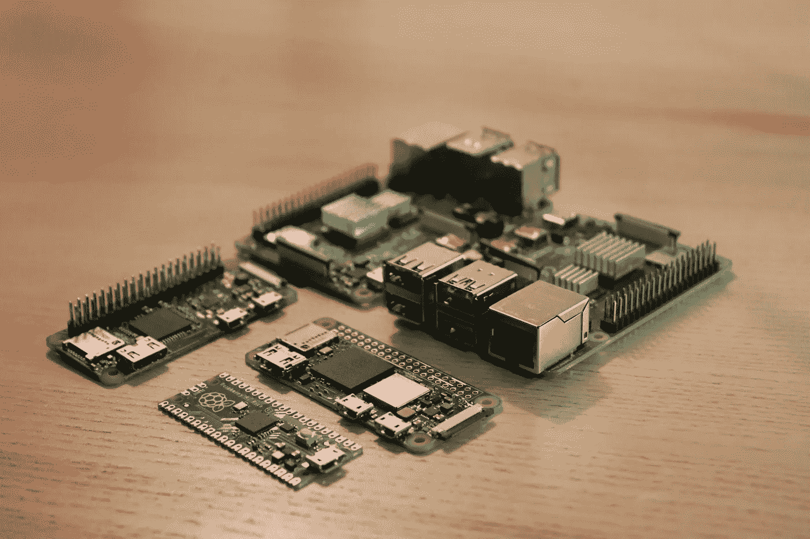
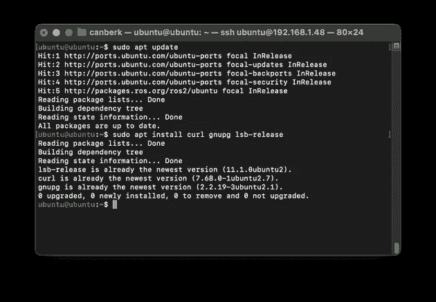
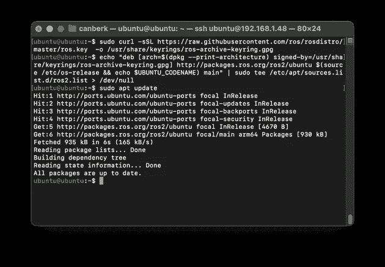
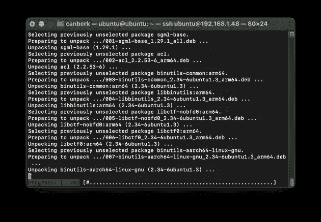
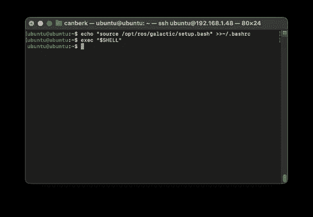
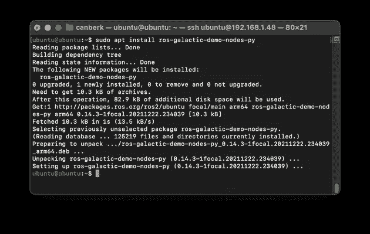
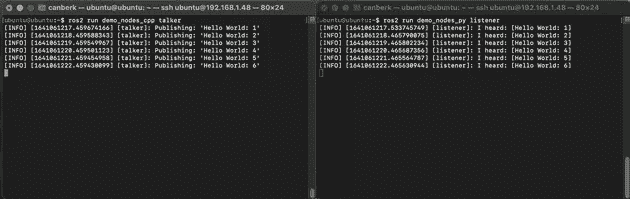

# ROS2 是什么，如何安装在树莓 Pi 上？

> 原文：<https://blog.devgenius.io/what-is-ros2-and-how-to-install-it-on-raspberry-pi-3a291bf3ea7f?source=collection_archive---------8----------------------->



作者照片

根据 [ROS 文档](https://docs.ros.org/en/galactic/index.html):“机器人操作系统(ROS)是一套用于构建机器人应用的软件库和工具。从驱动程序到最先进的算法，加上强大的开发工具，ROS 拥有您下一个机器人项目所需的一切。”

正如文档中的定义所述，ROS 包含各种各样的工具和库。其中一些工具用于开发目的(3D 模拟、数据可视化等)。)和一些核心应用程序(电机控制库、设备驱动程序等)。).

ROS 具有由节点组成的结构，并通过主题在节点之间提供发布/订阅机制。这些节点可以具有如上所述的开发或应用目的，并且它们可以在不同的计算机上运行，同时通过网络连接进行通信。这种结构使我们能够在 Raspberry Pi 上部署我们的控制软件，并从我们的开发计算机上监视或控制它。

在这篇博文中，我们将在 Raspberry Pi 上安装 ROS，并为我们未来将要构建的项目做准备。

# 1.在树莓 Pi 上安装 Ubuntu 20.04 LTS 服务器

我们将使用 Ubuntu 20.04 LTS 服务器操作系统在 Raspberry Pi 上运行 ROS2。你可以在[本帖](https://singleboardblog.com/install-ubuntu-server-on-raspberry-pi/)中找到 Ubuntu 20.04 LTS 服务器安装指南。

# 2.安装所需的软件包

这些包可能已经安装在 Ubuntu 服务器上了，但是肯定不会有什么坏处。

```
sudo apt update
sudo apt install curl gnupg lsb-release
```



# 3.将 ROS 存储库添加到源列表

我们需要将 ROS 密钥和 ROS 库源添加到我们的系统中，以便能够通过 apt 包管理器访问 ROS 包。

```
sudo curl -sSL https://raw.githubusercontent.com/ros/rosdistro/master/ros.key  -o /usr/share/keyrings/ros-archive-keyring.gpgecho "deb [arch=$(dpkg --print-architecture) signed-by=/usr/share/keyrings/ros-archive-keyring.gpg] http://packages.ros.org/ros2/ubuntu $(source /etc/os-release && echo $UBUNTU_CODENAME) main" | sudo tee /etc/apt/sources.list.d/ros2.list > /dev/nullsudo apt update
```



# 4.安装 ROS2 软件包

我们将安装“基础”,因为我们不想要 GUI 工具。这个版本只包括通信库、消息包和命令行工具。这一步将需要一段时间，取决于互联网速度和微型 SD 卡的性能。

```
sudo apt install ros-galactic-ros-base -y
```



# 5.在每次会话开始时自动设置环境

为了能够使用 ROS 命令行工具，我们需要在之前找到 ROS 安装的安装脚本。因此，最简单的解决方案是将源命令添加到。巴沙尔，它会在每次会议开始时准备好。

```
echo "source /opt/ros/galactic/setup.bash" >>~/.bashrc
exec "$SHELL"
```



# 6.测试您的安装

为了测试我们的安装，我们需要安装演示节点，使它们相互通信，这样我们就可以确定我们的安装是完整的。这些包安装在 ROS 2 的“桌面”包中，但不包含在“基础”包中，所以我们需要用下面的命令来安装它们。

```
sudo apt install ros-galactic-demo-nodes-cpp
sudo apt install ros-galactic-demo-nodes-py
```



安装完成后，我们需要打开另一个终端并再次通过 SSH 连接到我们的 Raspberry Pi——因此我们将有两个终端会话通过 SSH 连接到 Raspberry Pi。从其中一个运行以下命令

```
ros2 run demo_nodes_py listener
```

从另一个终端运行以下命令

```
ros2 run demo_nodes_cpp talker
```



一旦启动了谈话者节点，侦听器和谈话者节点应该能够相互通信。其中一个节点是用 C++编写的，另一个是用 Python 编写的，因此我们可以确认这些节点是用我们的安装支持的两种语言编写的。

# 7.下一步是什么？

为了能够在不同的计算机上运行 ROS 节点，我们需要在所有的计算机上安装 ROS。此外，为了能够使用您的开发计算机运行一些可以控制或监控您的 Raspberry Pi 节点的节点，您也需要在您的开发计算机上安装 ROS。你可以遵循我在下面分享的指南:

*   [在 Debian Linux (Ubuntu)上安装 ROS](https://docs.ros.org/en/galactic/Installation/Ubuntu-Install-Debians.html)
*   [在 Mac 上安装 ROS](https://docs.ros.org/en/galactic/Installation/macOS-Development-Setup.html)
*   [在 Windows 上安装 ROS](https://docs.ros.org/en/galactic/Installation/Windows-Install-Binary.html)

为了兼容性和广泛的社区支持，我强烈推荐在你的开发计算机上使用 Ubuntu，并且请不要忘记安装“桌面”版本而不是“基础”版本。

玩得开心！

*原载于*[*https://singleboardblog.com*](https://singleboardblog.com/install-ros2-on-raspberry-pi/)*。*