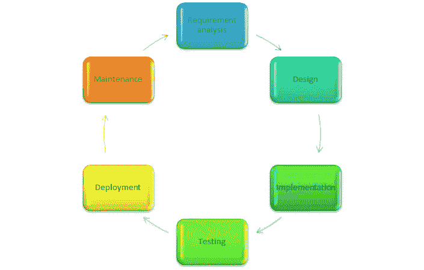

# 什么是 SDLC？？

> 原文：<https://blog.devgenius.io/what-is-sdlc-d6773e2ee6c3?source=collection_archive---------32----------------------->

马文·迈耶在 [Unsplash](https://unsplash.com/s/photos/development?utm_source=unsplash&utm_medium=referral&utm_content=creditCopyText) 上的照片

S DLC 是软件开发生命周期的缩写。这也被称为软件开发过程。现在你可能想知道这个软件开发生命周期是什么。简而言之，我们可以说软件开发生命周期是用于设计、开发和测试高质量软件的过程或方法。该流程旨在在分配的时间和预算内满足客户的期望。软件开发生命周期有几个阶段。好了，伙计们，让我们一个接一个地进入 SDLC 阶段。

作者截图

第一阶段:需求分析

需求分析是 SDLC 中最重要的第一步。我之所以说这是最重要的阶段，是因为如果我们不能正确识别客户的需求，那么整个过程将会一团糟，最终客户会非常失望。相信我，伙计们，如果我们不能正确理解需求，这将是一个巨大的问题。在这个阶段，我们收集信息，比如谁将使用这个系统，应该包括哪些数据，客户的期望是什么，等等。收集所有信息后，开发团队分析这些需求。最后，使用此阶段收集的信息创建需求规格文档。如果我们没有正确地认识到需求，它会影响以后的整个过程。

**第二阶段:设计**

设计是 SDLC 的第二阶段。在此阶段，根据需求规格文档，设计准备满足客户需求。在这一阶段，通过与客户讨论风险、技术、项目限制和时间预算，然后设计师设计出最佳设计。在所有这些事情之后，设计将被保存在一个叫做设计规范文档的文档中。

**第三阶段:实施**

实施是 SDLC 的第三个阶段。这是开发人员在分析需求规格文档和设计规格文档后开始编码的阶段。如果这些提到的文档非常准确和详细，那么它会使开发人员的生活变得更加容易。在这个阶段，开发人员使用 C、C++、Python、Java 等编程语言。但是语言会根据正在开发的软件而有所不同。

你可能会觉得很累。抓紧了，伙计们，只剩下 4 个阶段了…

**第四阶段:测试**

在这个阶段，软件在交付给客户之前要经过测试。有经验的测试人员根据需求测试软件。这个阶段的目标是发现是否有缺陷、错误(不是你房子里的那个错误..)以及系统是否按照预期工作。因此，如果报告了任何缺陷，这些缺陷将被报告、跟踪、修复和重新测试，以使产品达到质量标准。

**第五阶段:部署**

在对产品进行测试以查看是否满足所有要求和高质量标准之后，然后将产品交付给市场或客户。

**第六阶段:维护**

好了，好了，现在我们处于 SDLC 的最后阶段。在发布产品后，如果遇到任何错误或问题，那么开发团队会处理这些事情并维护软件。

嗯，这是相当多的信息，对不对。但是这些东西在你开发软件的时候真的很重要。所以我想现在你对什么是软件开发生命周期有一点了解了，对吗？

也有不同的 SDLC 模型，它们被称为软件开发过程模型。业内比较流行的一些机型有。

瀑布模型

螺旋模型

敏捷模型

我不会在本文中谈论这些模型。但是我将在以后的文章中逐一讨论这些模型。所以请继续关注。

> 如果你喜欢这篇文章，请与你的朋友分享。感谢阅读！