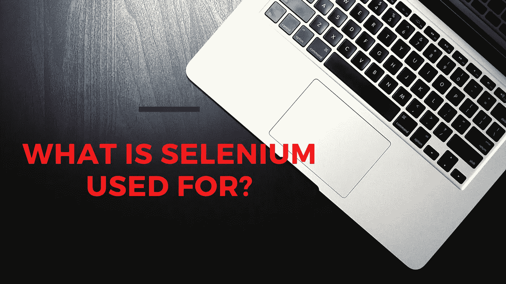
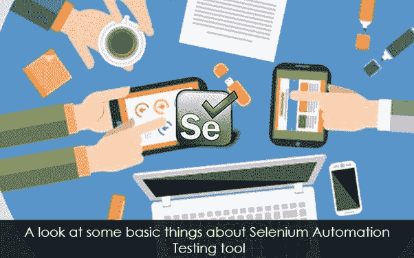

# 硒是用来做什么的？

> 原文：<https://blog.devgenius.io/what-is-selenium-used-for-dede446e3369?source=collection_archive---------36----------------------->

elenium 是一个适用于 web 应用程序的可移植的、流行的开源软件测试框架。它为创作测试提供了一个**回放工具，而无需了解测试脚本语言(Selenium IDE)。 [Selenium](https://qaandsoftwareblog.blogspot.com/2020/07/what-is-selenium-used-for.html) 还提供了一种测试领域特定语言(Selenese)来用**几种流行的编程语言编写测试，包括 Scala、Groovy、Java、Ruby、C#、PHP、Python 和 Perl。测试可以在当前和最新的网络浏览器上运行。 **Selenium 部署在 Windows、macOS 和 Linux 平台上。** [Selenium](https://qaandsoftwareblog.blogspot.com/2020/07/what-is-selenium-used-for.html) 由各自具有特定角色的组件组成，辅助 web 应用测试自动化开发:****

1. ***硒栅***

2. ***【硒 IDE(集成开发环境)***

3. ***硒网驱动***

4. ***【硒遥控】***

如今，用户可以在不同的平台、设备和浏览器上访问网站和 web 应用程序。组织需要健壮的测试自动化工具，以便在短时间内跨各种平台评估其 web 应用程序的所有方面。除了管理 web 应用程序测试时间之外，测试自动化框架或模型还有助于领先 QA 公司的 QA 专业人员产生更准确的、经过时间检验的、有保证的结果。

作为一个健壮的自动化测试套件， [Selenium](https://qaandsoftwareblog.blogspot.com/2020/07/what-is-selenium-used-for.html) 通过支持多种编程语言、操作系统和浏览器，简化并加速了 web 应用测试。Selenium 提供的工具进一步简化了测试专业人员控制 web 浏览器的不同方面以及以编程方式自动化 web 浏览器的工作。基于他们指定的需求，web 应用程序测试人员可以选择使用 Selenium WebDriver 或 Selenium IDE。

**硒测试的 7 个基本步骤:**

创建 Selenium 测试脚本有 7 个常见的[步骤，](https://qaandsoftwareblog.blogspot.com/2020/07/what-is-selenium-used-for.html)适用于任何测试用例以及任何被测应用程序(AUT)。

*   导航到网页。
*   形成一个 WebDriver 实例。
*   评估浏览器对该操作的响应。
*   在网页上定位或查找 HTML 元素。
*   对 HTML 元素执行操作。
*   使用特定的测试框架运行测试并记录测试结果。
*   结束测试。

**示例:登录用例**

> <**html**
> 
> <**正文**正文>
> 
> …
> 
> <**表单**action = " loginAction " id = " loginForm ">
> 
> <**标签** >用户名:< / **标签** >
> 
> <**输入**type = " text " name = " username "><**br**>
> 
> <**标签**密码:< / **标签**
> 
> <**输入**type = " text " name = " password "><**br**>
> 
> <**按钮**type = " submit " id = " Log In button ">登录< / **按钮** >
> 
> <**按钮** type="reset" id="reset" >清除< / **按钮** >
> 
> **表格**表格>
> 
> …
> 
> **正文** >
> 
> **html**
> 
> 主要用途是什么？

**Selenium 对开发 web GUIs 的敏捷团队要求很高。**专业开发人员喜欢用他们已知的编程/脚本语言进行测试，然而，编程新手面临着陡峭的学习曲线。另外，**应用程序变化越多，保持测试同步所必需的编程就越多。**

随着您在套件中的进步， [**Selenium**](https://qaandsoftwareblog.blogspot.com/2020/07/what-is-selenium-used-for.html) 的使用会增加，尽管 Selenium 的基本原理围绕着浏览器测试，因为开发人员&测试人员同样喜欢开源框架的能力，以便在浏览器中模拟真实用户的行为。开发人员创建测试脚本，在本地或云中运行，以评估基本的功能正确性&验证视觉设计。这种测试脚本可以是简单的 JavaScript 单元测试，也可以是日常用户的全自动端到端功能测试，比如登录或结账过程。

***你可以关注我:***

*   **Dzone**:[https://dzone.com/users/3854036/shormistha.html](https://dzone.com/users/3854036/shormistha.html)
*   **Quora**:【https://www.quora.com/profile/Shormistha-Chatterjee】T2
*   **博主**:[https://shormistha4.blogspot.com/](https://shormistha4.blogspot.com/)，[https://qaandsoftwareblog.blogspot.com/](https://qaandsoftwareblog.blogspot.com/)
*   **布洛格洛文**:[https://www.bloglovin.com/@shormistha](https://www.bloglovin.com/@shormistha)